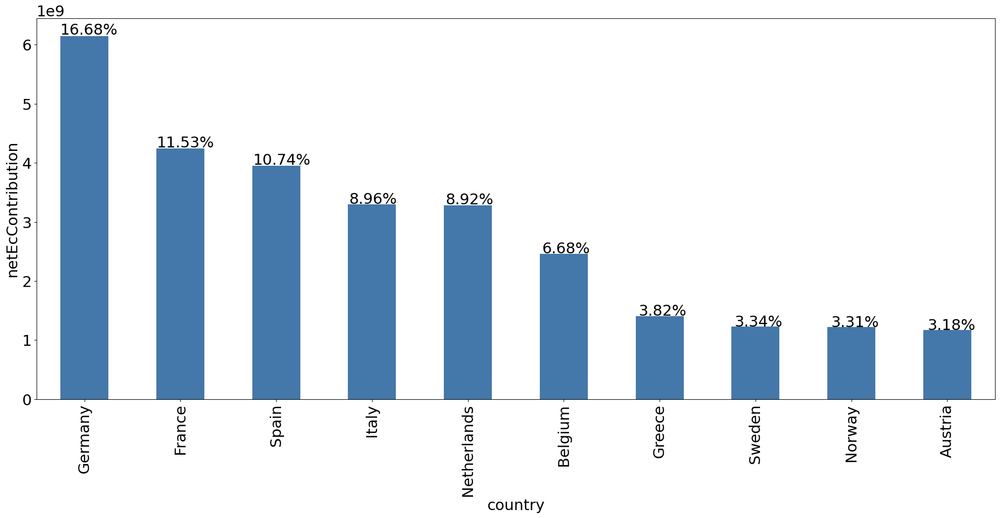
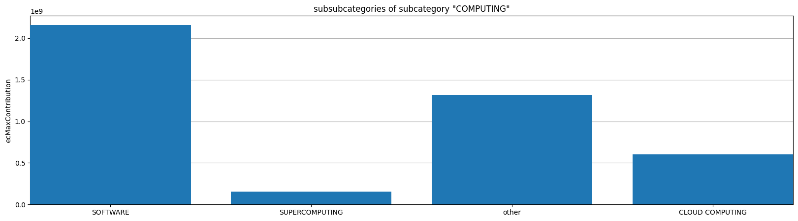
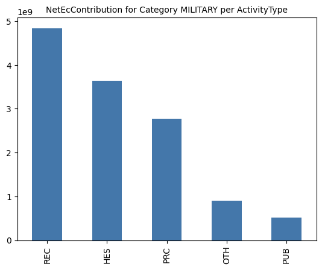

## Executive summary 

The European Union invests significant amounts of public money in digital research and innovation and has made steady progress in digital transformation over the decades. At the same time, people, businesses, and institutions in Europe remain heavily dependent on digital services and products provided and controlled by non-EU corporations. Rising geopolitical tensions and shifting alliances have made the precarious position this creates for Europe increasingly clear. Digital sovereignty is high on the EU’s agenda. This report analyzes the European Union's approach to funding digital technology research and innovation, focusing on the allocation of resources under the Digital Europe and Horizon Europe programs. It situates this analysis within the broader landscape of EU technology policy, its reliance on digital innovation for economic competitiveness, and the ambition to maintain – or perhaps rather, achieve – technological sovereignty. Based on our analysis, we draw the following conclusions and recommendations.

### Key findings

1. There is an overreliance on the potential and promise of “disruptive” technologies. The EU's funding strategies are heavily influenced by the idea that breakthroughs in AI, quantum computing, and other emerging fields will be a silver bullet that will turn things around for Europe’s competitiveness.  
2. The approach to R\&I funding is technology-centric rather than need-centric. Funding for digital innovation remains overwhelmingly focused on developing new technologies (“digitization for the sake of digitization”) rather than addressing well-defined, evidence-based needs and solving problems (“digitization as a means to an end”).  
3. Funding agencies fall for tech hype. EU funding programs often reflect industry-driven narratives about new technologies and their potential. This approach lacks critical rigor and analytical nuance in assessing the actual potential of different technology areas. 

### Recommendations

1. **Prioritize Public Digital Infrastructure (PDI)** — EU funding should strengthen public digital infrastructure rather than chase disruption. It should ensure that publicly funded digital tools serve the public interest. The development, maintenance and repair of PDI delivers value to society as a whole, and contributes to competitiveness in a reliable and sustainable way.  

2. **Align industry support with public interest** — EU funding decisions in support of industry should prioritize meeting public needs, with the goal of enhancing both individual and collective autonomy. State involvement in shaping markets achieve this objective only if it is driven by incentives that differ from those of private investors.  

3. **Adopt a more critical approach to technology investments** — Decision-makers should move beyond techno-deterministic and techno-optimistic narratives and take a more critical approach to assessing technologies. Evidence-based, strategic and mission-driven investment can control for risks inherent in pursuing research and innovation.

## Introduction

###### cutting ties with certain service providers to reduce risk

In January 2025, fearing that the new U.S. administration might impose sanctions on the International Criminal Court (ICC), including banning American companies from doing business with the Court, ICC officials began reviewing their suppliers and cutting ties with certain service providers to reduce risk. As reported by the Guardian, prosecutors admitted that nearly all of the court's evidence was stored in the cloud, in this case, Microsoft Azure.[^1] ICC's reliance on Microsoft's Azure cloud platform meant that any downtime, be that a technical blunder or a politically motivated suspension of services, would effectively bring investigations to a halt. The independence of the court is thus effectively curtailed by the infrastructural dependencies necessary for its operation.

This case reflects a far more profound and pervasive issue affecting individuals, businesses, and institutions worldwide. For all its regulatory zeal, the European Union (EU) is no exception. Over the last decades, the EU has advanced its digital transformation, yet the bloc still relies heavily on digital services and products provided and controlled by non-EU companies. While the EU prides itself on the openness of its markets, rising geopolitical tensions and shifting alliances have shown how risky a reliance on foreign digital technologies may quickly become. 

###### how EU R&I funding can be more effectively aligned with the public interest

In March 2024, the European Data Protection Supervisor (EDPS) determined that the Commission's use of Microsoft 365 breached EU data protection laws, particularly regarding the transfer of personal data to non-EU countries.[^2] According to Euractiv, internal documents reveal that Commission officials are apprehensive about their dependence on Microsoft and raise questions about the security and privacy of the data.[^3] Let's imagine for a moment that sanctions similar to those feared by the ICC were imposed on EU institutions. What would be the consequences? And what would it say about Europe's technological sovereignty?

This report examines the European Union's approach to funding digital technology research and innovation. It wants to uncover the explicit and implicit motivations and priorities behind funding decisions. It reviews publicly available data on two EU funding programs, Digital Europe and Horizon Europe, to analyze how resources are allocated. The report looks at the work programs of both funding schemes. It consists of two parts: Part I, which is narrative, and Part II, which includes additional analysis of quantitative data. To analyze the allocation of funding within the Horizon program, the authors used the *project, organization* and *euroSciVoc* datasets provided on the open-source European Data portal[^4] and scraped the CORDIS website.[^5] The analysis of work programs and the information on funded projects is placed in the broader context of the EU's evolving technology policy landscape, and its continued and recently reiterated reliance on digital innovation as a pillar of economic competitiveness and progress. The report challenges the assumption that increased investment in "disruptive technologies" is the best way to achieve EU digital sovereignty. It highlights the risks of current funding strategies being technology-driven rather than need-based, while following hype cycles rather than credible technology assessments. Based on these findings, it provides recommendations on how EU R\&I funding can be more effectively aligned with the public interest to reduce dependency on non-EU digital infrastructure and enhance digital sovereignty.

### Shifting Landscape for EU Tech Policy

In 2025, the European Union finds itself navigating a multipolar international landscape. The global tech sector is dominated by the United States and China, positioning the EU in a competitive struggle to maintain its technological sovereignty. During the last term of the European Parliament, the EU institutions adopted several pieces of legislation to gain more influence over digital tools and services that have become deeply embedded in European societies and markets. Laws such as the Digital Services Act (DSA) and the Digital Markets Act (DMA) have been key efforts to give Europe more control over its digital landscape. The DSA focused on making online spaces safer and ensuring that platforms respect users' rights. The DMA challenged the dominance of big tech 'gatekeepers' to create fairer and more competitive digital markets. These regulatory measures are part of the EU's strategy to strengthen its technological sovereignty, including digital sovereignty, as reflected in the appointment of Henna Virkkunen as Executive Vice-President for Tech Sovereignty, Security, and Democracy following the 2024 European elections. As pointed out by Mario Draghi,[^6] enhancing the EU's competitiveness requires strategic autonomy in key sectors and reducing dependencies on external actors. This involves coordinated policy actions as well as investment in research and innovation. 

### EU’s bet on digital technologies

In the EU, industrial policy has traditionally been carried out at national level. While member states have taken the lead in shaping their industrial strategies, the EU's role has primarily centered on completing the single market and fostering research and innovation. The EU Single Market has been seen as the main instrument to ensure competitiveness, productivity growth, and prosperity, while framework research programs such as Horizon 2020 and Horizon Europe have been designed to help Europe produce world-class science and technology that drives economic growth.[^7] In recent years, the EU has seen a significant rise in supra- and cross-national industrial policy initiatives, with the European Commission playing a more active role in pan-European efforts to drive innovation and economic growth. This shift has been largely driven by changes in the international political economy, particularly climate challenges, technological advancements, and geopolitical shifts, which have highlighted the need for a more integrated and coordinated industrial policy within the single market.[^8] 

Since its introduction in the European Commission's 2010 industrial policy strategy, the Digital Agenda has steadily gained prominence, becoming a central theme in subsequent strategies.[^9] In 2025, the EU is once again betting on digital technologies to regain competitiveness. In the mission letter to Henna Virkkunen, the President of the European Commission stated that digital technologies are at the heart of Europe's “progress and ambitions.”[^10] The letter mentioned the need to intensify efforts and investments concerning the next wave of frontier technologies, including several digital technologies such as “supercomputing, semiconductors, and the Internet of Things.” 

According to the former European Central Bank President Mario Draghi, Europe must accelerate innovation and identify new "growth engines." Digital technologies are expected to become drivers of economic growth 

> With the world now on the cusp of another digital revolution, triggered by the spread of artificial intelligence (AI), a window has opened for Europe to redress its failings in innovation and productivity and to restore its manufacturing potential. – The Future of European Competitiveness (“The Draghi report”), Part A, p. 6\.

###### ambition may be turned into action when it is translated into budgetary commitments

Overall, Europe's ambition for economic competitiveness puts research, innovation, and digital technologies at the forefront. Such an ambition may be turned into action when it is translated into budgetary commitments. The opportunity for doing so comes as the EU's future multiannual budget, set to run from 2028 to 2034, begins to be negotiated.

| **EU multiannual budget**    The long-term EU budget, the Multiannual Financial Framework (MFF), determines the spending limits across key policy areas. The MFF is usually adopted for seven years. The MFF negotiation process begins with the European Commission, which drafts the MFF proposal based on economic forecasts, policy goals, and input from stakeholders, including EU institutions, national governments, and civil society. The MFF is adopted by the Council with the consent of the European Parliament.    Even after the MFF is locked in, the EU’s budget isn’t set in stone. Every year, policymakers negotiate and adopt annual budgets within the MFF limits. A mid-term review allows the EU to tweak spending plans based on new challenges. The current MFF (2021-2027) introduced new financial tools, such as the NextGenerationEU recovery fund, showing how the EU can adapt its budget to unexpected challenges.   In terms of how the EU budget is structured, some reports[^11] suggested that ahead of the new MFF, the Commission is going back to the drawing board and considering various options, including "merging a dozen different pots of money for research, defense, and innovation into a single European Competitiveness Fund.” This would be a significant shift from the current approach. According to the leaked document, which outlines an idea for how the budget could be restructured, the idea behind the Competitiveness Fund is to address the weaknesses of the current set-up, in particular, the “complexity of funding for EU industry” and the lack of “strategic steering.” |
| :---- |

### Funding for R\&I in digital technologies

Government-led initiatives and funding have historically been essential in developing digital infrastructures and foundational technologies, including the Internet. The neoliberal shift in the late 20th century emphasized reducing state intervention in the economy and increasing reliance on market mechanisms for providing goods and services. This shift resulted in the deregulation and privatization of key infrastructures, including digital infrastructure, initially affecting the telecommunications sector, which was responsible for providing internet access. Currently, the majority of internet service providers are privately owned, while some countries provide state-funded connectivity in public areas, and only a limited number of networks are operated by local communities.[^12] Some of the most profound impacts of the neoliberal shift on the digital economy emerged in the early 21st century with the development of digital services built on top of the privatized networks. As a result, digital infrastructure and services became increasingly controlled by private corporations, shaping the modern digital economy. 

###### government funding has remained a cornerstone of research and innovation

Despite this shift in the economy, government funding has remained a cornerstone of research and innovation. As Mariana Mazzucato observes, everything smart about our smartphones has been government-funded.[^13] The EU has also invested substantial resources into the development and roll-out of digital technologies, although comparatively less than the US and China. For example, EU firms represent only 7 percent of R\&D expenditure among leading software and internet companies, compared to 71 percent for the US and 15 percent for China. In technology hardware and electronic equipment, the EU accounts for 12 percent of R\&D expenditure, while the US accounts for 40 percent and China for 19 percent.[^14] The EU invests in digital technologies through several large-scale programs, including substantial parts of Horizon Europe (HE), the Digital Europe program, and the Connecting Europe Facility \- Digital. However, questions remain about their effectiveness in addressing Europe's digital lag. 

| **In Europe, several programs fund digital technologies.**[^15]  The main ones in terms of scope and size include:    **Horizon Europe:** This is the EU's key program for research and innovation. Horizon Europe includes a dedicated budget for ‘Digital, industry, and space.’ This budget develops research and high-end innovation in technologies, such as “AI, robotics, next-generation Internet, high-performance computing, big data, and key digital technologies.” Horizon Europe’s budget amounts to €95.5 billion. The dedicated budget for the “Digital Industry and Space” cluster (Cluster 4\) is worth €15.349 billion. Cluster 4 is located in Pillar II of HE dedicated to “global challenges & European Industrial Competitiveness”.   **Digital Europe Programme:**[^16] This is the central program that aims to accelerate economic recovery and drive the digital transformation of Europe. The Digital Europe Programme aims to strengthen investments in areas such as “supercomputing, data processing capacities, artificial intelligence (AI), cybersecurity, digital skills, and the digitalization of businesses and public administrations.” The budget for this programme is worth €7.6 billion.  **Connecting Europe Facility – Digital:** This facility supports trans-European networks and infrastructures in the telecommunications sectors. It is investing in broadband networks as part of the EU’s wider efforts to build infrastructure that can handle emerging and future processes and applications. The budget for this facility is worth €2.07 billion.  Figure 1: Distribution of EU funds for digital technologies between three main instruments in the long-term budget   For more information on the policy and support landscape, please see this landscape mapping[^17] that looks at (1) existing instruments, (2) proposals for new instruments, and (3) other relevant concepts. It was created as part of the NGI Commons project.[^18] |
| :---- |

The Draghi report has been a prominent source of criticism of the EU’s approach to research, innovation, and digital competitiveness, identifying several challenges that must be addressed to strengthen Europe’s position in the global economy.

One of the report’s main concerns is that EU funding for research and innovation is spread too thin across too many fields, limiting its impact. Additionally, overall investment levels remain too low. The report also highlights a disconnect between EU-level initiatives and national innovation strategies, leading to inefficiencies and missed opportunities. A more coordinated approach between member states and EU institutions is needed to maximize resources, avoid duplication, and create a stronger, unified push for technological leadership. Draghi places a lot of faith in the potential of “advanced” and “disruptive” (see next section) technologies to improve Europe’s position in the global economy.

In addition to general innovation challenges, the report highlights Europe's limited capacity in the field of software for communication devices, which has led to a situation where European citizens and businesses rely primarily on non-EU services and products. It points to the fact that no European company has a significant share of the global communications software market, leaving the EU vulnerable to external dependencies. We see here how issues of competitiveness and sovereignty intersect. To address this, the report calls for strengthening Europe's capabilities across the technology value chain, from hardware and software to digital service platforms. As Draghi states:

> It is essential to restore the security of supply chains for critical technologies by strengthening the EU's capabilities and assets across the value chain in terms of end products and service platforms.[^19]

The EU must:

> deliver state-of-the-art communication services to its citizens and businesses provided by strong and successful EU companies, which are not overdependent on critical equipment and software providers from outside the EU*.[^20]

Other reports have raised concerns similar to those of Draghi, including a report from an independent group of experts tasked by the Commission with assessing the effectiveness, efficiency, relevance, coherence, and European added value of European research funding.[^21] Inefficiencies in research and innovation programs were said to pose a barrier to advancing innovation across Europe. Critics argue that misalignment between R\&I and industrial policies weakens the effectiveness of public investments and hampers the EU’s ability to translate research breakthroughs into industrial competitiveness. According to Draghi, tackling these inefficiencies is critical for the EU to build a competitive edge and support its economic ambitions.

As the negotiations of the new EU budget are underway, the Commission is expected to take action and address these concerns. Regardless of how the next MFF is structured, before committing financial resources to newly designed funds for R\&I and digital transformation, it is essential to continue the critical assessment of the current structures. Below are three lessons from our analysis of the current framework for financing digital transformation from public EU funds. These findings challenge the prevailing narrative that Europe must "catch up" by investing heavily in the next big innovation to overcome past shortcomings. Instead, they point to the importance of prioritizing strategic investments that address current problems to reduce digital dependencies.

## Three lessons on the EU’s funding for the digital R\&I

## *Lesson one: There is a fixation on the promise of "disruptive technologies".*

Draghi’s report makes the point that in Europe, support for breakthrough disruptive innovation remains limited and that Europe lags in digital areas such as “artificial intelligence (AI), cybersecurity, the Internet of Things (IoT), blockchain, and quantum computing.” The report suggests a fundamental reassessment of budget allocations, recommending that the percentage of funding for disruptive innovation should be increased to address the shortcomings of the existing funding allocation, which currently targets incremental progress and is overly focused on addressing capital market imperfections. Similarly, the independent expert group referred to in the previous section emphasizes the need to stimulate “disruptive research and innovation” in Europe, particularly in light of the rise of technologies like generative AI that are reshaping the context of EU research and development policy. They note that other emerging technologies, such as quantum technologies, synthetic biology, and cellular technologies, are reaching a level of maturity where their transformative potential is becoming clearer. 

The term “disruptive innovation” was popularized by Clayton Christensen in the 1997 book “The Innovator’s Dilemma.”  Christensen defined “disruptive innovation” as the process by which a smaller company, often with limited resources, successfully competes against a well-established business (referred to as an “incumbent”) by starting at the lower end of the market and gradually advancing into higher market segments. Christensen favored the term “disruptive innovation” over “disruptive technology” because he believed that most technologies themselves are not inherently disruptive or sustaining. Instead, he argued that it is the business model that harnesses key ideas to drive significant market success and act as the catalyst for disruption.

The Draghi report's enthusiasm for disruptive innovation as a solution to economic stagnation stems from the realization that failing to lead in this area could result in (further) long-term dependence on foreign technologies. Draghi more than once highlights that Europe failed to capitalize on the first digital revolution, where US and Chinese firms quickly outpaced their European counterparts, and risks missing out on the current and future ones. Hence, now it must “redress its failings”. 

This focus on technological disruption should be met with caution and a healthy dose of skepticism. History has shown that the promise of radical innovation often overshadows the challenges of governance and the risk of unintended consequences. A prime example is the rise of social media, once celebrated as a tool for global connection and free expression, but now recognized for its profound and often detrimental impacts on society and democracy.

Moreover, while categories such as “artificial intelligence” and “quantum technology” are frequently cited as examples of disruptive innovation, they are so broad that they encompass an array of potential solutions. For example, AI is not a single technology, but a broad field (that has been developing for decades). Within that broad field, some advancements, like large language models (LLMs) and computer vision, are already transforming industries, while others, such as AI-driven scientific discovery remain in early development. Much of today's AI development that catches policy makers’ attention is controlled by a few large technology companies, reinforcing rather than disrupting existing market dominance. Quantum technology can refer to anything from quantum computing to quantum cryptography, making it difficult to determine which areas should be or are meant to be prioritized for funding and research. Labeling an entire category as "disruptive" can be misleading, as some innovations in these areas may transform industries in the near term, while others may never reach commercial viability. Understanding these nuances is key to developing sensible policy and investment strategies that focus on technological breakthroughs that have the potential to produce public value, not just hype or buzzwords. As a result, it is difficult to determine what the call to "invest in disruptive technologies" means beyond conveying a sense of urgency and the need for (disruptive) change necessary to "turn things around" for the European market.

###### the obsession with innovation often overshadows the critical work of maintaining and improving existing systems

Disruption is not inherently positive. While some technological shifts create new markets and opportunities, others can destabilize industries, eliminate jobs, or reinforce existing corporate monopolies. Without precision, the call to invest in "disruptive technologies" risks becoming more of a rhetorical device than a concrete strategy, leaving room for inconsistent policies and misaligned funding priorities. Some disruptive technologies can yield benefits, but an overreliance on them risks neglecting the established practices and institutions essential for societal well-being. Relevant in this context are the insights of authors such as Lee Vinsel and Andrew L. Russell, who argue in *The Innovation Delusion* that the obsession with innovation often overshadows the critical work of maintaining and improving existing systems. While disruptive technologies are seen as transformative, they almost always depend on a strong base of existing infrastructure to succeed. The focus on tech solutions overshadows the fact that whether the roll-out of new and disruptive technologies is considered beneficial depends on the context and perspective.  

Finally, a closer examination of funding allocations under existing work programs reveals that some technology fields considered “disruptive” already receive a substantial share of resources. Taking the Draghi report’s list of digital technologies in which support supposedly lags (AI, cybersecurity, IoT, blockchain, and quantum), in the Horizon program, 20.44% of all analyzed projects have been assigned a keyword related to one or more of these categories (this is less than the sum of the percentage of these five categories combined as some projects are related to multiple “disruptive” categories). These projects received a total of €8.80 billion, or 23.91% of the program budget allocated at the time of our analysis (see Figure 2\).[^22] The issue, therefore, may not be a lack of funding for these fields but rather the fragmented and uncoordinated nature of the funding itself. European research and innovation funding is spread across many programs and initiatives, often with overlapping objectives. As a result, resources are diluted across many small projects, making it difficult to achieve the scale and impact needed to drive real technological change. The average funding for one project is €2.69 million and is distributed over an average of 6.4 organizations. The average funding per project lies a little higher for the subset of digital technologies with the exception of quantum (see Figure 3).

{style="width: 123mm"}

{style="width: 123mm"}

## *Lesson two: The approach to innovation is focused on industry demands, with too little direct connection to real, on-the-ground needs and everyday experiences.*
###### the vision for digital transformation remains predominantly industry-centric and technology-driven

A second takeaway from the analysis of current work programs and funding allocations for digital technologies is that the vision for digital transformation remains predominantly industry-centric and technology-driven. For example, within Horizon Europe's Cluster 4 funding, which targets the "Digital, Industry and Space" sectors, only one of the 25 most funded projects focuses on developing solutions that could directly benefit the public.[^23] The remaining 24 projects overwhelmingly support the development of solutions by and mostly for industry, such as new production capabilities or advanced space technologies. And while supporting industry aligns with the cluster's objectives, the imbalance is significant. It is notable that projects related to keywords in the *Public* category (including public services, but also policy and elections) form the 4th most funded group in the Horizon program (see Figure 4). However, the findings from the in-depth textual analysis of the 25 highest-funded projects in Cluster 4 suggest that the actual public benefits of projects in this category may be less clear than claimed, even though substantiating this claim would require further investigation.[^24] 

{style="width: 123mm"}

###### this approach risks subsidising solutions in search of problems rather than addressing the current challenges of the digital landscape

This industry-centric approach to funding points to a disconnect between research and innovation funding and the everyday needs of people in Europe, making the digital solutions that are developed as a result of industrial policy less relevant and accessible. As a result, this approach risks subsidising solutions in search of problems rather than addressing the current challenges of the digital landscape, which are abundant. 

When research and innovation are primarily driven by technological capabilities rather than societal or user needs, the result is a mismatch between what is being developed and what is truly needed. For example, in the Digital Europe program, a call for projects to develop "VR/AR worlds" for local communities explicitly states that the specific use cases for the technology to be developed have yet to be defined. Rather than relying on the assessment of areas where technology would be beneficial, this approach begins with the presumption that VR/AR is inherently valuable and seeks to retrofit these technologies into community contexts. 

The EU programs contain multiple examples of this approach. "Developing CitiVerse" aims to build digital twins of cities, but the program description lacks a clear rationale for why local governments and residents need these immersive environments or how they will integrate with existing urban management tools. "Towards Networked Local Digital Twins in the EU" proposes an ecosystem of interconnected virtual city models, yet it remains unclear whether municipalities have expressed a demand for such technology or if it is being developed for its own sake.

###### the result is a mismatch between what is being developed and what is truly needed

The EU Blockchain Services Infrastructure is developed with the aim of supporting the EU Digital Identity Wallet and other digital identity-related use cases. The program outlines that blockchain will be assessed for its potential value rather than establishing clear, pressing needs that blockchain would address. As far as AI is concerned, the program aims to promote the adoption of AI technologies in Europe, including the development of an ecosystem to facilitate the adoption and wide usage of AI by businesses. While some AI systems have potential benefits, a primary focus on adoption and usage, rather than addressing specific needs or problems, could lead to the implementation of AI solutions where they are not necessarily the most appropriate or effective choice.

| **Examples of industry-driven digital solutions to undefined societal problems** According to the data we have analyzed, under Horizon Europe:  ◈ \ 152 projects are related to the broader category of Extended Reality (XR). ◈ \ 224 projects are related to Digital Twins. ◈ \ 44 projects are related to Blockchain.  |
| :---- |

This technology-driven approach to innovation that overemphasizes high-tech solutions at the expense of practical utility and societal relevance makes the program vulnerable to industry lobby. It leads to the development of complex solutions that may be impressive from a technological standpoint but overlook simpler, more immediate needs that could be addressed through less fancy means, such as secure, community-driven online platforms or cloud solutions that empower people and free them from dependence on big tech. Moreover, the idea that citizens will adopt and thrive in these "immersive" digital environments assumes a level of digital literacy that does not exist. If the EU aims to support digital transformation that benefits the public, a shift to needs-driven innovation is needed, where technology is a means to an end, not an end in itself. 

This is supported by the analysis of the project keywords in the Horizon program. 22.66% of ecMaxContribution goes to projects related to at least one “disruptive” category (AI, XR, Digital Twins, Blockchain, or Cybersecurity), but this is only 6.19% for projects that are related to making technologies more open (keywords related to one or more of the categories Interoperability, Repairing or Open).[^25] 3.83% of the ecMaxContribution is given to projects related to Education, but this includes projects related to education research, pedagogy, technologies for education, and technology education, so we cannot confidently draw any conclusions from this number. 

{style="width: 60mm"}

## *Lesson three: EU funding falls for hype and false narratives around new technologies.*

###### an analysis of work programs reveals a susceptibility to technology hype

The third finding from the analysis of work programs and digital funding allocations is that EU institutions that decide on how to allocate funding are not immune to the hype and the promise surrounding new digital technologies. Several funding opportunities under the Digital Europe program described in the previous section illustrate this tendency. While investing in untested novel technologies can drive innovation, an analysis of work programs reveals a susceptibility to technology hype. In such cases, work programs prioritize the perceived potential and promise of technology, often fueled by optimism, industry narratives, or competitive pressures, over concrete evidence and societal needs.

Cluster 4 of the Horizon Europe program also offers a good illustration of this phenomenon. Within this Cluster, funding opportunities are grouped under several thematic focus areas called Destinations. Each destination is designed to address a particular challenge, such as the need for “a human-centered and ethical development of digital and industrial technologies,” for example. While this structure aims to align funding with EU’s policy priorities, once these broad goals are translated into concrete funding opportunities (known as “topics”), the descriptions frequently overlook critical questions about whether the proposed technologies can realistically fulfill their promises and bring the EU closer to the set objective.[^26] Instead, they echo popular, often overly optimistic narratives about technology’s transformative potential.

###### a desire to participate in a technology race rather than address a need

For example, the program assumes that 6G networks will be a game-changer, offering terabit capacity and "sub-millisecond response times" that will enable real-time automation and augmented reality applications. However, with 5G adoption still incomplete and facing challenges in deployment, infrastructure costs, and actual consumer demand, the rush to 6G–projects related to 6G technology (€72.82 million) receive more than three times the funding than projects related to 5G (€21.08 million)–seems premature and may reflect a desire to participate in a technology race rather than address a need. 

The reference to an "Internet of Senses" a concept that envisions immersive digital experiences that incorporate touch, taste, and smell, further illustrates the speculative nature of some of the investments. While extended reality technologies have applications in some fields, such as gaming, education, or arts, the assumption that people want or need fully immersive sensory Internet experiences remains highly speculative. A needs-based approach would have to account for the reason that in contrast to previous hype cycles of Virtual Reality technologies, this time around, social transformation and popular culture have caught up with real-world applications of immersion.

Another example of an unrealistic belief in the potential of technology can be found in the topic "AI for Human Empowerment." In this case, the expected impact includes fostering “interaction and collaboration between humans and AI systems, working together as partners to achieve common goals, sharing mutual understanding and learning of each other’s abilities and respective roles.” Even this short excerpt illustrates how deep the phenomenon of AI anthropomorphism[^27] is present in these programs. The text refers to humans and AI systems working together as "partners," even though a partner is typically someone who shares responsibilities, goals, and benefits with another. By using this term, the text suggests that AI systems can take on roles and responsibilities similar to those of a human partner. The phrase "achieve common goals" implies that AI systems have a level of agency or intentionality to work toward goals, a characteristic typically associated with humans (or other animals with higher cognitive functions), while the phrase "share mutual understanding" suggests that AI systems are capable of understanding in the same way that humans are. The real risks of implementing AI solutions, such as taking away people's livelihoods,[^28] are lost in this vision.

While mentions of trustworthy AI and human autonomy are often included in the descriptions of the topics, a close reading reveals that they function more as add-ons that check boxes rather than address the actual concerns. Furthermore, only 3.93% of projects in the AI category also are related to *Trust* and only 0.54% are related to *Sovereignty* (which includes autonomy). This shows that while these issues may be mentioned in the description of many topics, they are a main aspect of only a small subset of these projects.

###### these programs risk pandering to a naive techno-solutionist and techno-determinist mindset

By buying into a particular narrative about AI and failing to critically consider at a deeper level the societal and economic implications of integrating AI into the workplace, for example, these programs risk pandering to a naive techno-solutionist and techno-determinist mindset. 

## Moving forward

Based on these lessons, we recommend three shifts in approach to guide EU funding for digital innovation toward more publicly beneficial outcomes. 

### Prioritize public digital infrastructure

Instead of fixating on "disruptive technologies" as a cure-all, the EU should prioritize strengthening public digital infrastructure (PDI). While similar to the concept of digital public infrastructure,[^29] PDI emphasizes the "public" aspect, shifting the debate from technical concerns to its broader social significance. The shift in focus is particularly crucial as the EU pursues an ambitious industrial policy, which carries with itself a risk of reinforcing a techno-solutionist approach to innovation. In this context, PDI refers to digital infrastructure designed to maximize public value by integrating three key dimensions: public attributes (ensuring open access and interoperability), public functions (supporting social and economic needs for individuals and institutions, including government bodies, libraries, and museums), and public ownership (involving governmental or civic participation in its funding, governance, and development, as well as user control). Drawing on Mariana Mazzucato’s insights,[^30] this expanded understanding of “public” shifts the debate away from purely technical concerns (digitization) toward its broader societal significance (public benefit). 

###### public funding for digital technologies should adopt a mission-oriented approach

Sufficient investment in and support for PDI, from research and development to deployment and demand creation through public procurement, would strengthen the EU's digital resilience and reduce dependence on large technology companies and their services. To achieve this, public funding for digital technologies should adopt a mission-oriented approach. While the mission-oriented approach is not new to EU funding,[^31] it has not been widely applied to the funding of digital technologies, probably because digitization has been seen as a mission in itself, rather than a tool to achieve other societal goals. A mission-oriented R\&I policy for digital technologies would prioritize strategic, goal-driven investment, ensuring that digital infrastructure development aligns with broader economic and social objectives rather than being shaped solely by market-driven or technological imperatives.  

### Align industry support with public value objectives

Industry support remains an important pillar of European R\&D funding. However, EU decisions on the allocation of public support should prioritize solutions that meet public needs and reduce dependencies on corporate service providers that exploit user data, enforce lock-ins, and prioritize profit maximization, rather than focusing on speculative, technology-driven approaches. Programs such as the Next Generation Internet (NGI) aim to foster open-source and interoperable alternatives to big tech products and services. Yet, these initiatives, in their current limited scope, are insufficient to reduce the EU's current dependence on non-EU digital technologies. On top of this, the EU has yet to fully leverage its purchasing power, e.g., through procurement, to drive demand for non-big tech digital products. By continuing to rely on American tech giants for digital products and services, the EU does the opposite and undermines its own stated goals of promoting European alternatives and digital sovereignty. 

In the current changing geopolitical context, the ideas of public needs, values, or interests will increasingly be defined in terms of security and militarization. As funding priorities shift toward addressing security concerns, this refocusing should not overshadow other critical public needs. The concept of "public need" must entail empowering individuals and ensuring that everyone can enjoy their fundamental rights both offline and online. Public funding should support projects that prioritize these rights and enhance people's ability to participate fully in society rather than simply reinforcing a security-driven agenda. For example, ensuring protection from surveillance should be considered a public need and a condition for receiving public funding.

### Adopt a more critical approach to tech in funding

Prioritizing emerging technologies, such as 6G networks, ideas such as the "Internet of Senses," and speculative visions of AI, reflects a commitment to technological advancement that overlooks questions about the actual benefits these technologies do or do not deliver. The analysis of the funding allocations shows a pattern where decision-makers are often swayed by the hype surrounding new digital technologies, leading to investments in areas where the applications remain unclear.

EU support for digital transformation must be rooted in a critical assessment of the potential and promise of new technologies, as well as assumptions and narratives surrounding them. While high-level objectives such as "AI for human empowerment" are compelling in theory, they tend to obscure the complexities of technology implementation and the harms that can result from its use in real life. A more balanced narrative about technology's potential and limits would help avoid uncritical techno-solutionism and focus on solutions that address the need for a secure, sovereign, and non-extractive digital environment.

Overcoming unwarranted techno-optimism requires a more nuanced understanding of the technologies being funded, one that critically assesses their real potential to address societal challenges rather than subscribing to speculative promises. To avoid EU funding falling into the trap of hype, it is essential to involve a wide range of stakeholders, including public sector representatives, academics, and civil society organizations, in setting funding priorities and drafting work programs. Funding programs should specify the "missions" that serve as key performance indicators for the topics to be funded and include a technology assessment that provides compelling evidence that the technology is fit for purpose if developed as intended.

[^1]:  Davies, Harry. 2025. “ICC Braces for Swift Trump Sanctions over Israeli Arrest Warrants.” The Guardian. The Guardian. January 20, 2025. <https://www.theguardian.com/law/2025/jan/20/international-criminal-court-icc-braces-swift-trump-sanctions-over-israeli-arrest-warrants>.

[^2]:  “The EDPS Follows up on the Compliance of European Commission’s Use of Microsoft 365.” 2025. European Data Protection Supervisor. March 6, 2025. <https://www.edps.europa.eu/press-publications/press-news/press-releases/2024/edps-follows-compliance-european-commissions-use-microsoft-365_en>

[^3]:  Wold, Jacob Wulff. 2025. “Internal Documents Reveal Commission Fears over Microsoft Dependency.” Euractiv. January 9, 2025. <https://www.euractiv.com/section/tech/news/internal-documents-reveal-commission-fears-over-microsoft-dependency/>. See also Wold, Jacob Wulff. 2025. “How the Commission Might Wean Itself off Its Microsoft Dependency.” Euroactiv. January 16, 2025.

[^4]:  <https://data.europa.eu/data/datasets/cordis-eu-research-projects-under-horizon-europe-2021-2027?locale=en>

[^5]:  <https://cordis.europa.eu/>

[^6]:  Mario Draghi, *The Future of European Competitiveness: A Competitiveness Strategy for Europe*, September 9, 2024, <https://commission.europa.eu/document/download/97e481fd-2dc3-412d-be4c-f152a8232961_en>.

[^7]:  Alessio Terzi, Monika Sherwood, and Aneil Singh, “European Industrial Policy for the Green and Digital Revolution,” *Science and Public Policy* 50, no. 5 (October 16, 2023): 842–57, <https://doi.org/10.1093/scipol/scad018>.

[^8]:  Donato Di Carlo, and Luuk Schmitz. “Europe First? The Rise of EU Industrial Policy Promoting and Protecting the Single Market.” *Journal of European Public Policy*, vol. 30, no. 10, 2 May 2023, pp. 1–34, <https://doi.org/10.1080/13501763.2023.2202684>.

[^9]:  Landesmann, Michael A., and Roman Stöllinger. 2020\. “The European Union’s Industrial Policy.” Edited by Arkebe Oqubay, Christopher Cramer, Ha-Joon Chang, and Richard Kozul-Wright. *The Oxford Handbook of Industrial Policy*, October, 620–60. <https://doi.org/10.1093/oxfordhb/9780198862420.013.23>.

[^10]:  European Commission, *Mission Letter to Henna Virkkunen*, September 17, 2024, <https://commission.europa.eu/document/download/3b537594-9264-4249-a912-5b102b7b49a3_en?filename=Mission%20letter%20-%20VIRKKUNEN.pdf>.

[^11]:  Gregorio Sorgi, "European Commission Maps Out ‘Power Grab’ over €1.2T Money Pot," *POLITICO*, October 5, 2024, <https://www.politico.eu/article/european-commission-budget-economic-reforms-conditions-power-grab/>. 

[^12]:  Félix Tréguer. Alternative Internet Networks: History and Legacy of a ”Crazy Idea”. IAMCR 2017, Jul 2017, Cartagena, Colombia. Stephen Graham and Simon Marvin, *Splintering Urbanism: Networked Infrastructures, Technological Mobilities and the Urban Condition* (London: Routledge, 2001).

[^13]:  Mariana Mazzucato, *The Entrepreneurial State: Debunking Public vs. Private Sector Myths*, Anthem Frontiers of Global Political Economy (London: Anthem Press, 2013).

[^14]:  EIB, EIB Investment Report 2022/2023, Resilience and renewal in Europe, 28 February 2023.

[^15]:  <https://digital-strategy.ec.europa.eu/en/activities/funding-digital>

[^16]:  <https://digital-strategy.ec.europa.eu/en/activities/digital-programme>

[^17]:  Paul Keller, Jan Krewer, and Zuzanna Warso, "Digital Commons and Infrastructure Funding: Analysis of the Funding and Support Landscape in the EU" (presentation, Open Future Foundation, November 2024), [https://openfuture.eu/wp-content/uploads/2024/11/241111\_landscape\_maping.pdf](https://openfuture.eu/wp-content/uploads/2024/11/241111_landscape_maping.pdf>.

[^18]:  NGI Commons, "Open Source and Internet Commons for Europe’s Digital Sovereignty," accessed March 31, 2025, <https://commons.ngi.eu/>. 

[^19]:  Mario Draghi, *The Future of European Competitiveness: In-Depth Analysis and Recommendations*, September 9, 2024, 67, <https://commission.europa.eu/document/download/97e481fd-2dc3-412d-be4c-f152a8232961_en>.

[^20]:  Draghi, *The Future of European Competitiveness*, Part B, 74\.

[^21]:  Independent Expert Group on Maximising the Impact of EU Research and Innovation Programmes, *Align, Act, Accelerate: Research, Technology and Innovation to Boost European Competitiveness*, Publications Office of the European Union, October 2024, <https://op.europa.eu/en/publication-detail/-/publication/2f9fc221-86bb-11ef-a67d-01aa75ed71a1/language-en>.

[^22]:  These results are based on the analysis of the datasets downloaded on 2 September 2024, at which point not all of the Horizon funding had been allocated. For more details, see the section on the methodology for the quantitative analysis in the second part of this report.   

[^23]:  This is the “Next Generation Internet 0 Commons Fund” which provides small to medium size grants for projects that “deliver, mature and scale internet commons” i.e. open source internet infrastructure: <https://ngi.eu/ngi-projects/ngi-zero-commons-fund/>.

[^24]:  Of the 25 projects, two have keywords assigned to them that place them in the PUBLIC category although based on our close reading only one of them develops tools and services that could eventually be used also by the laypeople (see Figure 5). 

[^25]:  For Horizon projects, it is mandatory to adhere to some open science practices including open access to scientific publications and research data under the principle “as open as possible, as closed as necessary”, both under the conditions required by the grant agreement, meaning that exceptions can be made. Furthermore, publishing software open source is “strongly recommended”18, but not mandatory, see HE Programme Guide”. 2024\.  Version 4.1 (May 1, 2024). [https://ec.europa.eu/info/funding-tenders/opportunities/docs/2021-2027/horizon/guidance/programme-guide\_horizon\_en.pdf](https://ec.europa.eu/info/funding-tenders/opportunities/docs/2021-2027/horizon/guidance/programme-guide_horizon_en.pdf) 

[^26]:  Only 2.70% of the Horizon program’s funding goes towards projects that have been assigned any ethics-related keywords. For “human”, this is 4.81%. 

[^27]:  Salles, Arleen, Kathinka Evers, and Michele Farisco. 2020\. “Anthropomorphism in AI.” *AJOB Neuroscience* 11 (2): 88–95. <https://doi.org/10.1080/21507740.2020.1740350>.

[^28]: See e.g., Brian Delk, “Nearly Half of US Firms Using AI Say Goal Is to Cut Staffing Costs,” The Sydney Morning Herald, June 29, 2024, <https://www.smh.com.au/world/north-america/nearly-half-of-us-firms-using-ai-say-goal-is-to-cut-staffing-costs-20240629-p5jpsl.html>.

[^29]:  On the concept of digital public infrastructure, see for example: <https://www.oecd.org/en/publications/digital-public-infrastructure-for-digital-governments_ff525dc8-en.html>.

[^30]:  David Eaves, Mariana Mazzucato, and Beatriz Vasconcellos, “Digital Public Infrastructure and Public Value: What Is ‘Public’ about DPI?” Working paper, Institute for Innovation and Public Purpose, University College London, 2024–25, <https://www.ucl.ac.uk/bartlett/public-purpose/sites/bartlett_public_purpose/files/iipp_wp_2024-05.pdf>.

[^31]:  See Mazzucato, Mariana. Mission-Oriented Research & Innovation in the European Union: A Problem-Solving Approach to Fuel Innovation-Led Growth. European Commission, 2018, <https://research-and-innovation.ec.europa.eu/funding/funding-opportunities/funding-programmes-and-open-calls/horizon-europe/eu-missions-horizon-europe/mission-oriented-policy-studies-and-reports_en>.

<!-- ## Test -->

<!-- | Item         | Price     | # In stock | -->
<!-- |--------------|-----------|------------| -->
<!-- | Juicy Apples | 1.99      | *7*        | -->
<!-- | Bananas      | **1.89**  | 5234       | -->
<!-- | Juicy Apples | 1.99      | *7*        | -->
<!-- | Bananas      | **1.89**  | 5234       | -->

<!-- `if(x=y): -->
<!--    do something; -->
<!--  else: -->
<!--    do comething else; -->
<!--  endif; -->
<!-- ` -->

<!--     if(x=y): -->
<!--         do something; -->
<!--     else: -->
<!--         do comething else; -->
<!--     endif; -->

<!-- ## References -->

# 

# Quantitative analysis

## Introduction

In order to analyze the allocation of funding within the Horizon program, we used the *project, organization* and *euroSciVoc* datasets provided on the open-source European Data portal[^32]. These datasets were downloaded on 2 September 2024, at which point not all the funding for the Horizon had been allocated yet. For each project in the *project* dataset, its keywords as given on the project’s CORDIS webpage[^33] were scraped on 4 November 2024. Furthermore, the fields of science according to the European Science Vocabulary for each project were retrieved from the *euroSciVoc* dataset. The union of the CORDIS keywords and the EuroSciVoc fields of science are here referred to as a project’s keywords. 

These keywords were used to group projects into categories. First, we ranked the keywords according to the number of projects to which they had been assigned and then manually labeled often occurring keywords into  “technology” (e.g., *AI*, *Sensors*) and “strategy” (e.g., *Trust*, *Security*). It is worth noting that labeling was done by people primarily with a background in digital technologies, meaning that keywords related to e.g. biology might not be as thoroughly labeled as, for instance, those related to AI. Based on these manual labels, some very simple phrase-based classifications were carried out. Through analyzing the results of this first classification, we found that no clear separation could be made between technologies and strategies. *Health* could be both a strategy as a technology, for example. Because of this, we decided not to group the keyword categories into technologies or strategies. Based on the analysis, we also heuristically improved the keyword labels. The keyword “ecosystem” was removed, for example, because it is used in different contexts with very differing meanings: in computing contexts, it refers to *software ecosystems* while in biology contexts it refers to ecosystems in the ecological sense.

The classification method that we finally used is a combination of phrase-based matching and word-sense disambiguation. Given the manually compiled labels, a keyword is assigned categories as follows. First, it is checked whether a completely stripped (such that it is reduced to only its lowercase alphanumeric characters) version of the keyword has a direct match in the stripped versions of the labelled keywords. If this is the case, the keyword is assigned that labelled keywords’ category. If no such match is found, the tokens (e.g. words) in the keyword are matched with the labelled keywords. If a labelled keyword matches with a token, its category is added to the keyword’s categories. The same is done for any subset of the keyword, meaning labelled keywords are also matched if they only form part of a token of the keyword, but for this, labelled keywords containing less than 4 characters are skipped as to prevent meaningless matches (e.g. *AI* in *container*). If token matching did not lead to any categories being assigned to the keyword, word sense disambiguation is carried out using the *Natural Language Toolkit*[^34]. The synsets of the keyword are compared with the synsets of the labelled keywords and if there is a WuPalmer[^35] similarity greater or equal to 0.95 between any of the synsets of the keyword and any of the synsets of the labelled keywords, the keyword is assumed to match with the labelled keyword and its category is added to the keyword’s categories. Word sense disambiguation is only applied if synsets could be assigned to at least ¾ of the keyword’s tokens.

After having applied this classification method once, we again heuristically adjusted the keyword labelling. We then found, however, that that keyword labelling contained so many categories that it became very hard to oversee the data. Therefore, we decided to group the categories into categories, subcategories and subsubscategories. The classification was carried out again, and the results were analyzed. The results of this analysis can be found in the *Results* section below.

The code for the steps described above along with the code used to obtain the results in the section *Results* can be found on GitHub[^36].

## Limitations

The CORDIS datasets were downloaded on 2 September 2024\. The sum of *ecMaxContribution* across projects in that *project* dataset is €36.8 billion, which is substantially lower than the €95.5 billion allocated for the Horizon program[^37]. This indicates that at that time, not all the Horizon money had been allocated to a project yet. While this means that the data analysis here is limited, the data analysis does give a representative indication of the money allocated from 2021 - September 2024.

As mentioned above, the manual classification for this project was done by people with a digital technology background. This leads to keywords related to digital technologies being classified in a much more fine-grained manner than keywords in, e.g., the health field. This might skew the results of the data analysis, but this has a limited impact on the overall analysis as the analysis is focused on digital technologies.

Furthermore, not all categories have the same number of labelled keywords associated with them. This may skew the data somewhat, as a category with a larger number of keywords has a higher probability of matching a given keyword.

For the word sense disambiguation that is part of the classification method, synsets are assigned to the keyword that is to be classified and the labelled keywords. A given word can have many synsets, the word “cloud” has 14, for example. Which synset may be relevant in the case of that keyword can be determined based on the context, but this context is very limited in the case of keywords. Furthermore, the keywords for any given project may not be related, so other keywords cannot be used as context either. This leads to synsets being included that may not correspond to the intended meaning of a keyword, which lowers the accuracy of the classification method.

## Results

### Organizations

#### ActivityType

Organizations that receive funding under the Horizon program are assigned an activityType, referring to the type of organization. In Table 1 and Figure 5, the distribution of the total netEcContribution of the Horizon program over these activityTypes is shown. The netEcContribution is the total money an organization keeps for a project. It does not include the money distributed to other parties, but does include such money that has been received from other organisations. Here, we can see that Higher or Secondary Education Education Estabilishments receive the most money, followed by Private For-Profit Entities and Research Organisations.

::: {.widetable}

+-----------------+----------------------------------------------+------------------------+-------------+
| *ActivityType*  | *Meaning*                                    | *€*                    | *%*         |
+=================+==============================================+========================+=============+
| \ HES           | Higher or Secondary Education Establishments | 12.9 billion           | 35.03%      |
+-----------------+----------------------------------------------+------------------------+-------------+
| \ PRC           | Private For-Profit Entities                  | 10.3 billion           | 27.98%      |
+-----------------+----------------------------------------------+------------------------+-------------+
| \ PUB           | Public Bodies                                | 1.30 billion           | 3.52%       |
+-----------------+----------------------------------------------+------------------------+-------------+
| \ REC           | Research Organisations                       | 10.1 billion           | 27.45%      |
+-----------------+----------------------------------------------+------------------------+-------------+
| \ OTH           | Other (including associations, membership    | 2.2 billion            | 5.95%       |
|                 | organisations and NGOs)                      |                        |             |
+-----------------+----------------------------------------------+------------------------+-------------+

:::

<!--
| ActivityType | Meaning | netEcContribution (€) | % of total netEcContribution |
| :---- | :---- | :---- | :---- |
| HES | Higher or Secondary Education Establishments | 12.9 billion | 35.03% |
| PRC | Private For-Profit Entities | 10.3 billion | 27.98% |
| PUB | Public Bodies | 1.30 billion | 3.52% |
| REC | Research Organisations | 10.1 billion | 27.45% |
| OTH | Other (including associations, membership organisations and NGOs) | 2.2 billion | 5.95% |
-->

Table 1: Distribution of netEcContribution across activityTypes within the Horizon program.

{style="width: 123mm"}

In Figure 6, the distribution of netEcContribution over activityTypes per Horizon cluster is shown. Here, we can see that this distribution varies greatly across clusters. More than half of the netEcContribution goes to Private For-Profit Entities in clusters ERC-SJI (56.3%, Science Journalism Initiative[^38]), HORIZON-EIC (62.4%, EIC Accelerator[^39]), HORIZON-EIT (61.5%, European Institute of innovation and Technology[^40]), HORIZON-ER (75.8%, EU Rail[^41]), HORIZON-EUSPA (50.4%, EU Space[^42]), HORIZON-JTI (67.6%, sustainability in the hydrogen value chain[^43]), HORIZON JU (53.8%, Joint Undertaking[^44] ), HORIZON\_KDT (63.4%, Key Digital Technologies[^45]), and HORIZON-SESAR (68.9%, air traffic management[^46]). Most of these clusters are related to digital technologies and are focused on public-private partnerships.

#### Most-funded organizations

The ten organisations that receive the most funding across all clusters in the Horizon program are shown in Figure 7\. Most of these organizations are Research Organisations or Education Establishments. EIT Raw Materials GMBH[^47] and EIT KIC URBAN MOBILITY SL[^48] are the only Private For-Profit organizations. Both are in initiatives by the European Institute of Innovation and Technology (EIT) and partner with private and public organizations. This shows the limit of these datasets: the organization given in a dataset may not be the ultimate organization to which money has been given. EIT FOOD[^49], which is also part of EIT and COST ASSOCIATION, a “funding organisation for research and innovation networks”[^50] are classified as Other.

{style="width: 184mm; margin-left: -60mm"}

<!-- {style="width: 184mm; margin-left: -60mm"} -->

{style="width: 157mm; margin-left: -55mm"}

#### Countries

In Figure 8, the ten countries that receive the most funding in the Horizon program are shown. It is not the case that the governments of these countries receive funding, but organizations that are based in these countries do.

{style="width: 123mm"}

All of the ten countries that receive the most funding are part of the European Union (and located in Europe). Indeed, 91.87% of Horizon funding goes to organizations in the EU. In Figure 9, we can see that the vast majority (95.67%) of Horizon funding goes to organizations located in Europe. The ten non-EU countries that receive the most funding are displayed in Figure 10\. Only three of these ten countries (Israel, South Africa and the United States) are not (partially) located in Europe.

{style="width: 123mm"}

{style="width: 123mm"}

### Categories

In this section, we analyze what topics are funded under the Horizon program through the results of the classification discussed in the *Methodology* section. An overview of some general statistics for these categories can be found in the *overviewCategories* table on GitHub[^51].

In Figure 11, the 25 categories that receive the most funding in the Horizon program are shown. It is important to note that one project can be assigned to multiple categories. For each of these categories, the project’s ecMaxContribution is then counted for that category. The sum of the ecMaxContribution across all categories here is therefore greater than the total ecMaxContribution. Digital Technologies, Sustainability and Health are the categories that are funded most overall. Raw Materials, Aerospace and Explainability obtain the most funding per project, on the other hand (see Figure 12\).

{style="width: 123mm"}

{style="width: 123mm"}

#### Digital Technologies

In this section, we zoom in on the Digital Technologies category. Within this category, projects related to AI receive the most funding, followed by projects related to Data and Computing. Most projects fall in at least one of the categories, as the ecMaxContribution of the “other” grouping is quite small.

{style="width: 123mm"}

When we zoom in further on AI (see Figure 14), we can see that, of AI’s subsubcategories, Machine Learning receives the most funding. Generative AI and LLM receive the least of these subsubcategories.

{style="width: 123mm"}

For the subcategory Computing, the most funding goes to the subsubcategory Software. Supercomputing is receives the least ecMaxContribution (see Figure 15).

{style="width: 123mm"}

We can also look at the co-occurrences of categories, i.e. the categories that occur most together with another category within one project. In Figure 16, the 17 categories that occur with the most funding relative to the other category’s funding are displayed. Here, we can see that approximately 70% of funding in the Robotics and Privacy categories goes to projects that are also related to AI. This is also the case for more than 50% of categories in the Trust and Law Enforcement categories.

{style="width: 123mm"}

For Sovereignty, the most co-occurring categories are shown in Figure 17. Here, we can see that Sovereignty co-occurs most with projects related to User, Interoperability and Privacy, but that these co-occurrences less than 10% of those categories’ funding.

{style="width: 123mm"}

Finally, the co-occurrences of the Military category are shown in Figure 18. Maritime, Bioinformatics and are the most co-occurring categories and more than 10% of their funding goes to projects that are also related to Military. After these three, Surveillance is the most co-occurring category.

{style="width: 123mm"}

#### AI across clusters

In Figure 19, the percentage of the total ecMaxContribution of a cluster that goes to projects related to AI is shown. Although HORIZON-CL4 (*Digital, Industry and Space*) is the cluster dedicated to digital technologies, HORIZON-CL3 (*Civil Security for Society*) and HORIZON-EUSPA (*Space*) are the clusters with the greatest percentage of ecMaxContribution going to projects related to AI.

{style="width: 184mm; margin-left: -60mm"}

#### ActivityTypes per Category

Finally, we can also look at the distribution of activityTypes within certain categories.

Within the Military category, on the other hand, most funding goes to Research Organisations (see Figure 20). On the other hand, within Digital Technologies, the most funded category, most funding goes to Private For-Profit Entities (see Figure 21). This is also the case for the Digital Technologies subcategory AI (see Figure 22).

{style="width: 123mm"}

{style="width: 123mm"}

{style="width: 123mm"}

{style="width: 123mm"}

[^32]:  <https://data.europa.eu/data/datasets/cordis-eu-research-projects-under-horizon-europe-2021-2027?locale=en>

[^33]:  <https://cordis.europa.eu/](https://cordis.europa.eu/>

[^34]:  <https://www.nltk.org/](https://www.nltk.org/>

[^35]:  Zhibiao Wu and Martha Palmer. 1994\.  “Verb Semantics and Lexical Selection,” *Proceedings of the 32nd annual meeting on Association for Computational Linguistics* (June 27, 1994): 133-138, <https://doi.org/10.3115/981732.981751>.

[^36]:  <https://github.com/Meret6832/horizon-funding-analysis/](https://github.com/Meret6832/horizon-funding-analysis/>

[^37]:  <https://ec.europa.eu/info/funding-tenders/opportunities/portal/screen/programmes/horizon>

[^38]:  <https://erc.europa.eu/apply-grant/science-journalism-initiative>

[^39]:  <https://eic.ec.europa.eu/eic-funding-opportunities/eic-accelerator_en>

[^40]:  <https://research-and-innovation.ec.europa.eu/funding/funding-opportunities/funding-programmes-and-open-calls/horizon-europe/european-institute-innovation-and-technology-eit_en>

[^41]:  <https://european-union.europa.eu/institutions-law-budget/institutions-and-bodies/search-all-eu-institutions-and-bodies/europes-rail-joint-undertaking_en>

[^42]:  <https://www.euspa.europa.eu/opportunities/horizon-europe>

[^43]:  <https://ec.europa.eu/info/funding-tenders/opportunities/portal/screen/opportunities/topic-details/horizon-jti-cleanh2-2024-05-01>

[^44]:  <https://www.welcomeurope.com/en/the-list-of-our-calls-projects/heu-ju-research-and-innovation-actions-supporting-the-global-health-edctp3-joint-undertaking-2024/>

[^45]:  <https://www.era-learn.eu/network-information/networks/key-digital-technologies/>

[^46]:  <https://www.sesarju.eu/discover-sesar/>

[^47]:  <https://www.eitdeeptechtalent.eu/the-pledge/meet-the-pledgers/eit-raw-materials/>

[^48]:  <https://www.eiturbanmobility.eu/who-we-are/about-us/>

[^49]:  <https://www.eitfood.eu/about-us/>

[^50]:  <https://www.cost.eu/>

[^51]:  <https://github.com/Meret6832/horizon-funding-analysis/blob/main/overviewCategories.csv>
