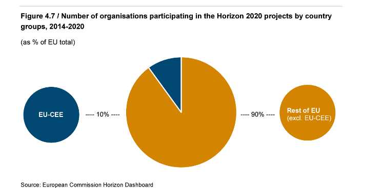

# Critical Internet Governance: A beginning

\ 

For many people the early internet was a place they did not know, but felt at home. The current internet is familiar, but starts to feel less and less as a home. This feeling is the seed from which the field of critical internet governance is growing.

The field of internet governance stems from a happier time when the internet was still widely perceived as a space for exploration in terms of content, connection, and governance, not extraction. When the internet was accessed through independent Internet Service Providers, not large telecommunication companies.

The internet has changed. And so should the field of internet governance studies. This book is an attempt at doing so.

In 2023, the critical infrastructure lab and the Research Network on Internet Governance (REDE) were having conversations about how the field of internet governance (IG) was evolving over the years and what, in consequence, has been the sense of community that scholars developed as IG researchers.  It turned out that within the broader group of internet researchers, many scholars working on IG did define themselves as IG scholars, either because of the understanding of the field as too specific, narrow and circumscribed to technical and regulatory discussions, or because there has been limited open spaces for an IG community to flourish as an interdisciplinary, critical, and diverse field.On the one hand, issues regarding environmental justice and multiple aspects of social justice related to disability, gender, race and ethnicity, socio-economic divides and other critical aspects have not been the most present concern in the IG literature in English, with a few exceptions (such as Corinne Cath 2023, on exclusionary cultures of standardisation in the IETF).

On the other hand, emerging debates around digital technologies and new applications running on top of internet infrastructure such as artificial inteligence have quickly gained popularity in IG scholarship (for example Radu, Nanni, Shahin, 2024).

Based on these assumptions, we decided to convene a group of scholars to reflect on what a field of critical internet governance can be, bringing decolonial, environmental, sovereign perspectives intertwined with discussions of IG policy and material network infrastructures, in terms of their societal implications.  As a 4S (Society for Social Studies of Science) pre-conference, a group of 20 scholars from about 10 countries got together in the University of Amsterdam on July 15, 2024 to ignite this conversation in a facilitated symposium organized around position papers reflecting on the following call.

Call for papers

<blockquote> The aim of the symposium is to explore what comes next in internet governance (IG) as a field of inquiry.  This proposal is motivated by the perception that the practice of IG has changed considerably since the beginning of the internet, amplifying the historical challenge to define the borders of IG studies.  More importantly, we ask how the technical discussions in IG can increasingly dialogue with critical perspectives that de-center western interpretations, center the people and invisible actors, and expand the variables of analysis to include gender, race, ethnicity, disability, the global South, and non-humans in their core.  Anti-colonial, anti-racist, anti-fascist, deep ecological, long-durée historical and political economical perspectives are examples of approaches that IG as a discipline has resisted more than other areas to adopt in its representative studies with empirical examination of governance mechanisms.  The goal of the symposium is, first, to frame the technopolitics of the internet and its governance using more plural and inclusive paradigms, and second, to situate IG studies in view of quick technological transformations within and on top of its infrastructure.  In order to reflect and act on this scenario, we call on IG scholars and scholars from adjacent and intersecting disciplines to collaboratively and intentionally shape a critical turn in internet governance.</blockquote>

Despite debates around the differences between IG significances in the global South and the global North, between western and eastern societies, especially associated with sovereignty, on the whole the workshop produced a veritable opening to a new version of IG scholarship and its subject: global digital media infrastructures.  In the following sections, we report on the debates at the workshop and the positions taken by the participants in their peer-reviewed submissions.  We share the plans and possibilities for the way forward in a final section.

Debates and discussions

| How to articulate local preferences in the context of a globally interconnected world?  How to overcome the underlying assumption of methodological nationalism in IG?  How to best account for the metabolic limits of internet development?  What is the role of the academia — especially engineering departments — in shaping global digital media infrastructures?  How should scholars in the critical humanities and social sciences relate to their colleagues in the Science faculties?  Can we surpass the epistemological horizon of the market as the ultimate model for our political ideals?  Is there a way to steer clear of the dependencies on superpowers who dominate the standardisation and implementation of emerging technologies? — These were just some of the questions participants debated. |
| :---- |

The first workshop on critical internet governance centered around the tension between global interests and local preferences.  It was argued that the internet, as a global infrastructure, often forces local values and needs to be overwritten by dominant global standards.  This reflects a broader movement between sovereign nationalism and corporate globalism, which tends to reproduce Western conceptions of governance.  The key takeaway here was that if we fail to challenge the lens through which we view these problems, we risk perpetuating the assumptions that sustain this imbalance.  Rather than bringing the world together into a global village, the internet often acts as a force of homogenization, overcoding local differences with global, market-driven norms.

Thus, the underlying problematic for these debates might have been the friction between social processes unfolding at different scales, as topologies overcode topographies, or vica versa.  More or less connected actors negotiate their power positions across disparate scales based on their material interests and ideological outlook.  Local preferences may be trumped by actors that profess to project their power on a global scale, yet local contexts such as geographical features can suddenly acquire geopolitical significance — for instance when they become a bottleneck of supply chains.  As mentioned, IG scholars tend to interpret social conflicts in terms of great power and bloc politics, or in political economical terms based on corporate strategies, these lenses are bound to produce fatalist narratives that leave little to no possibility for the articulation of liberatory politics from situated positions rooted in local contexts.  Looking from the top down, the Internet appears as a homogenising force.  Nonetheless, the cracks appear if we look under its seedy underbelly from below.

The multiscalar analytical perspective that inspired workshop participants does not relinquish the ambition to see the whole picture, but seeks to situate actors at the intersection of particular scales.  For example, there is a totality of metabolic relations that sets the material conditions limiting the growth of Internet infrastructures such as data centres in terms of their natural resource consumption and the strain they put on social relations.  While the internet is often hailed for its potential to drive growth and innovation, there are significant costs involved — both in terms of social equity (such as access gaps) and environmental impact (like water and energy consumption and e-waste).

These limitations urge us to think beyond technological progress and consider the sustainability of internet infrastructure from a broader, more ethical perspective.  Simultaneously, there is a decolonial history that remains a nurturing hinterland of much needed liberatory epistemologies.  Alternative modernities and alternatives to modernity need to be considered in the production of infrastructural ideology that can take us beyond currently widespread framings of technological progress outpacing environmental degradation.  Metabolic limits and decolonial histories are at work even if they are not taken into account in dominant discourses: one limits what is materially possible and the other expands our political horizons.

While internet governance studies is most inhabited by people from the social science, the humanities, and law, the practice of internet governance are primarily engineering and business disciplines, where funding and research priorities are concentrated.  This leaves little room for broader, critical perspectives from the social sciences or humanities.  If we are to truly address the governance of the internet, we must examine what is happening in engineering departments and how we can bring more critical theory into those conversations.  There was also a question of power dynamics: while smaller states may have the capacity to implement more democratic governance models, the larger players, such as the US, EU, and Brazil, tend to follow a market-driven route.  How can we challenge this dominant path and introduce more diverse approaches to internet governance?

The works also examined the  role of the market as an epistemological structure that underpins technological development.  The dominance of market logic in internet governance shapes what is considered possible or desirable, making it difficult to envision alternatives.  How, then, can we break free from this market-driven paradigm and reframe the internet as a space that serves broader social and democratic needs, rather than simply serving corporate interests?

Finally, the concept of infrastructural geopolitics was discussed, particularly the concentration of power in a few states, such as the US, China, and the EU, which are able to set global technical standards.  These standards reinforce their dominant positions, leaving smaller states and actors on the periphery, negotiating their relationships with these powerful hubs.  This unequal distribution of power complicates efforts for digital sovereignty and equitable governance, as smaller states struggle to assert their values or protect their interests in the face of larger, more interconnected actors.

Overall, the session emphasized the need for a fundamental rethinking of internet governance.  We need to critically examine the structures that perpetuate inequalities, both in terms of power relations and the market-driven logic that underpins technological development.  Only by doing so can we imagine and build a more liberatory, sustainable, and inclusive model for the future of the internet.

Fields and positions

Contributions in the volume — comprising of short position papers — address three broad topics to extend the interpretative reach of the IG field.  Due to the North-South collaboration in the organisation of the event, it is to be expected that decolonial voices are strongly represented.  These contributions serve as a backbone that defines the overall direction and methodological approach of critical internet governance as opening up the field dialogically to the future, based on a critical examination of present power structures.  Batista Israel, Beltràn, Sautchuk Patrício and Rosa offer different takes on reframing the core research questions of the field around such action-oriented, liberatory perspectives.  Collectively, their work maps the current poverty of the field, argues for decentring Western perspectives, contributes to developing a structure of feeling (Williams 1981) that can serve as a hinterland for renewing IG.  Their proposals range from considering the current state of technoepistemic colonialism embedded in the institutions and academic discourses on IG (Batista Israel) as a starting point, and developing critical AI literacy (Sautschuk Patrício), to building an infrastructural critique that takes into considerations all levels of intrastructural embeddedness (Beltràn), or mobilising critical pedagogy to overcome the limitations of the field (Rosa).  Rone's contribution, written from an Eastern-European perspective on technological sovereignty in the EU, brilliantly highlights that the centre-periphery dynamics as an analytical lens is relevant across geographical scales.

A second cluster of contributions examines, from below, the power relations shaping the infrastructural realities of IG — renewing the field by cross-pollination with critical approaches from political ecology (Jansen), social movement studies (Paris) and political-economy (Perarnaud).  As in the case with the decolonial positions, these papers use a normative ground to advance constructive proposals about the direction that Internet infrastructure — and its academic study should be heading.  While Jansen diagnoses the broader context of infrastructural modernisation that it should answer to (i.e. the ecological crisis), Paris recovers theories of change that can break the mould of current infrastructural ideologies.  It is in this context of responsibility and potential that Perarnaud's landscape analysis of corporate saturation in IG taken on its full strategic significance.

A third cluser of contributions take cognitive mapping (Jameson 1988) — to locate IG scholars in the totality of social relations — as their main task, whether in the network infrastructures (Musiani), in history (Maxigas) or the future (ten Oever).

Plans and possibilities

There are many ways in which critical internet governance can come about, other than simply an enriched scope of debates within the academic discipline proper.  For example, the contributions in this volume address mutually intertwined issues: the field and the subject matter.  That is, "How to characterise and surpass the limitations of current debates in scholarship?", but also "What is the Internet that we want and how to make it happen?".  The possibility of changing the field indirectly, by changing the facts on the ground, such as the architecture of the Internet infrastructure proper, are left open as one of the possible interventions in to the governance debate.  This is also possible because the audiences of critical internet governance scholars may be activists, policy makers, technologists themselves, rather than just their academic peers.

Then, there is also the fact that a considerable portion of contributors to the *critical* debate do not necessarily identify as IG scholars or publish in IG fora.  The critical internet governance discourse works both ways: by contaminating the IG field proper with contextual considerations, but also by engaging scholars outside the gated community of the field with preoccupations about the core research interests of IG.  Either way, it is about permeating borders and promoting empathy, taking care of subject matters critical scholars inside and outside the field feel strongly about.

In concrete terms, there is a fitting opportunity this year to continue plotting for a critical internet governance field and a people-centered Internet infrastructure.  The 2025 annual meeting of the Association of Internet Researchers, which will take place in Niterói, Rio de Janeiro, Brazil, is the first time that the conference is organised in Latin-America.  Defeating naysayers who argued that there is no sufficient traction behind Internet research on the continent, the call for papers received a record number of proposals.  A dedicated panel that we have proposed is one of the casualities of curating the copious academic program.  Nonetheless, several authors will be presenting at the conference, and this publication circulated in print.  A preconference on critical internet governance is organised by the Research Network on Internet Governance (REDE) and the critical infrastructure lab to pursue the threads started on the sidelines of the 4S conference in Amsterdam last year.

This publication was made in the spirit of "learning in the open", that is sharing the research process and the discussion points rather than seeking to have the last word in a debate.  It is an invitation — and hopefully an inspiration — for taking ideas and running with them, redrawing the borders of the field or abandoning them altogether.  We find for prefigurative politics, the values articulated through the research process are as important as the eventual outcomes.

References

Cath, Corinne. 2023. *Loud Men Talking Loudly: Exclusionary Cultures ofInternet Governance*. Critical infrastructure lab document seriesCIL003. Amsterdam: critical infrastructure lab.<https://criticalinfralab.net/wp-content/uploads/2023/06/LoudMen-CorinneCath-CriticalInfraLab.pdf>.  
Radu, Roxana, Riccardo Nanni, and Jamal Shahin. 2024. "New Challenges inInternet Governance: Power Shifts and Contestation from 'Within'."*Telecommunications Policy* 48 (5): 102740. <https://doi.org/10.1016/j.telpol.2024.102740>.  
Jameson, Fredric. 1988. "Cognitive Mapping." In *Marxism and the Interpretation of Culture*, edited by Cary Nelson and Lawrence Grossberg, 347--60. Urbana, IL: University of Illinois Press.  
Williams, Raymond. 1981. *Politics and Letters Interviews with New Left
Review*. London: Verso.  

# The government of Internet Governance: Considerations on multistakeholderism as technoepistemic colonialism

## by Carolina Batista Israel {style="display:none"}

###### Carolina Batista Israel ^★^

\ 

<code>internet&nbsp;governance|multistakeholderism|technoepistemic&nbsp;colonialism</code>

> They’re going to get rubbed out sooner or later, and it might as well be sooner. It’s just how things happen to be. Primitive races always have to give way to civilized ones. — The Word for World is Forest (Le Guin, 1972)  

Contextualization

This position paper presents itself as a reflective text that seeks to question whether Internet Governance, as a technology of government, has become an instrument of neutralizing social struggles through the multistakeholder model, translating into an instrument of technoepistemic colonization. This reflection follows a genealogical approach to understand the emergence of governance as a concept and as a neoliberal policy, its adoption in the realm of Internet Governance, and its reverberations in power relations, suppressing, based on the premise of consensus among stakeholders, the possibilities for insurgency and the construction of alternative technical futures. It results from an effort of critical tension and existential anguish that seeks to question how we, academics and activists, may be contributing to an eternal containment that perpetuates digital colonialism.

^★^ Research professor at the Federal University of Paraná Member of the Rede de Pesquisa em Governança da Internet  
[<carol_israel@ufpr.br>](mailto:carol_israel@ufpr.br)

Premises of governance as neoliberal policy

The genealogy of the Internet is inscribed in the consolidation of the global network in a format that allowed this technical device to become one of the main instruments of economic globalization and late 20th-century neoliberalism, based on three main milestones: the replacement of the technical standardization model by multilateral organizations with standardization through private representation; the deconstruction of a sovereign telecommunications model through the global commercialization of infrastructures; and multistakeholderism in the management of the Internet's critical resources as a strategy for neutralizing state multilateralism.  

The development of the corporate Internet, as we know it today, passed, on one hand, through the definition of its technical standardization by the Internet Engineering Task Force (IETF), establishing private representation and the consensus policy as premises for supposed equality and neutrality in the production of standards. On the other hand, it passed through the definition of legal norms that deregulated the telecommunications sector, leading to the formation of large multinational conglomerates and the concentrated privatization of connection infrastructures. And, no less importantly, the privatization of the Internet’s critical resources by the United States, with the creation of ICANN (Internet Corporation for Assigned Names and Numbers), replaced political multilateralism with multistakeholderism, breaking with the global geopolitical recognition of other sovereignties as equal in matters of international interest, and establishing the principle of governance. With the discourse of the state’s diminishing role, the principle of Internet management was assimilated by the multistakeholder model, which, under the justification of distributing power among stakeholders, operated as a mechanism of interstate power asymmetry and the neutralization of conflicts between social segments with distinct interests.

The paradox of governance and neoliberalism, however, lies in their inseparability from governmental policies. Their feasibility in certain strategic sectors depends on governmental regulation. In this sense, governance, as a retreat from the economic political participation of the state, is nothing more than a state policy.  
Thomas Lemke observes that governance operates through the participation and representation of the governed, placing emphasis on dialogue and consensus. In this way, it expands the public sphere "to the extent that it promotes consultation and inclusion of a range of social and economic actors whom it addresses as 'partners' or as 'stakeholders'" (Lemke 2017, 51). In this politics of inclusion and consensus, it is assumed that the representativeness of the parties makes decision-making a rational and neutral practice, in which "conflicts are not considered a threat to the social order, but rather a means of social progress" (Lemke 2017, 54).  

Noting the growing political and economic use of governance in the mid-1990s, Bob Jessop attributed the emergence of this political perspective to the collapse of the welfare state in the post-war era  (Jessop 1995). The author points out that, although the term had been used since the 14th century in a broad sense, related to ways of governing, by the late 1970s it would be revived with a new meaning in opposition to the idea of government. The transformation from the political and administrative centrality of government to decentralized mechanisms, where stakeholders assume part of the responsibility, participates in the disengagement of the welfare state, engaging non-governmental organizations and public-private partnerships in the management of economic and social relations (Jessop 1995).  

The flexibilization of the boundaries separating the state from civil society did not annul its role as a regulatory agent. The state continues to regulate the rules of governance, defining the scope of possible actions for the various "stakeholders”, as occurred in the management of the Internet’s critical resources. Here, action is equally "subject to norms, written or not, formal or informal" (Santos 2009 \[1996\], 78). In this sense, governance, as a discourse of state retrenchment, is nothing more than a state policy, or a government of governance, referred to as meta-governance by Jessop (Jessop 2016a, 2016b).  

Jeanette Hofmann refers to the multistakeholder model of Internet Governance as a fiction, an "imaginary that provides meaning and regularity to a fragmented and disordered world" (Hofmann 2016, 30). As an imaginary, multistakeholderism generates a performance behavior, from which those who engage work to make their proclaimed qualities a reality: inclusion, diversity, and bottom-up policy formulation. For the author, ICANN's and the Internet Governance Forum's (IGF) multistakeholderism is based on three promises that were never fulfilled: the promise of global representation, the promise of democratizing the transnational sphere, and the promise of superior policy outcomes (Hofmann 2016).  

At the beginning of the 21st century, amid pressure from several dissatisfied nation-states with the governance model of critical Internet resources, the International Telecommunication Union – a body linked to the UN – held two World Summit on the Information Society (WSIS) meetings in 2003 and 2005, resulting in the creation of the IGF, with annual periodicity.  

Having participated in the process between the two WSIS meetings, McLaughlin and Pickard (2005) observed at that moment a movement by the United Nations to shape an Internet Governance model they called neocorporatist. The corporatism of the welfare state consisted of celebrating cooperation between the working class, the state, and the private sector as a mechanism for social balance, eliminating oppositions. According to the authors, WSIS had become a similar mechanism, but on a global scale, with the absorption of Civil Society into the operating mechanisms of the UN.  
Based on a multistakeholder participatory model, represented by the governmental, private, technical-scientific, and civil sectors, Internet Governance Forums became a moment of debate with only a propositional bias, without any deliberative power over the management model of resources impacting the various dimensions of a daily life characterized by the ubiquity of the Internet.  

One of the most significant contradictions of governance lies in the fact that "stakeholders" are represented within the same framework as equals, when in reality the various sectors do not have the same political and economic power. The government of governance, likewise privileging certain states over others, produces an imbalance in interstate relations and renewed forms of digital colonialism.  

Internet Governance as Technoepistemic Colonialism

The Internet is not restricted to the technical domain. Technologies carry with them ways of being and knowing that are co-constitutive of cognitive and sensory structures, shaping socio-technical relationships within a complex technoepistemic system. In its process of concretization, the technical object gives rise to forms of composition of geographic space, derived from the mutual transformations engendered by the relationship between technique, environment and society (Simondon 2012 \[1958\]; Santos 1996; Stiegler 2018; Hui 2020). These are processes of sympoietic worlding, in which the entanglements between humans, non-humans, and other-than-humans compose new semiotic-material totalities and realities. Contrary to the perspective of self-regulating (autopoietic) systems, sympoiesis understands existence as a synthesis of co-determination produced by the relationship between organic and inorganic beings, including technical beings (Haraway 2016). In this context, the control over the fabric of socio-technical entanglements translates into power relations over worlding processes, even though the becoming-with movements possess a high degree of uncertainty.  

The information society, grounded in the Internet, has converted capital into a sociotechnical entanglement continuously experienced on a global scale, as a space of virtual simultaneity. In this semiotic-material worlding process, both technical presence and absence produce effects of technoepistemic domination. Territories with higher technical density experience a form of existence, both bodily and mentally, that has become inseparable from digital technologies, with every activity, thought, and feeling absorbed into devices (Lovink 2023). Meanwhile, territories still situated on the frontier of the digital divide or in a condition of marginalized access participate in the uneven and combined development that allows capital to reproduce itself through the exploitation of undervalued labor due to the lack of connectivity as a fundamental absence.  

In a globalized world where access to the Internet affects the conditions of existence, connectivity becomes a fundamental human right, as advocated by several countries, including Brazil. The current pursuit of Internet universalization thus becomes the desire for the total realization of the digital condition as a technical fatalism, a civilizational progress to be shared by all of humanity.  

In current sociotechnical configurations, however, the expansion of connectivity has been serving digital colonialism through a new division of the globe for data extraction practices by large companies, reproducing old dependencies through power arrangements updated by technologies (Faustino and Lippold, 2023). Digital colonialism is based on technoepistemic domination, which involves the primacy of monetary value embedded in technical infrastructures as an inescapable condition. But it also includes hegemonic political morphologies, such as multistakeholderism, that neutralize the possibility of insurgency, as a consequence of the philosophy of consensus among stakeholders. It mobilizes academics, scientists, social movements, and civil organizations for an eternal regulatory struggle, translating into a continuous effort of containment against colonization. It privileges experts and excludes other epistemologies, other than Western ones, as technical, political, and economic possibilities.  

The multistakeholder model assumes that it is possible to reconcile the interests and worldviews of stakeholders, such as the private sector and civil society/social movements. By forging coexistence between these segments, it neutralizes conflicts and antagonisms, admits the impossibility of futures with alternative arrangements, and reifies the status quo.  

In digital neoliberalism, popular forces become stakeholders who recognize the dominant classes as their interlocutors for building a common future, eliminating the possibility of revolution and other sociotechnical futures.  

Multistakeholderism is a system that legitimizes commercial exploitation and monetary value as the principle of development and constitution of digital architectures. In the multistakeholder model, there is no space for a non-capitalist world. It presents itself, therefore, as a sociotechnical dimension of what Mark Fisher (2009) describes as capitalist realism, a socio-spiritual condition that assumes the impossibility of alternatives to this system. When all dimensions of life, material and immaterial, are absorbed by capitalism, including, with multistakeholderism, social struggles and antagonisms.  

Citation diversity statement

Through this declaration, we join a collective effort to undo the structural epistemological erasure in academia against women, genderqueer people, Black people, people from the global South, and other social groups, whose voices are less heard due to bias in citations. We believe that transparency in relation to our bibliographies is essential to understand the present, and to change this structural condition in a joint and consistent way. In this paper, citations are distributed as follows: female names (4; 26,67%), male names (14; 86,67%), female-male names (1; 6,67%), and institutional sources (0; 0%).  

The gender distribution in this article reflects how the automated search process for references can lead to a predominance of male reflections, since our thinking is inseparable from our socio-corporeal conditions (such as race, gender, class, among others). This exercise will serve as a starting point for me to actively seek my references with more attention to gender and racial equity, even though the present article includes two Black authors and one Asian author.  

### References

Faustino, Deivison, and Walter Lippold. 2023. *Colonialismo Digital: por uma Crítica Hacker-fanoniana.* São Paulo: Boitempo Editorial.  
Fisher, Mark, Caue Seignemartin Ameni, Hugo Albuquerque, Manuela Beloni, Jorge Adeodato e Maikel da Silveira Rodrigo Gonsalves, Victor Marques, e Sobinfluencia. 2020. *Realismo Capitalista: é Mais Fácil Imaginar o fim do Mundo do que o fim do Capitalismo?* São Paulo: Autonomia Literária.  
Haraway, Donna J. 2016. *Staying with the Trouble: Making Kin in the Chthulucene.* Illustrated edição. Durham London: Duke University Press.  
Hofmann, Jeanette. 2016. “Multi-Stakeholderism in Internet Governance: Putting a Fiction into Practice”. *Journal of Cyber Policy* 1 (1): 29–49. <https://doi.org/10.1080/23738871.2016.1158303>.  
Hui, Yuk. 2020. *Tecnodiversidade.* São Paulo: Ubu Editora.  
Jessop, Bob. 1995. “The Regulation Approach, Governance, and Post-Fordism: Alternative Perspectives on Economic and Political Change’?” *Economy and Society* 24 (agosto):307–33. <https://doi.org/10.1080/03085149500000013>.  
______. 2016a. *The State: Past, Present, Future.* Cambridge: Polity Press. <http://catalogimages.wiley.com/images/db/jimages/9780745633046.jpg>.  
______. 2016b. “Territory, Politics, Governance and Multispatial Metagovernance”. "Territory, Politics, Governance" 4 (1): 8–32. <https://doi.org/10.1080/21622671.2015.1123173>.  
Le Guin, Ursula K. 1972. *The Word for World Is Forest.* New York: Berkley Pub.  
Lemke, Thomas. 2017. *Foucault, Governamentalidade e Crítica.* São Paulo: Editora Politeia.  
Lovink, Geert. 2023. *Extinção da Internet.* São Paulo: Editora Funilaria.  
McLaughlin, Lisa, e Victor Pickard. 2005. “What Is Bottom-up about Global Internet Governance?” *Global Media and Communication* 1 (3): 357–73. <https://doi.org/10.1177/1742766505058129>.  
Santos, Milton. 2009. *A natureza do espaço: técnica e tempo, razão e emoção.* São Paulo: Edusp.  
Simondon, Gilbert. 2012 [1958]. *Du mode d’existence des objets techniques.* Paris: Editions Aubier.  
Stiegler, Bernard. 2018. *La technique et le temps: 1. La Faute d Épiméthée. 2. La Désorientation 3. Le Temps du cinéma et la question du mal-être.* Paris: Fayard.

# Notes on the ethno-stack

## by Héctor Beltrán {style="display:none"}

###### Héctor Beltrán ^★^

\ 

<code>code&nbsp;ethnography|infrastructure|users</code>

\ 

The “ethno-stack” responds to this symposium’s goal to “situate IG studies in view of quick technological transformations within and on top of its infrastructure.” What exactly are the different layers that make up this infrastructure, this stack? What type of work does it take to move between the layers of this stack? How does difference in social position (along dimensions of race, gender, class, disability, sexuality) influence the way users navigate the stack? And how do other(ed) communities propose we re-configure the stack?

^★^ Associate Professor  
MIT  
[<hectorb@mit.edu>](mailto:hectorb@mit.edu)

Grounding the Stack

The stack, in computing terms, refers to the interrelated and interdependent layers of hardware components and software protocols that make high-level computation and programs possible. To move from the bottom of the stack (e.g. machine code) to the top of the stack (e.g. programming languages and systems) means to traverse the corresponding circuits, microchips, and computer code that can be part of each layer of abstraction that makes up the system. The fundamental idea is that one can navigate the stack by building up layers of abstraction from lower-level components. Across different layers of the stack, each configuration of elements becomes a component to be used by other components. The corresponding internal implementation of each element is abstracted away and largely irrelevant to the other components that use it.  

Social scientists who research new computing technologies and their aspirational promises have proposed that in order for marginalized populations to infuse their own worldviews and future aspirations into a system, they must fully participate in and be adept at navigating all layers of the stack. The structure of the stack inherently hides conditions, keeping its range of possibilities from view. In the world of professional software development, a full-stack developer is a programmer who shows interest and mastery in all facets and layers of software development. A common way to describe a full-stack developer, for example, is as someone who can write code for both the back-end of a project (e.g. databases, architecture, hardware) and the front-end of a project (e.g. graphical user interfaces, web applications). Jason Edward Lewis (2016) argues that only by fully and comprehensively infiltrating and navigating all layers of the stack can Indigenous people, or other communities systematically excluded from the power of computing, increase their ability to “make the technology speak in the way that they [we] desire” (242). Becoming a full-stack code worker might thus help to expose the stack and uncover its liberatory possibilities.  

Learning to navigate the stack across all its layers is one way to think with and beyond computing-as-usual, to think of alternative stacks or of alternatives to the stack. Even scholars who push the stack and its metaphors to the planetary scale to think about everything, from human and nonhuman users to state governance to climates, leave conceptual space for other stacks to emerge. “We need not one but many Stack design theories,” Benjamin Bratton (2016, 300) tells us. His invitation starts with what he calls The Black Stack, the “generic term for The-Stack-to-Come that we cannot observe, map, name, or recognize” (368). The idea is that this more elusive and future-looking stack is coming and we can have a hand in modelling it. If we cannot escape the stack, at least it’s designed to be re-designed and re-made.”  

Ethnographic Entries into the Stack

My proposal for thinking with but also against the stack starts with the concept of the ethno-stack. The ethno in ethno-stack points first to the definition of “ethno-” as a particular culture or people, this notion of difference signaling the different stacks that can emerge from stack theorizing.  In order to build the Black Stack or the Stack-to-come, coders might have to “…first imagine it in ruins and work backward from this as both a conclusion and a starting point” (Bratton 2016: 357). A particular collective might have to destroy the stack in order to re-build it, to make it work for them. The ethno in the ethno-stack also refers to the ethnographic approach that can lead us to think in this more expansive way about computing and its code worlds. Like the systems engineer, the avid ethnographer also deploys a type of “systems thinking” as they set out to their fieldsites or when they return from their sites to do the theorizing.  They observe or reflect about (or from within) a particular system to find its internal logic. Whether it’s an economic system, a legal system, an educational system, or a particular community, ethnographers are determined to find out how these systems “work.” Depending on their disciplinary training and what their specific purposes are, they develop theories about how these different (perhaps autonomous systems) interact to make up “society.”  

The ethno- and ethnographic in the ethno-stack thus work together to ground the stack, to ask how it might be inhabited, contested, accommodated, resisted, multiplied, situated, or bent. The ethno-stack is grounded in this “systems thinking and doing” approach to research and theorizing, a line of inquiry dating back to the era when anthropologists called for other scholars to become familiar with vocabulary of information theory and take seriously the possibilities and effects of systems thinking and doing (Bateson 1972; Mead 1968). Following and unpacking the code work up and down the layers of the stacks ethnographically can help us understand how computing elements become entangled with human collectives in the code worlds at the same time that coders use the logics underlying these particular arrangements to think about the layers of the different systems they navigate. The code work becomes “good to think with” – for research participants and for ethnographers – about how one moves from MOSFETs to logic gates, but also about how socio-technical systems construct and are constructed along markers of racial, gendered, and embodied difference (Beltrán 2023). Ethnography opens up the possibility to explore how code workers themselves connect their coding practices with their constructions of self and negotiations of diverse socio-political realities.  

Notes for \[Re-Ordering, Bending, Destroying\] The Stack

In our contemporary world, surrounded by code worlds, the stack seduces. The stack envelops. The stack is everywhere, and perhaps, the stack is everything. And if you are a modern subject or a researcher who thought you could exist outside of the stack, perhaps escape the stack, “It is likely that every contemporary academic discipline relies on some form of the stack model as part of its ontology, epistemology, or methodology” (Bratton 2016, 375).  

So if we accept our fate and assume for the moment that there is no escape from the stack, or even the stack to come, how do we prepare for the stacked future? Even the stack theorists agree that perhaps we should re-imagine it, re-build it, start from zero. By situating this re-imagining and re-constructing from an Indigenous perspective, Lewis proposes that we need to actively re-build the stack. But he warns that once we infiltrate the deepest layers of this corrupted, monocultural stack, we’ll find the “ghosts” that first built it, along with their corresponding epistemologies and ideologies (2016, 246-247). Lewis’ vision of what these technical ghosts represents builds on D. Fox Harrell’s (2013) idea of phantasms, or a combination of images and ideas that becomes codified and reified in computing systems and encompass a “sense of self, metaphor, social categorization, narrative, and poetic thinking” (ix). In order for Indigenous people to “make the technology speak in the way that [they] desire” (243), they need to infiltrate the deepest layers of the stack to displace the ghosts or phantasms that have instantiated themselves at its core level; they need to infuse these root stack layers with Indigenous stories, worldviews, and epistemologies.  

Our challenge, then, is to think about how to ground the stack, how to “bend” its deep technical structure, as Lewis writes, to make it work for our respective communities. This is particularly challenging for marginalized groups who have been systematically excluded from the stack and from stack theorizing. Bratton views the “user” subject in the Stack as “a position that can be occupied by anything (or pluralities, multitudes and composites)” (Bratton 376), and this user might be something beyond the human, “Users (e.g. human, animal, machine) view The Stack and that initiate chains of interaction (columns) up and down its layers” (375). This might work for unmarked subjects accustomed to seeing themselves as generic users within a system, but for subjects marked along some dimensions of difference, their preoccupation might be to simply make it to the “human” category or to not be noticed as an exceptional user. The average “user” (white, male, heteronormative) is historically applauded for bending, hacking, or otherwise skillful technical maneuvering; for the racialized, gendered, or sexualized user, these moves are frequently criminalized and always surveilled (Beltrán 2022). To understand the role of computing in Othering and vice versa, we must think of computing, and its attendant infrastructures (“the internet”) not only as a field of expertise and as a set of converging technologies, but also as a means of organizing and differentially valuing knowledge as well as a method for surveilling and categorizing groups of people and their knowledge practices (Amrute and Murillo 2020).  

Citation diversity statement

Through this declaration, we join a collective effort to undo the structural epistemological erasure in academia against women, genderqueer people, Black people, people from the global South, and other social groups, whose voices are less heard due to bias in citations. We believe that transparency in relation to our bibliographies is essential to understand the present, and to change this structural condition in a joint and consistent way. In this paper, citations are distributed as follows: identify as Black, Indigenous, Latinx or Latin American (6; 75%), female names (1; 12.5%), male names (6; 75%), female-male names (1; 12.5%), and institutional sources (0; 0%).

References

Amrute, S. & Murillo, L.F. (2020). Introduction: Computing in/from the South. *Catalyst: Feminism, Theory, and Technoscience* 6 (2). https://doi.org/10.28968/cftt.v6i2.34594  
Bateson, G. (1972). *Steps to an Ecology of Mind*. University of Chicago Press.  
Beltrán, H. (2023). *Code Work: Hacking Across the U.S./México Techno-Borderlands*. Princeton University Press.  
Beltrán, H. (2022). Hacking, Computing Expertise, and Difference. *Just Tech*. Social Science Research Council.  
Bratton, B. H. (2016). *The Stack: On Software and Sovereignty*. MIT Press.  
Harrell, D. F. (2013). *Phantasmal Media: An Approach to Imagination, Computation, and Expression*. MIT Press.
Lewis, J. E. (2016). Preparations for a Haunting: Notes toward and Indigenous Future Imaginary. In Barney, Darin, Gabriella Coleman, Christine Ross, Jonathan Sterne, and Tamar Tembeck (Eds.), *The Participatory Condition in the Digital Age* (pp. 229-249). University of Minnesota Press.  
Mead, M. (1968). Cybernetics of Cybernetics. In Heinz von Foerster, John D. White, Larry J, Peterson, and John K. Russell (Eds.), *Purposive Systems: Proceedings of the Fifith Annual Symposium of the American Society of Cybernetics* (pp. 1-11). Spartan Books.

# From growth to scarcity: Can Internet Governance meet the ecological crisis?

## by Fieke Jansen {style="display:none"}

###### Fieke Jansen ^★^

\  

<code>internet&nbsp;governance|environmental&nbsp;justice|industrial&nbsp;policy|power</code>  

*The world is on fire and our ecological crisis is slowly emerging as a topic on internet governance agendas. In the growth and progress-oriented technology industry, efficiency measures are proposed to curb the environmental impact of internet infrastructures. These solutions are too narrow in scope, as they omit to challenge the values embedded within the internet; the belief in infinite growth, abundance of resources, and the always-on mentality. In this position paper, I argue that to address the ecological crisis head-on, we need to move beyond the relenting infrastructural ideology of abundance and govern from a place of scarcity. The act of centring limits in the governance of internet infrastructures, I have found, creates new avenues for change and reconfigures the locus of power in the state, market, and citizen nexus. The state is seen as the primary actor in directing the market to serve environmental and societal needs by shaping environmental standards and investing in innovative practices through a progressive industrial policy. This observation requires critical internet governance scholarship to empirically and theoretically engage with the changing role of the state in infrastructure governance processes.*

^★^ Post-doctoral Researcher  
University of Amsterdam  
Co-Principal Investigator  
critical infrastructure lab   [<fieke@criticalinfralab.net>](mailto:fieke@criticalinfralab.net)

A relenting internet ideology

Internet governance scholars have looked at the processes, actors, and fora governing the internet. This research exposed the intertwinement of counter-culture and corporate interest in the early days of the internet (DeNardis 2014), theorised about power asymmetries in private multi-stakeholder and multilateral models (Carr 2015; ten Oever 2020), explored the political interest that pushed the concept of digital sovereignty (Pohle and Thiel 2020), and situates policy in the geopolitical race the ensure tech dominance (O’hara and Hall 2018). These scholars show how power relations shifted in the state-market-citizen nexus throughout the history of the internet. Where North American and Western European companies and governments push conservative modes of governance to keep their vested interest safe and ensure that the global north remains a technological hegemon. These governance dynamics did not materialize out of nowhere, Maxigas and ten Oever (2023) use the concept of ‘infrastructure ideology’ to theorize how distinct worldviews become embedded in and legitimize specific network paradigms. These network paradigms are internet, mobile phone, and 5G, promoted by the ideology of openness (United States), mobility (Europe), and smartness (China). In this paper, I look at internet infrastructures, originated in the United States and legitimized by the ideology of openness, to identify three beliefs that guide Western approaches to internet governance, that of infinite growth, abundance of resources, and the always-on mentality. After which I will discuss how this ideology limits sustainability solutions to mere market solutions of efficiency and optimization. Yet, when we change the underlying values, from growth to scarcity, new avenues for change open up and internet practitioners look towards the state as the primary power-holder to ensure environmental justice considerations. For this argument, I will draw on both my academic work at the critical infrastructure lab and my work with the Green Screen Digital Rights and Climate Justice Coalition, which has allowed me to engage on the environmental issue of internet infrastructure in different policy spaces. As such, I will use the term internet governance in its broadest sense, from observations in engaging in international forums such as the IGF and the IETF to participating in political policy spaces in Brussels and the Netherlands.  

A central belief that governs the internet is that when networks grow, the cost for each new node increases linearly but the value of the network increases exponentially, also referred to as Metcalfe’s law (Swann 2002). Thus, the value of an infrastructure, and the services that run on top of it, are believed to be intrinsically connected to its market share and the volume of users, nodes, and data. The capitalist desire to monetize on the value generated by the growth of the network creates a perverse incentive for companies to dominate and control parts of the internet ecosystem (Srnicek 2017), as we have seen in search, operating systems, and ad tech market. To keep a competitive advantage, companies are continuously searching for new ways to exert their dominance, expand their market share, and grow the value of their network. A market logic guided by the belief in infinite growth, in which the digital is not constrained by scarcity of resources. These dynamics, the centralization of market concentration in the hands of a few companies and the continued search for expansion are very visible in the cloud, in 2024 three companies collectively command over 66% of the cloud computing market (Vailshery 2024). AWS leads with 31%, trailed by Microsoft at 25%, and Google at 10%, and their dominance is likely to continue to grow as these companies offer convenience by renting out computational power to third parties they take away the burden of having to buy, run, and maintain infrastructure.  

This outsourcing of computational infrastructure further renders material infrastructures invisible to the end user as it “reinforces a long-standing imagination of communication that moves us beyond our worldly limitations” (Starosielski 2015). The convenience and price with which developers and users can scale up cloud computing capacity dematerializes hard infrastructures, pushing data centres located in industrial zones to the background and making the cloud feel ephemeral and boundless. Only when there is a conflict, what Star (1999) first identified as ‘moments of breakdown’, do these obscure buildings become sites of political contestation that foreground their drain on land, water and energy supplies. Secondly, the cloud dematerial imagination only can exist as many aspects of mining, pollution, and e-waste are hidden (Liboiron and Lepawsky 2022), happening far away and out of sight of engineers and internet users. This cultural imagination of dematerialization (Starosielski 2015) feeds the socio-technical imaginary that one can consume the cloud without fearing its depletion. Finally, the always-on mentality relates to redundancy in material infrastructure to assure continuity, reliability, and trust in the network’s ability to perform. Here, we can assume that to meet the future expectation of limitless data storage, computation, and connectivity, data centres are and will proliferate in number, size, hardware, and total energy consumption (Munn 2022). This imagined abundance of natural resources is far removed from the actual strain the internet has on natural resources in the mining, manufacturing and operations phases.  

Emergence of environmental consideration on the internet governance agenda

There are many ways in which environmental justice considerations intersect with internet governance debates, this position paper will limit itself to the materiality of the internet. As of 2024, the environmental harms of the internet are becoming an emerging issue on several internet governance agendas. There are working groups, workshops, and panels on the topic at the IETF, IGF, and IEEE, and the European Commission, the White House, and several municipalities are trying to figure out how they can limit its harms. The premise of these governance agendas is that the internet has a direct negative impact on the environment but holds the promise to transform and make other sectors more sustainable, which will cancel out any direct harm. For example, it is believed that efficiency gains from the internet and new technologies will reduce carbon emissions in the transportation, building, manufacturing, agriculture, and energy sectors by making them more efficient (Pargman et al. 2020; Rasoldier et al. 2022). There are two dynamic at play in this notion of the internet as a sustainability tool. The concept of ‘false and misleading climate solutions’ highlights how direct and immediate harms are ignored while potential future benefits are hyped (Kazansky and Kekana 2023). Promoted by a mode of governance that collapses the political into the technical, where the answer to the ecological crisis is merely a matter of investing in smarter technologies. And the dynamic Alex Steffen calls ‘predatory delay’, “the blocking or slowing of needed change, in order to make money off unsustainable, unjust systems in the meantime” (McKibben 2018). Predatory delay draws attention to the corporate interest behind these sustainable cloud solutions.  

Efforts to reduce the direct harms of the internet are limited to reducing carbon emissions through measurements, greening, and optimization. The governance community emphasizes the need to develop methodologies and standards to measure carbon emissions and water consumption of hardware components, servers, data centres and entire networks. From the idea that we can not change what we can not measure. Phase out fossil fuels, move towards renewable energy sources, and optimise computational processes by making standard tasks more efficient. The market is seen as the power holder responsible for developing and implementing these sustainability measures. It is important to note that the focus lies primarily on improving the operational and not the embodied costs of the industry, the latter refers to the pollution and resource consumption in the mining, manufacturing, transport, and disposal of hardware (Sutherland 2022; Bridges 2023). These solutions could be considered a first step from the internet governance community to meet the ecological crisis head on but without fundamentally challenging the three beliefs that are embedded within ‘Western’ infrastructure ideology these well-intentioned actions are reduced to marketing propositions. A historical perspective shows that since the Industrial Revolution, technological efficiency gains have not reduced but increased the overall consumption of natural resources, as all usable capital, time and energy are reinvested again and again. This is also known as the Jevons paradox or the rebound effect (Alcott 2005; York and McGee 2016). If we continue Jevons argument to today's technology market, where internet companies continuously try to expand their market share, these greening efforts will not lead to less but rather to more computing and increased use of natural resources. The emergence of generative AI is a prime example, where excess capital and unused cloud capacity were reinvested in the development of a product that in turn needs even more computing power. Disconnecting environmental harms from our growth and progress-oriented economy prevents structural reform in the internet and other sectors from happening.  

Changing the conversation

The critical infrastructure lab started from a joint interest in how power and conflict become embodied and enacted through communication infrastructures and the observation that our collective internet imaginaries have run out of steam. Where, predominantly, Western interventions in internet governance processes are often aimed at protecting the status quo or going back to an imagined past of a free and open internet (Barlow 1996). The lab position is that these conservative approaches no longer, or never have, served the public interest. To this end, we have been working and thinking with others to co-develop alternative infrastructural futures that centre people and the planet over profit and capital. In our environmental track, a focus has been on developing a data centre policy that is rooted in scarcity. For this, we are mixing interviews with policymakers, civil society, and engineers with participatory action research in policy spaces to gain insights on what an internet governance approach could look like that is centred on the notions of limits. The proposition is that there are planetary and social boundaries to capitalism and continuing with extractive economic models will ensure that these limits are overshot in the near future, triggering ecological crisis and social injustice. To stay within these boundaries we need to reduce extractive, polluting, and colonial practices and grow alternative economic and social practices that are aimed at redistribution, solidarity, and regeneration. It might seem like a daunting task, as it is easier to imagine the end of the world than the end of capitalism (Fisher 2022), but we encountered that changing the premise, designing in scarcity rather than growth and abundance, allows people to explore demands and practices that would otherwise remain unimaginable in contemporary internet governance debate. 
 
Preliminary findings of this research approach reveal several shifts in thinking. The first shift is that the limits on land, water, and energy require prioritization, making choices rather than accepting the mushrooming of digital infrastructures. The term mushrooming of infrastructures is used to describe data centres popping up, generally in clusters, near major internet exchange points. Prioritization raises the question ‘What is an acceptable use of natural resources?’, for example, is it desirable to have a Meta hyper-scale data centre that gobbles up the same amount of energy as the entire city of Amsterdam to run the Metaverse or should these resources remain untapped, allocated to run public interest infrastructure or power hospitals. The second shift relates to a desire for stronger state intervention, specifically to develop and enforce an ecological industrial infrastructure strategy. Prioritising companies that give back and invest in the social, economic, and natural environment they operate in and ban those that merely extract, i.e. companies that contribute to the internet communities' knowledge and skills on how to run (sustainable) infrastructure versus those that hoard this knowledge for themselves. The third shift relates to the state's ability to drive sustainable innovation. In its role as a seed investor (Mazzucato 2011) it can set standards on and invest in ideas such as slow computing, post-silicon computing, or hardware designed for circularity, reducing the need for critical raw materials and mining activities. In its role as a legislator, the state can incentivize the internet sector to develop sustainable practices by setting and enforcing limits to the total energy and water use of the internet sector and annually reducing these limits. Finally, a long-standing critique on internet governance reemerged, who gets to decide how problems and solutions around environmental harms and internet governance are defined? People in governance spaces are often far removed from the locations and communities where harms materialize, without their expertise these problems get overlooked or flattened and solutions become irrelevant and insufficient at best or harmful at worst.  

The need for a stronger state

In this position paper, I explore if and how the internet governance community can meet the ecological crisis. I start from the premise that if we continue to locate sustainability solutions within the contemporary internet ideology that is rooted in the notion of growth, abundance, and the need to be always on, we will continue to come up with ways to optimize business as usual and as a result increase the overall consumption of natural resources and worsen the ecological crisis. However, if we stray the course by centring scarcity instead of growth, the solutions become radically different and so are the actors who are believed to be the drivers of change. The state, not the market, emerges as the power-holder in the governance of internet infrastructures, to ensure that our societies stay within planetary and social boundaries. The desire for a stronger state could be seen as a response to the mismatch between the scale of the problem and the proposed solutions (Liboiron and Lepawsky 2022). When we agree that a problem of a certain scale demands solutions of a similar scale, we fall back on a power holder that can act at that scale, for better or worse the state is often identified as this actor. Traditionally, Western voices have contested, rejected, or reduced the state’s role in internet governance fora. Yet, market and state interests have been intertwined since the early days of the internet. Mazzucato notion of the entrepreneurial state (2011), draws our attention to its role as the seed investor of the technology industry, and Pohle and Thiel’s research on digital sovereignty points to a protectionist state. The state's capacity to manage and direct economic development through its industrial policy, understood as an overarching framework that guides and combines government spending, investment, soft power, and regulatory focus for a specific goal, becomes an object of study. Future internet governance research should revisit the state as a power-holder, and critically examine how its industrial policies have up till now been intertwined with the shaping of the technology industry.  

Acknowledgements

This position paper builds on the data centre research project that dr. Corinne Cath and I run and the conversation I have had with the lab members and Green Screen community. Corinne is a post-doc at programmable infrastructures group led by Dr. Seda Gürses at the University of Delft.

Politics of citation

In this position paper, citations are distributed as follows: female names (5; 22.0%), male names (9; 39.0%), co-authorship female-female names (1; 4%), co-authorship female-male names (5; 22.0%), co-authorship male-male names (2; 9%) and institutional sources (1; 4%). In reflecting on my bibliography, it becomes clear that voices from the Global Majority and racialized scholars are completely absent from this position paper. To ensure that thoughts and voices from these authors are not erased I need to make a conscious effort to decolonize my reading.

References

Alcott, Blake. 2005\. “Jevons’ Paradox.” *Ecological Economics* 54 (1): 9–21. https://doi.org/10.1016/j.ecolecon.2005.03.020.  
Barlow, John Perry. 1996\. “A Declaration of the Independence of Cyberspace.” Electronic Frontier Foundation. 1996\. https://www.eff.org/cyberspace-independence.  
Bridges, Lauren. 2023\. *Geographies of Digital Wasting*. https://www.geographiesofdigitalwasting.com/.  
Carr, Madeline. 2015\. “Power Plays in Global Internet Governance.” *Millennium: Journal of International Studies* 43 (2): 640–59. https://doi.org/10.1177/0305829814562655.  
DeNardis, Laura. 2014\. *The Global War for Internet Governance*. New Haven: Yale University Press.  
Fisher, Mark. 2022\. *Capitalist Realism: Is There No Alternative?* John Hunt Publishing.  
Kazansky, Beck, and Nikita Kekana. 2023\. “Coming Together to Counter Misleading and False Climate/Tech Solutions.” *Branch Magazine* (blog). September 6, 2023\. https://branch.climateaction.tech/issues/issue-6/coming-together-to-counter-misleading-and-false-climate-tech-solutions/.  
Liboiron, Max, and Josh Lepawsky. 2022\. *Discard Studies: Wasting, Systems, and Power*. Cambridge, Massachusetts: The MIT Press.  
Maxigas, and Niels Ten Oever. 2023\. “Geopolitics in the Infrastructural Ideology of 5G.” *Global Media and China* 8 (3): 271–88. https://doi.org/10.1177/20594364231193950.  
Mazzucato, Maria. 2011\. “The Entrepreneurial State.” *Soundings* Winter (49): 131–42.  
McKibben, Bill. 2018\. “How Extreme Weather Is Shrinking the Planet.” *The New Yorker*, November 16, 2018\. https://www.newyorker.com/magazine/2018/11/26/how-extreme-weather-is-shrinking-the-planet.  
Munn, Luka. 2022\. *Countering the Cloud: Thinking With and Against Data Infrastructures*. Routledge.  
Oever, Niels ten. 2020\. “Wired Norms: Inscription, Resistance, and Subversion in the Governance of the Internet Infrastructure.” PhD, Amsterdam: University of Amsterdam. https://nielstenoever.net/wp-content/uploads/2020/09/WiredNorms-NielstenOever.pdf.  
O’hara, Kieron, and Wendy Hall. 2018\. “Four Internets: The Geopolitics of Digital Governance.” https://eprints.soton.ac.uk/427838/.  
Pargman, Daniel, Aksel Biørn-Hansen, Elina Eriksson, Jarmo Laaksolahti, and Markus Robèrt. 2020\. “From Moore’s Law to the Carbon Law.” In *Proceedings of the 7th International Conference on ICT for Sustainability*, 285–93. ICT4S2020. New York, NY, USA: Association for Computing Machinery. https://doi.org/10.1145/3401335.3401825.  
Pohle, Julia, and Thorsten Thiel. 2020\. “Digital Sovereignty.” *Digital Sovereignty. Internet Policy Review* 9 (4). https://papers.ssrn.com/abstract=4081180.  
Rasoldier, Aina, Jacques Combaz, Alain Girault, Kevin Marquet, and Sophie Quinton. 2022\. “How Realistic Are Claims about the Benefits of Using Digital Technologies for GHG Emissions Mitigation?” In *LIMITS 2022-Eighth Workshop on Computing within Limits*. https://inria.hal.science/hal-03949261/.  
Srnicek, Nick. 2017\. *Platform Capitalism*. John Wiley & Sons.  
Star, Susan Leigh. 1999\. “The Ethnography of Infrastructure.” *American Behavioral Scientist* 43 (3): 377–91.  
Starosielski, Nicole. 2015\. *The Undersea Network*. Durham: Duke University Press.   
Sutherland, Brian. 2022\. “Strategies for Degrowth Computing.” In *Computing within Limits*. LIMITS. https://doi.org/10.21428/bf6fb269.04676652.  
Swann, G. M. Peter. 2002\. “The Functional Form of Network Effects.” *Information Economics and Policy* 14 (3): 417–29. https://doi.org/10.1016/S0167-6245(02)00051-3.  
Vailshery, Lionel Sujay. 2024\. “Global Cloud Infrastructure Market Share 2024.” Statista. May 21, 2024\. https://www.statista.com/statistics/967365/worldwide-cloud-infrastructure-services-market-share-vendor/.  
York, Richard, and Julius Alexander McGee. 2016\. “Understanding the Jevons Paradox.” *Environmental Sociology* 2 (1): 77–87. https://doi.org/10.1080/23251042.2015.1106060.

# What's splintered in the "splinternet"? A multi-layered perspective on Internet fragmentation

## by Francesca Musiani {style="display:none"}

###### Francesca Musiani ^★^ with Clément Perarnaud, Julien Rossi and Lucien Castex  

\ 

<code>splinternet|fragmentation|human&nbsp;rights|Europe|democracy</code>  

What future for the Internet? Is the Internet threatened with explosion, or are these fears unfounded, and only good enough to serve as a “red flag” in political negotiations? Our recent work in the frame of a report for the European Parliament, then a French-language book aimed at a broad audience (Perarnaud et al., 2022; Perarnaud et al., 2024), has tackled the question of the so-called Internet “fragmentation”, or, as a controversial label sums up, the “Splinternets” phenomenon. In this book, we have addressed how what was fundamentally, in its early days, a horizontal and decentralized mechanism has become a system that favours monopolies and quasi-monopolies, the concentration of resources and wealth, informational, economic and military wars. Internet “fragmentation” happens at different levels, or layers, of the network of networks.

^★^ Research Professor  
French National Center for Scientific Research (CNRS)  
Centre Internet et Société (CIS)  
[<francesca.musiani@cnrs.fr>](mailto:francesca.musiani@cnrs.fr)  
This short paper is the result of joint work with Clément Perarnaud, Julien Rossi and Lucien Castex, and a longer version of it has been published in September 2024 as the conclusion of a book (Perarnaud et al., 2024).

Internet “fragmentation”, and what we can do about it

So, will the Internet explode, or fragment beyond repair? Our work shows that the answer likely lies somewhere between the two extremes mentioned above. There is indeed no direct and imminent threat which dooms the Internet, as we know it, to fragmentation into a multitude of “Splinternets”. Multi-layered tensions of a (geo-)political, economic and commercial nature do act as centrifugal forces, including the material and technical layer of the network of networks; however, the Internet model arguably still has a bright future ahead of it.  

But awareness of the threats to the unity of the Internet can motivate us to act, making “critical” approaches Internet governance a series of actions embedded in our daily actions as Internet users (/consumers/citizens…) in addition to a tool for conceptualization and debate. Instead of favoring the use of social networks and other proprietary platforms which lock their users into walled gardens, it is possible to use federated social networks, such as Mastodon, which allow a freer circulation of information. A number of actions can be carried out at an individual scale, and at different layers of the Internet: to resist the transition from e-mails (which are based on open standards) to private messaging services which do not communicate with each other (WhatsApp, Messenger, Slack, etc.); to choose an ISP which offers a real public IP which allows us, if we wish, to have our own server at home; to exercise our right to portability when we want to change platforms; and so on.  

On a more collective scale, the adoption of encryption - including for emails - helps secure everyone's exchanges, by making the circulation of encrypted messages on the Internet commonplace. Ensuring that digital services (websites, applications, etc.) work on all browsers - and not just on Google Chrome - and on all operating systems also reduces the ability of digital giants to impose their choices to users and forces them to continue to play the game of interoperability. Calls to (re-)build an independent web are beginning to emerge, and numerous community network projects (e.g. in France, some of them are federated by the French Data Network federation) are fighting to ensure that a real alternative to hegemonic technological silos remains. Projects like the Tor network help people living in dictatorships circumvent their country's censorship. All these possibilities should not appear as abstract, reserved for specialists or difficult to implement. On many scales, the decisions we make every day affect the health of the Internet, both in our personal and professional lives. When a sports association decides to do without a website and make do with a WhatsApp group, it strengthens Meta's ability to secede from the Internet. When a school or university decides to host all of its emails on a Google or Microsoft server, it reinforces the power of these companies. When a journalist does not publish a public key allowing her to send encrypted emails, she makes herself unavailable to all those who would like to write to her but take risks in doing so due to the political regime of the country where they reside.  

Is Internet unity a desirable policy goal?

Of course, just as relying solely on the actions of individuals to fight global warming is illusory, it is not realistic to expect Internet users to come to the aid of Internet unity without the existence of public policies that also act in this direction. This leads us to ask a fundamental question: is Internet unity desirable? In our work of the past three years we have, in some ways, assumed that the fragmentation of the Internet is a bad thing. Both our report for the EP and our book seek, above all, to explain how the Internet works, and why there are concerns about its survival. We have therefore mostly avoided this question, but it now seems essential to return to it, and some of our thoughts are laid out here.  

Indeed, if we were to play the “Splinternet-devil's advocate”, it is clear that the principle of an open and global Internet can sometimes come into contradiction with other fundamental principles, such as the right to privacy, the right to security, or intellectual property rights. In fact, when the EU – or other democratic states or supra-national entities – impose new rules on Internet players with a view to protecting these rights, this inevitably has the effect of affecting the availability of certain information on a regional scale, even if the European approach seems increasingly extraterritorial in its scope of application. We saw this, e.g., with the discussions on the right to be forgotten.  

In the name of the fight against illicit content (of all kinds: apology for terrorism, revenge porn, hate speech, online scams, etc.), democratic states are putting in place legal and technical measures which often echo those of other States whose stated objective is to better control, or even “police”, their infrastructures and the digital content accessible on their territory, as illustrated by the Chinese and Russian cases. This does not mean that the objective is the same; but the technical means of getting there looks similar. Therefore, if such practices are deemed acceptable in liberal democracies, what can we say in response to states that limit connectivity with the aim of restricting freedoms?  

This tension is at the origin of a real political headache for many decision-makers. In fact, on the one hand, it is a question of guaranteeing regulation of digital infrastructures allowing public actors to guarantee respect for human rights online through territorial legal instruments. On the other hand, it is about allowing these same infrastructures to function in such a way that users who elsewhere wish to escape a walled Internet, imposed by a state actor violating human rights, are able to do it. Added to this problem is the thorny question of the political approach to follow in relation to fragmentation itself. Indeed, the new political activism of States and their -- clearly more strategic than in the past -- vision of the Internet inevitably induces forms of fragmentation (even if on different scales).  

 A human rights-based approach to Internet fragmentation

Rather than demonizing any form of fragmentation as such, we propose (contrary to what most current political approaches suggest) to judge them not only in terms of their direct effects for the network, or their effects on the accessibility of certain content, but also in light of their effects on human rights. We do wish to acknowledge here, as a premise, that the human rights approach is based on a Western-originated paradigm, that it comports with a normative dimension, and that, for both of these reasons and others, there is some degree of debate and controversy about this approach, that does not enjoy a fully globalized consensus. Nonetheless, human rights law can offer a framework that can help to make sense of what an acceptable fragmentation of the Internet could be, or, to put it in the vocabulary of the European Court of Human Rights, what would be a fragmentation that is “necessary in a democratic society”, and we believe it can give us a key to approach the issue of Internet fragmentation from a “critical Internet governance” perspective.  

The unity of the Internet is deeply linked to the right to freedom of expression. Article 19 of the Universal Declaration of Human Rights proclaims that “Everyone has the right to freedom of opinion and expression, which implies the right not to be disturbed for their opinions and the right to seek, receive and disseminate, without regard to borders, information and ideas through whatever means of expression.” For Article 11 of the EU Charter of Fundamental Rights, freedom of expression includes the right “to hold opinions”, to “disseminate” them without interference from public authorities, but also to “receive information [...] and ideas [...] without consideration of borders.” When a state restricts access to the global Internet, it restricts the ability to access information across borders and by any means. It is therefore a limitation of freedom of expression.  

Freedom of expression, in France as elsewhere in Europe, is not absolute. It is likely to be limited, according to Article 10 paragraph 2 of the ECHR, when it is necessary "for national security, territorial integrity or public safety, the defense of order and the prevention of crime, the protection of health or morals, the protection of the reputation or rights of others, to prevent the disclosure of confidential information or to guarantee the authority and impartiality of the judiciary”.  

We therefore consider that rules protecting privacy are welcome to protect Internet users in particular from the predatory practices of big tech companies. If adopted on a national or regional scale, it is possible that these rules create a gap between the experience of one user and that of another who is located in a country where such rules have not been implemented. adopted. This also implies (under the terms, in Europe, of the GDPR) that the transfer of personal data to countries which do not respect the rights to privacy and the protection of personal data can be prohibited. The role that the Internet, and the digital services that it enables, now play in our societies invites certain interventions by the public regulator in many areas, and one of the side effects of these interventions is to lead to forms of fragmentation. However, having established that universal access to a unified Internet arises from the fundamental right to freedom of expression, any public intervention that fragments the Internet must be "provided for by law and respecting the essence of these rights and freedoms", to repeat the terms of the EU Charter of Fundamental Rights.  

This approach can also lead to slowing down the illusory quest for technical solutions to social problems which manifest themselves in the forms of online expression that States - even democratic ones - seek to ban. We are witnessing a “progression/regression” which consists of first imposing censorship at the level of the DNS system, then preventing direct connections to certain IP addresses, then prohibiting encryption or VPNs, or even creating a sort of local national network, such as in Iran. This “progression/regression” comes from the inability to accept that, whatever the legal and technical measures adopted to combat a phenomenon - including crime -, each of these techniques has its flaws which allow them to be circumvented. This effort then weighs more and more heavily on legitimate uses of the Internet, to the point of creating de facto fragmentation for a majority of Internet users, without this guaranteeing the chimera of a world without crime. Perhaps it would then be relevant for liberal democracies to remember that they are based, as a political regime, on the acceptance of a self-limitation of state power through systems of counter-power. Refusing to participate in the rush which would ultimately lead to the explosion of the Internet, without however giving up when it is "necessary in a democratic society" to take into account other general interests, also means accepting that there is a healthy limit to the power of the State.  

Finally, if for a long time freedom of expression was a “negative freedom”, i.e. a freedom made possible by the absence of interference from public authorities (Berlin, 1969), it is on the way, in the face of the power of the digital giants, to become a “positive freedom”, guaranteed by the action of the State in the face of private actors who restrict it. This is the meaning of the Digital Services Act, which equips Internet users in Europe who want to appeal against a censorship decision enacted by platforms. In this sense, the positive actions of public authorities in favor of Internet unity are a way of guaranteeing the fundamental right to freedom of expression... as long as this does not conflict with other general interests, which require the imposition of measures contributing to acceptable (i.e. not prevent the survival of the Internet as a whole) forms of fragmentation.  

Conclusions

Despite its limits, which are linked to its Western origins and normative dimension, a human rights-based analytical framework has the merit of getting us out of the impasse of a horizon where the supporters of a united Internet and those of a fragmented Internet (for good or bad reasons) regularly affront each other, without taking into account the underlying trends which have revolutionized our uses of networked communication technologies, and which have made the Internet one of the most important infrastructures of our time. In this sense, it can provide a valuable contribution to “critical Internet governance”, by situating current debates about Internet fragmentation in the longue durée, and by making explicit the intersection of technical, political, legal and economic dimensions that affect Internet unity and the instruments at the disposal of different actors – first and foremost, us as users, consumers and citizens – to act upon it, and about it.

Politics of Citation

This is an essay-type contribution and as such, it has very limited citations. Two out of three are of a report and a book written by three (male) colleagues and myself (female), in the frame of a project (Splinternet, 2021-2022) which I coordinated and was funded by the European Parliament.  
In this paper, citations are distributed as follows: female names (2 out of 9 names; 22%), male names (7 out of 9 names; 78%); co-authorship female-male names - no matter the order (2 out of 3 cited publications; 67%); institutional sources (1 out of 3 cited publications; 33%).

References

Berlin, I. (1969). “Two concepts of liberty”, in *Four Essays on Liberty*, Oxford University Press, Oxford, p. 118‑172\.  
Perarnaud, C., Rossi, J., Musiani, F. & Castex, L. (2022). *‘Splinternets’: Addressing the renewed debate on internet fragmentation*, Report commissioned and published by the Panel for the Future of Science and Technology (STOA) of the European Parliament, July 11, 2022. https://www.europarl.europa.eu/thinktank/en/document/EPRS\_STU(2022)729530  
Perarnaud, C., Rossi, J., Musiani, F. & Castex, L. (2024). *L’avenir d’Internet: Unité ou fragmentation?* Le Bord de l’Eau éditions, Bordeaux.

# Digging up a buried body: Uncovering theories of change for people-centered Internet infrastructure 

## by Britt Paris {style="display:none"}

###### Britt Paris ^★^

\ 

<code>Internet&nbsp;infrastructure|theory&nbsp;of&nbsp;change|cooperativity|social&nbsp;movement&nbsp;theory</code>

\ 

^★^ Assistant Professor  
Rutgers, the State University of New Jersey U.S.A.  
[<britt.paris@rutgers.edu>](mailto:britt.paris@rutgers.edu)

Information infrastructures, like the Internet, are highly organized yet chaotic and disordered systems laden with power. The Internet is more than technical material wires, cables, fiber, routers, and protocols that facilitate connection, it is bound with multiple economic, environmental, social, political, activities and imperatives. It is necessary to dig up and uncover the power relations made invisible in these sociotechnical systems if we want something else.

The standard assumption in internet governance is that problems wrought by the tech industry can be fixed by expert actors who ‘stand in’ for, or represent, some segment of the public. On the other hand, people-centered social movement scholars Jane McAlevey (2016) and Frances Fox Piven (Piven & Cloward, 1978) emphasize that nearly all effective social movements in history are lead by ordinary people building broad-based power. In keeping with social movement and labor theorization and practice, in this work I outline people-centered Internet infrastructure as an organizing challenge, as I discuss theories of change to clarify the terrain of possibility for Internet governance to be more concretely tied with other social and political struggles under capitalism.

Here I advocate for cooperatizing the entirety of Internet infrastructure. While the author follows Rosa Luxemburg’s critiques of Bernstein (Luxemburg, 2006), and recognizes cooperatives are not radical in the anticapitalist sense. In the contemporary world prefigured by corporate technofeudalism, where the revolution never came, cooperatives are a decent – but not perfect - goal to strive towards (Sandoval, 2016). Indeed following Luxumberg’s understanding of communicative infrastructure as a necessary tool for capitalist power in the Accumulation of Capital (Luxemburg, 2015) while thinking about her later call for both reform and revolution, and  updating it for the present, the Internet can be understood as a site of meaningful struggle in which people try to take back the tools of the master to serve themselves. This work imagines Internet infrastructure as a site of struggle for common people to “[\bring\] fragments together, making them legible as many fronts of one struggle against capitalism” (Dean, 2012). By this I mean that Internet infrastructure is a set of objects and phenomena connected with other material struggles over which people can build strategic alliances  - between activist groups, public institutions, surviving co-ops, existing radical networks, and labor unions - to formulate demands in solidarity with one another, and mobilize power for meaningful bottom-up change. While a discussion of relationships to modes of production is important for this work, it is the subject of a larger project from which this is drawn (Paris 2025), and is far too lengthy for a short position paper.

Practices and theories of change

This short meditation draws from previous research, and a future book project, that focuses on different parts of Internet infrastructure, from cables to Internet exchange points (IXP), to protocols, service providers, and applications, highlighting the paid and unpaid work and natural resources that go into the maintenance of Internet infrastructure. Understanding how the groups involved with governance, maintenance, and use of these Infrastructures helps us hypothesize about how to organize resources to affect those who hold the power to solve the various problems of Internet infrastructure.

Within the infrastructural stack, protocols have been built to favor market driven capitalism and the imperial property state. Previous work on Future Internet Architecture (FIA) - that were conceptualized in the 2010s to circumvent congestion at the layers of addressing and routing data – ideals of frictionless use were built on 1960s imaginaries of American hegemony and negation of the material realm of bodies, labor, and their class, race, and gender identities, as well as the elimination of the political struggle tied with these. FIAs intervention of in-network data storage does hold promise to change Internet infrastructure at the protological layer and subvert IXP rentiers deep within the connection layers of Internet infrastructure, their data routing and recall mechanisms allow for further commodification and surveillance, and they invite military and corporate partnerships. This FIA endeavor echoes ideals of reform from technocrats that can only enable incremental technical change, if any at all, following Piven and Cloward (1978) and McAleavey (2016) because institutions are vested in maintaining the status quo of power relations.

Theory of change FIAs: If we build a protocol that solves a congestion problem, this will make our work valuable to the government defense programs and industry, which is the way technology has always scaled up.

On the other end of the spectrum, Internet service cooperatives like the People’s Rural Telecommunications Cooperative (PRTC) hold a material and political commitment to meaningful people-focused reform and maintenance of Internet infrastructure. These public service commitments are mandated through New Deal Programs that still support the PRTC. These material and political commitments are advanced by their appearance of staying out of party politics in very conservative leaning areas. But, instead reinforcing an outdated version of a body-less infrastructure, as the FIAs engage, they are defined by their radical governance solutions, albeit at a small scale, where their members they serve can have input in the direction of the infrastructural endeavor. Users are not customers to extract value from but rather considered member-partners in the cooperative. However, within this more radical frame, these sites must also negotiate with private industry as it is at once crucial for their survival within the capitalist system, and as their material commitments mandated by the New Deal necessarily include local economic uplift—which is always a market-driven affair. PRTC negotiates with the private equity firms that extract rent for connecting through Internet Exchange Points. Further, these negotiations are constantly negotiating with privatization and private entities or “partners” gutting their public service mandate.

Theory of change PRTC: If our rural cooperative offers Internet service to members, then the state will continue to give us money to move forward with our work which will significantly improve the quality of life for our members.

The People’s Tech Project (PTP) theory of change is the clearest, as it is explicitly an advocacy organization that is explicitly premised on a theory of change. It is different from the PRTC as it is an activist effort attempting to organize locales where there is no state support for cooperative Internet alternatives, first to connect technical problems with other social problems including racial, economic, health, and environmental justice to create affinities and working relationships across groups of people with these concerns to imagine sociotechnical infrastructures that might work better for the multifaceted and connected problems they face. Through these working relationships, they build power, making it possible to move towards the next steps where they can push for more state support, or to reconfigure any number of practices and resources as they intervene in Internet infrastructure.

**Theory of Change PTP:**

- If local communities develop intersectional visions for justice, can move forward with those goals as they relate to tech justice. 

- As municipalities move forward with these interrelated social and tech justice at the local level, then these municipal or local groups will build power through collaboration with other localities doing the same thing. 

- As the localities build power around tech and social justice, they will be able to negotiate resources for people-centered goals from state and industry entities. 

Conclusion

At every layer of Internet infrastructure there are objects, relations, negotiation, and the possibility for struggle. Internet governance as a field is heavily focused on building expertise to guide Internet policy within the halls of power, like those in the FIA example. But the provocation here is to call attention to the many actors who already shape the Internet that already are enacting different types of bottom-up change of sociotechnical systems. Perhaps the most useful suggestion would be for Internet governance factions to invest their technocratic efforts into providing more money and support for bottom-up, cooperative, localized Internet infrastructure to be built and governed by the people who use it. It’s a tall ask, but the resulting struggles might well be more people-centered.

Citation Statement

In this paper, citations are distributed as follows: female names (100%), male only cites (0), female-male names (20%), and alternative institutional sources (40%).  

References

Dean, J. (2012). *The Communist Horizon* (1st edition). Verso.  
Luxemburg, R. (2006). *Reform or Revolution and Other Writings* (1st edition). Dover Publications.  
Luxemburg, R. (2015). *The Accumulation of Capital* (A. Schwarzschild, Trans.). Martino Fine Books.  
McAlevey, J. F. (2016). *No Shortcuts: Organizing for Power in the New Gilded Age*. Oxford University Press. https://doi.org/10.1093/acprof:oso/9780190624712.001.0001  
Paris, B. (2023). Mining in Silicon Holler. In C. Cath (Ed.), *Eaten by the Internet*. Meatspace Press.  
Piven, F. F., & Cloward, R. (1978). *Poor People’s Movements: Why They Succeed, How They Fail* (unknown edition). Vintage.  
Sandoval, M. (2016). What would Rosa do?: Co-operatives and radical politics. *Soundings: A Journal of Politics and Culture*, *63*(1), 98–111.

# Corporate saturation in the open: The case of Internet standards

## by Clément Perarnaud {style="display:none"}

###### Clément Perarnaud ^★^

\ 

<code>standards|Internet|Big&nbsp;Tech|corporate&nbsp;power|saturation</code>

\ 

*In this paper, I suggest one step further in the qualification of the dominant role of the private sector over the “rules” shaping how the internet functions. From corporate capture, I propose using the term of “corporate saturation” (Bartley, 2021) in reference to the multifaceted structural power gained by large companies over the internet standards-making process. It will be argued here that acknowledging evidence of saturation could help dislodge the still prevalent multistakeholder model of analysis and contribute to a more critical internet governance field.*

The scholarship on internet policies often points to the great influence of technological companies in shaping norms and discourses, powered by their unrivalled lobbying budgets and unique control over digital infrastructures and consumers. Though the scale of their influence varies, some have become quasi-state actors, entertaining symbiotic relationships with actual states (Tréguer, 2019). The body of work on the feudalisation of the internet describes at length the power accumulated by private actors (Doctorow, 2023) and the resulting rise of a “private Internet governance regime” (ten Oever, 2021b), running an Internet more and more consolidated and centralized around the interests of a few. The increasing dependence of states upon the private sector is further described in the literature on “regulatory capture” in digital policies (Brown & Marsden, 2023), underscoring how companies can succeed in ensuring that state regulators predominantly defend private interests over public ones.  

As demonstrated by Cath (2023), internet technologies have become the “default infrastructure for society”. Within this infrastructure, internet standards are known to be the fundamental tools that allow the Internet to be a global, interoperable network of networks. While the internet governance literature often characterises as multistakeholder the organisations whose functions are to formulate and agree on internet standards (such as the Internet Engineering Task Force, IETF, and the World Wide Web Consortium, W3C), this paper challenges this framing by questioning the level of corporate saturation prevailing in those organisations and the implications for internet and its governance.  

^★^ Postdoctoral Researcher  
Brussels School of Governance (BSoG-VUB)  
[<clement.perarnaud@vub.be>](mailto:clement.perarnaud@vub.be)
  

What does “saturation” mean?

While saturation is a polysemic word, with distinct meanings across scientific fields, it often refers to a state when the concentration of power and/or matter, and the underlying general laws that are associated with their rise/decline, are put to the limits. For instance, in the domain of electronics, saturation refers to the “state of a semiconductor device that is carrying the maximum current of which it is capable and is therefore unresponsive to further increases of input signal”. In the field of meteorology, the air is saturated when it hold as much water as it can for a given temperature. Drawing on this metaphor, and noting interestingly that clouds are known as “saturated portions of the atmosphere”, we will explore what this terminology may bring to the study of internet governance.  

This largely borrows from the work of Bartley (2021) and his illuminating piece Power and the Practice of Transnational Private Regulation. Using examples of private rules for land and labour, Bartley argues that the practice of private regulation can be said to be “saturated with corporate power” (Bartley, 2021). The seemingly pluralistic design of the multistakeholder organisations governing the formulation and implementation of land and labour rules is presented as hiding, not only the capture of intermediaries (certifications companies in this case), but the structural dependence of those governance systems on large companies, the direct and indirect effect of their practices and imaginaries for other actors, and ultimately their ability to make one's particular approach become “an unquestioned global norm” (Bartley, 2021). Thus, there seems to be merits in trying to transpose this notion to Internet standards-making, a field structured around a multitude of private consortia which we know to be increasingly consolidated around a few large technological companies (Cath, 2023a).  

Manifestations of corporate saturation in Internet standards-making

In the field of internet standards, corporate saturation manifests itself in various ways, starting with the most visible, the overwhelming presence of corporate engineers among the membership and leadership of standards-developing organisations. From this predominance of corporate experts emanates an “exclusionary culture” documented in-depth by Cath (2021) in the IETF. Though recognising the intense power battles that companies often wage between themselves around standards, the general objectives of internet standard-developing organisations are in line with broad private interests, starting with the overall growth of the network. Aside from the actors and structure of standardisation processes, evidence of saturation can be conveyed by specific outcomes, such as HTTP/2 (Peacock, 2020) or the QUIC protocol (ten Oever, 2021a; Perarnaud & Musiani, forthcoming). Both cases highlight the capabilities of large technological companies in standardisation processes, while the very choice of Google’s initial brand name for QUIC is in itself another indication of the ethos that often prevails in Internet standards-setting.  

These observations show the value of using the framing of corporate saturation instead of capture. Indeed, capture suggests an overly active posture, where actors need to actively fight for, or protect, what they intend to secure (here, it would be their control over the formulation of norms). But what the case of internet standard-setting suggests instead is a model where corporate actors do not perceive this need, as they operate in a space primarily designed for the implementation of their vision of the internet, and whose corporate saturation seems to annihilate the advancement of alternative pathways.  

The concept of saturation can also help to go beyond rather consensual observations on the ongoing process of Internet consolidation, which is often solely assessed as a function of the control of a few companies over key segments of the Internet architecture. Instead, thinking in terms of saturation allows us to grapple with the ideational power of these corporate actors and its lasting effect on the imaginaries of public regulators, citizens, and importantly for the Internet governance field, academia.  

The recognition of this state of saturation does not suggest however that internet standards-making is characterised by only one (neoliberal) rationality (Flyverbom, 2011). When observing IETF processes, one will note the great autonomy that some experts may enjoy vis-à-vis their own corporate masters, or the genuine intellectual passion for the Internet that animates others. Multiple attempts to contest corporate stances can be observed, with their own contrasted rationalities, as illustrated for instance by the creation of the “Human Rights Protocol Considerations” research group of the Internet Research Task Force (IRTF), which is specifically tasked with the mandate to assess whether protocols can enable or threaten human rights. But paradoxically, the very fact that such standard-developing organisation could allow compartmentalised contestation within their own core is illustrative of their relative control of the field as a whole. It illustrates yet again how “reputation-sensitive firms” tend to accommodate at the margins some civil society demands in standardisation processes, partly as a way to legitimise those processes and give them greater credibility (Graz & Hauert, 2019). This is further confirmed by the anthropologist Corinne Cath, who argues that “as open it may be”, the IETF remains a place “where corporate power rules” (Cath, 2023).  

Addressing saturation in standards-setting

The current status quo for internet standard-setting, namely its predominant privately saturated industry-driven regime, falls short in terms of democratic accountability, legitimacy and inclusion (Perarnaud, 2024). Corporate saturation can be said to be one of the “dysfunctions and depredations of the modern internet” (Tarnoff, 2022) needing to be addressed; but how to do so remains the question. Though a strictly multilateral governance regime for internet standards is evidently not a desirable option (notably from a human rights standpoint), public regulators should support the emergence of a standardisation regime that is not saturated by a few multinational corporations.  

As we know, the internet is contingent (Pohle & Voelsen, 2022). It is the result of technological and political choices and imaginaries that, over the course of half a century, gradually shaped its structure and the affordances it grants to its users. But one could argue that the corporate saturation of Internet standards-making has the potential to transform “contingency” into “structural dependency”.  

Critical internet governance studies have an important role to play there. The resulting “corporate saturation of imaginaries” needs to be challenged by academia, notably by not blindly repeating the at times heroic discourses around internet’s multistakeholder governance. There is a need, instead, for more investment into the emerging body of work aiming at re-imagining the internet and what building internet infrastructures for the public good actually means (Mager, 2023; Cath, 2023).  

Politics of citation

In this article, citations are distributed as follows: female names (5; 30%), male names (11; 64%), co-authorship female-male names (1; 6%). This gender disparity has been recognised and addressed as best as possible, while an additional effort was carried out to cite younger scholars – instead of only established figures within the field.  

References

Bartley, Tim. "Power and the practice of transnational private regulation." *New political economy* 27, no. 2 (2022): 188-202.  

Brown, Ian, and Christopher T. Marsden. *Regulating code: Good governance and better regulation in the information age*. MIT Press, 2023.  

Cath, Corinne. *Changing Minds and Machines*. PhD diss., University of Oxford, 2021.  

Cath, Corinne, ed. *Eaten by the Internet*. Meatspace Press, 2023.  

Cath, Corinne. “*Loud Men Talking Loudly: Exclusionary Cultures of Internet Governance*”, Primer prepared for the launch of the Critical Infrastructure Lab – Amsterdam, April 2023.  

Doctorow, Cory. *The Internet Con: How to Seize the Means of Computation*. Verso Books, 2023.  

Flyverbom, Mikkel. *The power of networks: Organizing the global politics of the Internet*. Edward Elgar Publishing, 2011.  

Graz, Jean-Christophe, and Christophe Hauert. "Translating technical diplomacy: The participation of civil society organisations in international standardisation." *Global Society* 33, no. 2 (2019): 163-183.  

Mager, Astrid. "European Search? How to counter-imagine and counteract hegemonic search with European search engine projects." *Big Data & Society* 10, no. 1 (2023): 20539517231163173.   

Peacock, Sylvia E. "Politics, Public Goods, and Corporate Nudging in the HTTP/2 Standardization Process." *SAGE Open* 10, no. 4 (2020): 2158244020971611.  

Perarnaud, Clément and Francesca Musiani. QUIC, or the battle that never was: a case of reinfrastructuring control over Internet traffic. *new media & society* (forthcoming)  

Perarnaud, Clément. *Finding the path to a more open internet. A new European approach toward internet standards*. [Open Future](https://openfuture.pubpub.org/pub/internet-standards/release/3), 2024.  

Pohle, Julia, and Daniel Voelsen. "Centrality and power. The struggle over the techno‐political configuration of the Internet and the global digital order." *Policy & Internet* 14, no. 1 (2022): 13-27.  

Tarnoff, Ben. *Internet for the people: The fight for our digital future*. Verso Books, 2022\.  

ten Oever, Niels. "“This is not how we imagined it”: Technological affordances, economic drivers, and the Internet architecture imaginary." *new media & society* 23, no. 2 (2021a): 344-362.  

ten Oever, Niels. The metagovernance of Internet governance. In *Power and Authority in Internet Governance* (pp. 56-75). Routledge, 2021b.  

Tréguer, Félix. *L'utopie déchue*. Fayard, 2019.  

# Researching back Internet Governance: Towards a critical Internet Governance?

## by Fernanda R. Rosa {style="display:none"}

###### Fernanda R. Rosa ^★^

\ 

<code>Internet&nbsp;Governance|decolonial&nbsp;thought|critical&nbsp;pedagogy</code>

\ 

^★^ Assistant Professor of Science, Technology, and Society  
Virginia Tech  
[<frrosa@vt.edu>](mailto:frrosa@vt.edu)

In this short essay, my intent is to mobilize some critical pedagogy thinking to reflect on internet governance (IG) in order to illuminate the silences and blind spots that constitute this field of knowledge. Can we collectively “research back” (Smith, 2021) IG?

My first contact with a computer occurred in 1989, when I was in the 3rd grade in a public school in São Paulo. Paulo Freire, a critical pedagogy thinker and activist, was starting as the secretary of education in that that is the largest city of Brazil, after the invite of the first woman to govern the city, the Workers Party mayor Luiza Erundina. Freire’s project was to design a popular education program “whose main traits [were] joy, seriousness in appropriating and recreating knowledge, class solidarity and love, curiosity and question” (Freire, 1989, p. 1). Although computers were already in use in some schools in the city since 1986, Freire expanded their presence and launched the Projeto Gênese (Genesis Project) centered on Logo, a programming language in which students learned how to easily program geometric drawing with the help of an unforgettable turtle cursor. Logo was designed back in the sixties, in the United States, by the computer scientists Wally Feurzeig, Cynthia Solomon and the constructivist education scholar Seymort Papert, the founder of MIT Artificial Intelligence Laboratory (today MIT CSAIL). It was translated into numerous languages across many different regions and became a popular tool in educational systems eager to help children’s appropriation of new technologies, from Brazil to Japan (Logo Foundation, n.d.; Secretaria Municipal de São Paulo (SME), 2024).

What would be necessary for this story, which precedes the internet as we know it, to become a matter of internet governance (IG)? Our guess is that, considering the field interest in technology architecture, coordination, and policy,[^pachamama] questions of property, national borders, design and policy decisions could more easily find its way into this literature, while the people, e.g. the students, would likely be left out of the problematization. Concerned with power dynamics at the level of states, institutions, corporations, and infrastructure, IG scholarship has been known for its technical writing, and, certainly, not for being a literature that focuses on users or regular people. We enjoy talking about “technopolitics,” a keyword in science and technology studies (Hecht, 2011), but the Politics that happens at the moment of use, domestication (Matassi et al., 2019; Silverstone & Haddon, 1996), and appropriation of technologies seems to have a secondary role, overshadowed by approaches shaped by political economy analyses. **It is difficult to disagree that IG has rarely been an area that ignites our dreams and liberatory thoughts.**

At the same time, it is common that scholarship concerned with the relationship between digital technologies and the people does not self-classify as IG or is not recognized as such (e.g. Broussard, 2019; McIlwain, 2019; Noble, 2018; Ricaurte Quijano, 2024), with exceptions coming from a dialogue with human rights (e.g. DeNardis & Hackl, 2016, on the DNS mediation of queer rights; ten Oever, 2021, on the routing system role in human rights mediation) and Indigenous knowledges (e.g. Rosa, 2023, on the internet co-design labor of Tseltal and Zapoteco people). A similar phenomenon occurs with researchers of technology and the environment (Cooper, 2021; Mukherjee, 2020).

I would like to be part of a field where we can dream. Where we can expand the understanding of what governance is, both acknowledging the role of the ones who are absent of the traditional governance arenas and subverting the capital and extractive-oriented purposes of the traditional actors that occupy these spaces. For the internet to work, ICANN, IETF, ITU, GAFAM, US and China governance occurs parallel to the governance of ordinary people, including Indigenous people; and nonhumans, including the environment, the trees, the mountains, and numerous artifacts, such as code (Rosa, 2022, 2023). Dreaming requires to build a space of hope, where the goal is not only to analyze what exists, but to imagine what does not seem to be possible yet. It also requires recognize Indigenous people as internet co-designers, who along mountains, trees, lights and storms need to be considered internet governance actors.[^igdef]

Critical pedagogy, Black, feminist, Indigenous, and decolonial literature all point to spaces of less hierarchy and more distributed dialogues, but when it comes to IG, rooted in institutionalist approaches, most of our field end up reproducing hierarchical models. The use of our technical knowledges to support existing counter hegemonic movements is still scarce. I am thinking of a field of IG away from resignation and closer to transformation intents. As Paulo Freire reminds us:

> When a word is deprived of its dimension of action, reflection automatically suffers as well; and the word is changed into idle chatter, into verbalism, into an alienated and alienating "blah." It becomes an empty word, one which cannot denounce the world, for denunciation is impossible without a commitment to transform, and there is no transformation without action.* (Freire, 2005, p. 87)

At the same time, it is hard, and maybe necessary, to recognize what the critical pedagogy scholar and activist Peter McLaren states when reflecting on information technologies:

> We are... trapped into becoming activists for types of cultural change that are dependent upon the very corporations that we rail against instead of becoming agents for transforming existing social relations of production so that they will help to produce both the systems of intelligibility and the durable, concrete infrastructure necessary to help populations meet their needs. (McLaren & Jandric, 2020, p. 37)

So, what are some of the things that we can do? One possibility is to join people with whom we can think with. People whose scholarship we admire and who we recognize is expanding what IG is. And if a sense of belonging to the field of IG does not exist among these people, should we nurture it? Should we shape a parallel network?

Another possibility is to reflect on how we can “research back” IG. Researching back is a decolonial approach proposed by Linda Tuhiwai Smith, who, reflecting on academia, states that “[i]n a very real sense research has been an encounter between the West and the Other” (Smith, 2021, p. 8).  In this encounter, academic knowledge is marked by erasures, which have been increasingly denounced and disputed in multiple areas.  *Researching back IG means to shed light on its silences, foregrounding peoples, knowledges, practices and geographies, which, for different reasons, have been neglected of IG arenas.* For example, what can we do... to include other voices in IG?... to rethink internet architecture based on people’s right to communicate instead of corporations’ and government’ thirst for more surveillance?... to learn from below? (Harding, 2008). Is it possible to see Freire’s values, from joy to solidarity, reflected within IG? And what are the other questions that we feel that need to be responded?

I am writing from a place of hope and optimism; a place where there is no belief that we will “change the world,” given that reproducing imperialist and diffusionist models has never been beneficial to my people in Latin America and the global South. My hope is that we can find a community with similar goals to collectively create forms to repurpose IG, with the commitment to support transformative actions on the way.

Citation Diversity Statement

Through this declaration, we join a collective effort to undo the structural epistemological erasure in academia against women, genderqueer people, Black people, people from the global South, and other social groups, whose voices are less heard due to bias in citations. We believe that transparency in relation to our bibliographies is essential to understand the present, and to change this structural condition in a joint and consistent way. In this paper, citations are distributed as follows: female names (10; 40.0%), male names (9; 36.0%), female-male names (3; 12.0%), and institutional sources (3; 12.0%).

References

Acosta, A., & Martínez, E. (Eds.). (2011). *La naturaleza con derechos: De la filosofía a la política*. Abya Yala Universidad Politécnica Salesiana.

Broussard, M. (2019). *Artificial Unintelligence: How Computers Misunderstand the World* (1st Edition). MIT Press.

Cooper, Z. G. T. (2021). Of dog kennels, magnets, and hard drives: Dealing with Big Data peripheries. *Big Data & Society*, *8*(2), 20539517211015430\. https://doi.org/10.1177/20539517211015430

DeNardis, L. (2014). *The Global War for Internet Governance*. Yale University Press.

DeNardis, L., & Hackl, A. M. (2016). Internet control points as LGBT rights mediation. *Information, Communication & Society*, *19*(6), 753–770. https://doi.org/10.1080/1369118X.2016.1153123

Durán Medina, V. (2023, January 27). Los derechos de la naturaleza ya entraron a la Constitución de 2022\. *Observatorio Constitucional Ambiental*. https://constitucionambiental.uchile.cl/2023/01/los-derechos-de-la-naturaleza-ya-entraron-a-la-constitucion-de-2022/

Freire, P., & Macedo, D. (2005). *Pedagogy of the Oppressed, 30th Anniversary Edition* (M. B. Ramos, Trans.; 30th Anniversary). Continuum.

Gregor Barié, C. (2014). Nuevas narrativas constitucionales en Bolivia y Ecuador: El buen vivir y los derechos de la naturaleza. *Latinoamérica. Revista de Estudios Latinoamericanos*, *59*, 9–40. https://doi.org/10.1016/S1665-8574(14)71724-7

Harding, S. (2008). Sciences from Below: Feminisms, Postcolonialities, and Modernities. In *Sciences from Below*. Duke University Press. https://doi.org/10.1515/9780822381181

Hecht, G. (Ed.). (2011). *Entangled Geographies: Empire and Technopolitics in the Global Cold War* (1st Edition). The MIT Press.

Logo Foundation. (n.d.). *Logo History*. Retrieved June 17, 2024, from https://el.media.mit.edu/logo-foundation/what\_is\_logo/history.html

Matassi, M., Boczkowski, P. J., & Mitchelstein, E. (2019). Domesticating WhatsApp: Family, friends, work, and study in everyday communication. *New Media & Society*, *21*(10), 2183–2200. https://doi.org/10.1177/1461444819841890

McIlwain, C. D. (2019). *Black Software: The Internet & Racial Justice, from the AfroNet to Black Lives Matter* (1st Edition). Oxford University Press.

McLaren, P., & Jandric, P. (2020). *Postdigital Dialogues on Critical Pedagogy, Liberation Theology and Information Technology*. Bloomsbury Academic.

Mueller, M. L. (2010). *Networks and States: The Global Politics of Internet Governance*. The MIT Press.

Mukherjee, R. (2020). Sensitivity to Electromagnetic Stimuli: Entwined Histories of Wireless Signals and Plant Ecologies. *Media+Environment*, *2*(1). https://doi.org/10.1525/001c.13523

Noble, S. U. (2018). *Algorithms of Oppression: How Search Engines Reinforce Racism* (Illustrated edition). NYU Press.

República del Ecuador. (2008, October 20). *Ecuador: 2008 Constitution in English*. Asemblea National. https://pdba.georgetown.edu/Constitutions/Ecuador/english08.html

Ricaurte Quijano, P. (2024). Resistencia como reexistencia: La defensa del cuerpo-territorio en la sociedad algorítmica. *Pléyade: Revista de Humanidades y Ciencias Sociales*, *32*, 64–92.

Rosa, F. R. (2022). Code Ethnography and the Materiality of Power in Internet Governance. *Qualitative Sociology*, *45*(3), 433–455. https://doi.org/10.1007/s11133-022-09517-3

Rosa, F. R. (2023). From community networks to shared networks: The paths of Latin-Centric Indigenous networks to a pluriversal internet. *Information, Communication & Society*, *26*(11), 2326–2344. https://doi.org/10.1080/1369118X.2022.2085614

Secretaria Municipal de São Paulo (SME). (2024). *Tecnologias para Aprendizagem: D Informática Educativa à Educação Digital—Trajetórias que fazem história* (p. 78). Prefeitura Municipal de São Paulo. https://acervodigital.sme.prefeitura.sp.gov.br/acervo/tecnologias-para-aprendizagem-da-informatica-educativa-a-educacao-digital-trajetorias-que-fazem-historia/

Silverstone, R., & Haddon, L. (1996). Design and the domestication of information and communication technologies: Technical change and everyday life. In R. Mansell & R. Silverstone (Eds.), *Communication by Design: The Politics of Information and Communication Technologies* (pp. 44–74). Oxford University Press.

Smith, L. T. (2021). *Decolonizing Methodologies: Research and Indigenous Peoples* (3rd edition). Zed Books.

ten Oever, N. (2021). Norm conflict in the governance of transnational and distributed infrastructures: The case of Internet routing. *Globalizations*, *0*(0), 1–17. https://doi.org/10.1080/14747731.2021.1953221

[^igdef]:  According to some of the classic works in the area “\[...\] Internet governance is the simplest, most direct and inclusive label for the ongoing sets of **disputes** and **deliberations** over how the Internet is **coordinated**, managed, and shaped to reflect **policies**.” (Mueller, 2010, p. 8, emphases added). Or yet “The primary task of Internet governance involves the **design** and **administration** of the Technologies necessary to keep the Internet operational and the enactment of substantive **policy** around these technologies” (DeNardis, 2014, p. 6, emphases added).

[^pachamama]:  For references on the rights of the Pacha Mama (the Mother Earth) added to the law in Bolivia, Chile and Ecuador see (Acosta & Martínez, 2011; Durán Medina, 2023; Gregor Barié, 2014; República del Ecuador, 2008).

# We have never been sovereign? EU’s Digital transition from a CEE perspective 

## by Julia Rone {style="display:none"}

###### Julia Rone ^★^

\ 

<code>CEE|digital&nbsp;sovereignty|semi-periphery|organized&nbsp;hypocrisy</code>

\ 

This position paper problematizes the concept of EU digital sovereignty and the growing number of policies associated with it (Falkner et al, 2024) by drawing attention to Central and Eastern European countries’ role in these recent developments. In doing this, I draw on Sidney Rothstein’s work on the digital transformation in Europe’s Southern periphery, more specifically Portugal (Rothstein, 2023), on recent research on centre-periphery relations in EU’s new industrial policy (Lavery and Valença, draft), as well as on the mission statement of the newly established UACES research network “Rethinking Europe’s East-West Divide” (Rone, Gateva, Tudzarovska, 2024).

The definition of CEE is contested, with some authors focusing mainly on the Visegrad Four, the Baltics, and the Balkans (Bohle and Grescovits, 2012), others including most former countries from the Soviet Block, and yet others expanding the notion from a geographical signifier to a conceptual one, as seen in the rise of the term “Global East” (Müller, 2018). Since this chapter deals with EU’s digital sovereignty ambitions, I discuss mainly CEE states that are part of the EU or applying to become part. I argue that looking at these states matters since it allows us to pose three crucial questions about EU digital sovereignty:   

First, whose digital sovereignty, pointing to the persisting inequalities within the EU and the lack of democratic legitimacy of new industrial policy in the digital field. Second, what types of strategic actions do CEE states engage in regarding EU’s pursuit of digital sovereignty? Third, what can the EU as a whole learn from the experience of the semi-periphery? I explore each of them in turn below.  

^★^ Assistant Professor  
Vrije Universiteit Amsterdam
[<j.e.rone@vu.nl>](mailto:j.e.rone@vu.nl)

Whose Digital Sovereignty?

To begin with, I argue that a focus on CEE’s role in EU’s pivot towards digital sovereignty is crucial because it reminds us of well-known problems related to state capacity and the notion of sovereignty. Looking at CEE is important also because it reveals the slight-of-hand involved in generalizing the preferences of Germany and France (and occasionally The Netherlands and Ireland) as representing the whole of the EU. Not to mention that France and Germany, on the one hand, and the Netherlands and Ireland, on the other, often have vastly different visions of what European digital sovereignty should entail (Rone, 2024).

While academia is becoming increasingly aware of Global North - Global South differences and attempting to bring voices from the Global South to the table, it is often forgotten that the Global North itself is far from a homogenous entity. Most CEE states have never been colonizers, some – like Russia - have been both a laggard semi-periphery and an empire with expansionary ambitions- and quite a few of them have for centuries been part of entities such as the Austro-Hungarian Empire or the Ottoman Empire (Müller, 2018; Doyle, 2013). In fact, when it comes to state capacity and the ability to drive digital transformation, CEE states are probably more similar to Global South states than to Global North ones such as Germany, France, the Netherlands, Sweden, or the US.  

Thus, a potentially more productive way for analyzing the current pivot to digital sovereignty in the EU could draw on classic world-systems theory, which sees states as belonging to the core, semi-periphery or periphery of an integrated world-economy (Wallerstein, 1974; Lavery and Valença, draft). Indeed, despite the EU being a common political project and despite the presence of the single market (or rather precisely because of it), the EU is marked by striking inequalities, with countries such as Poland and Hungary clearly being integrated in German production systems in a semi-periphery role (Vukov, 2023), and countries such as Bulgaria and Romania with weaker state capacity being integrated mainly as markets for Western goods and as a source of a cheap labor.

Structural interdependencies in mind, the question is: will the new investments in digital sovereignty in the EU shake or further perpetuate core-periphery divisions? Looking at investments in semiconductor chips in the EU under the Important Projects of Common European Interest instrument, Lavery and Valenca (draft) argue that such instruments in fact strengthen core-periphery divisions. In a similar vein, Zavarská et. al. argue that unlike Cohesion Policy instruments which aim to decrease inequalities between EU member states, “the uptake of EU industrial policy instruments rather appears to be a function of economic strength” (2023, 62). Even a cursory glance at organizational participation in Horizon 2020 projects by country until 2020 reveals that CEE states are significantly underrepresented (See Fig.1).  

{width="100%"}

Ultimately, while division of labour within the former Soviet Bloc was a highly contested and explicitly political affair, with countries competing to position themselves as responsible for higher-added value industries (Petrov, 2024), this political battle in the EU remains more implicit, buried under the narrative of common industrial policy. Thus, it is more than ever crucial to ask: whose digital sovereignty are we talking about when discussing EU digital sovereignty?

Popular Sovereignty Sidelined?

There is also a second key element to the question of “whose digital sovereignty”: EU citizens – both in the West and in the East - have not been consulted about the goals and conditions of new investments in digital sovereignty (Poitiers and Weil, 2022; Rone, 2024). The EU Chips act has been criticized not only for being untransparent but also for completely failing to impose “social, environmental, or redistributive conditions on the public subsidies granted to ensure they meet broader public goals” (Silva and Merk, 2024). And while corporate expansion has gone against democratic decision making in many Western European countries as well (Rone, 2024), disregard for transparency, democracy and citizen participation have sadly been particularly strong in semi-peripheral EU states as well as candidate memeber states.  

Considering the ongoing struggle against lithium mining in Serbia (Stefanovic, 2024), which is applying to become an EU member state, as well as recent contracts on lithium mining in Romania (Mining, 2024), it increasingly transpires that EU’s Eastern-most states are providing the underbelly of EU’s Digital Transition. CEE seems to be destined to be the location of mineral extraction that is not welcome in Western Europe (Zimmermann, 2023), as well as outsourced software development with little chance of developing domestic champions capable of competing at the EU, not to mention global level (Iliev, 2024). The current turn to digital sovereignty ultimately disregards democratic concerns, with CEE citizens’ democratic demands being sidelined by their own governments, Western corporations, and the EU alike. The EU digital sovereignty agenda emerges as serving not only a few Western states, but also as a corporate agenda above all.  

CEE’s strategic interests in pursuing EU Digital Sovereignty

At the same time, the narrative so far presents CEE citizens and their governments as passive recipients of policies – doomed to be semi-peripheral, ignored, and stuck in low value-added industries.  

Against such overly pessimistic analyses, several political economists have argued that CEE states are not doomed to be relegated to the periphery of digital innovation. To the contrary, CEE countries could make use of new possibilities for state-aid and EU-wide financing and upgrade their economies, depending on state capacity and a strategic and realistic choice of industries to invest in (Hruby, 2024; Medve-Bálint and Šćepanović, 2019).  

What is more, the EU is not the only interlocutor of CEE EU member states. Partnership with the US or Russia/China has been incredibly important for countries from the region, performing a complex balancing act between competing hegemons. On the one hand, we have had Hungary’s Viktor Orban attracting investment from China. On the other hand, we have seen a rising Poland, which has traditionally had very strong geopolitical and security ties with the US. Poland has spearheaded its own regional project – the Three Seas Initiative, which encourages cooperation between thirteen EU member states allocated between the Baltic, Adriatic and Black Seas. The Three Seas initiative has been recognized by the US as a key opportunity to promote US interests (Kim, 2022), including US Big Tech interests. During the 2023 event “Digital Industries of the Three Seas Region”, for example, representatives of US tech companies questioned any attempt by the EU to achieve cloud sovereignty and develop EU champions capable of competing with the US (Digital Industry of the Three Seas Region, 2023). Still, against simplistic interpretations of Poland sabotaging the EU digital sovereignty agenda from within, we see that Polish companies have repeatedly made use of EU instruments such as the IPCEI, including when it comes to next generation cloud projects. Thus, Poland emerges not as a loser of EU digital sovereignty policies, as previous sections of this text might suggest, nor as an agent without stakes in it, but as a strategic player, navigating between the EU and the US, in pursuit of its own interests in the digital field.  

What is more, CEE countries often act in accord with each other in the digital field. Notably, all CEE countries are members of the so-called “liberally-like minded group” that pushes for more liberal digital policy and often supports the Netherlands and Ireland in their resistance against more stringent digital regulations (Perarnaud, 2021). CEE countries have also been among the staunchest critics of EU’s turn to new industrial policy, since they lack the fiscal space to invest in national/European champions and feel that such policies favour the bigger EU states (Bora and Schramm, 2024, 15). Ultimately, it is clear that attempts to achieve EU digital sovereignty cannot be understood without exploring the sometimes contradictory, sometimes coordinated moves of CEE players in the game.  

We have never been Sovereign

The critique of EU’s pivot to digital sovereignty from a CEE perspective is a bit more than the ramblings of a disgruntled Eastern European, stating the obvious inequalities that still persist in the EU. In this final section, I argue that the experience of limited sovereignty of CEE (Bickerton, 2009) might in fact provide important insights for the EU in its attempt to catch up with the US and China. Could the limited sovereignty of CEE be a form of future past for the EU as whole? Drawing on Werner and de Wilde’s (2001) theorization of sovereignty as a speech act, it has been argued that actors make sovereignty claims precisely in situations of disputed or threatened sovereignty. So, is not EU’s digital sovereignty agenda precisely a recognition of failing sovereignty: the failing ability to exercise supreme authority over a territory? Has full-fledged sovereignty ever existed anyway? The idea that all states in the world system are sovereign has been labelled as a useful form of “organized hypocrisy” (Krasner, 1999)? Some states are surely more sovereign than other.  

In light of all of this, what can the EU as a potential future semi-periphery learn from its own current semi-peripheries? Or is it too rushed to presume that the EU and its core countries will lose the technological race with US and China? US corporations’ business strategy to address EU’s demands for digital sovereignty by providing “sovereign clouds” (Blancato and Carr, 2024), for example (no matter how unsatisfying these attempts are), show these corporations at least attempt to pay lip service to non-existing (yet?) EU digital sovereignty. Most CEE states have been so far deprived of these forms of polite hypocrisy.  

Conclusion and Outlook

To sum up, focusing on the role of CEE in EU’s digital sovereignty push is important not only because it problematizes superficial uses of the concept of sovereignty and reveals inequalities within the EU. It is important also because it reveals inner tensions within the EU, with CEE countries being less interested in (and capable of) developing domestic digital champions. At the same time CEE countries have actively invested in industrial upgrading and have often pursued their strategic interests by playing off the EU against other geopolitical actors such as China or the US. While in this position paper I outline why it matters to look at CEE, I hope in the future to develop a research programme that looks more specifically at 1) the relative role of domestic and foreign businesses in formulating national preferences – that is narratives of national interest - on digital policy in CEE, as well as at 2) the ability of CEE countries to influence EU-wide digital sovereignty policies and narratives. The (liberal) intergovernmentalist approach holds a strong promise to address the strategic interests and power inequalities involved in digital governance in our age of new state capitalism. It thus can make a substantial contribution to critical internet governance research.  

A colorful pro-diversity airport ad by HSBC recently drew my attention with the rhetorical question: “Is it better to have a point of view or a view of different points?”. Without overstating the pseudo-philosophical depth of airport billboards, I would argue: both are important. Looking at CEE is key not only to have some representation and diversity in academic research, but also because it allows us to see the cracks, breaks, and problems within the mainstream narrative of EU digital sovereignty.  

Paraphrasing Ostap Bender, the hero of the classic novel “The Twelve Chairs”: “the ice is cracking, gentlemen of the jury”. So is the notion of EU digital sovereignty. Indeed, rather than being a monolithic and unproblematic common strategy, EU digital sovereignty resembles more the cracked ice on a Sofia street – the result of a beautiful and clean first snow that has then melted, frozen again, melted again, and ended up as a cracked kaleidoscope of perspectives, past intentions, and futures non-realized.  

Politics of Citations

I have 29 references for this text and 46 names. In this paper, citations are distributed as follows: female names (9; 19.6%), male names (16; 34.7%), co-authorship female-male names - no matter the order (19; 41.3%), and institutional sources (2; 4.3%). A large part of the authors I quote come from CEE providing also a regional and geographical balance in my citations. Finally, I have quoted early career scholars and early stages research, trying to increase the visibility of original ideas that otherwise would not be noticed/would be picked up only later.  

References

Bickerton, C. (2009) From Brezhnev to Brussels: Transformations of sovereignty in Eastern Europe. *International Politcs* 46, 732–752.  
Blancato, F. G., & Carr, M. (2024). The trust deficit. EU bargaining for access and control over cloud infrastructures. *Journal of European Public Policy*, 1–32.  
Bohle, D. and Greskovits, B. (2012) Capitalist Diversity on Europe's Periphery. Cornell University Press.  
Bora, S. I., & Schramm, L. (2024). Intergovernmentalism in a supranational field: France, Germany, and EU competition policy reform. *West European Politics*, 1–29.  
Digital Industry of the Three Seas Region (2023) Digital industry of the Three Seas Region leads the way for EU cloud regulations development. [https://ceedigital.org/Digital-industry-of-the-Three-Seas-Region-leads-the-way-for-EU-cloud-regulations-development.html](https://ceedigital.org/Digital-industry-of-the-Three-Seas-Region-leads-the-way-for-EU-cloud-regulations-development.html).  
Doyle, L. (2013). Inter-Imperiality: Dialectics in a Postcolonial World History. *Interventions*, 16(2), 159–196.  
Falkner, G., Heidebrecht, S., Obendiek, A., & Seidl, T. (2024). Digital sovereignty \- Rhetoric and reality. *Journal of European Public Policy*, 1–22. [https://doi.org/10.1080/13501763.2024.2358984](https://doi.org/10.1080/13501763.2024.2358984).  
Hruby, M. (2024) Rethinking Industrial Policy for Central and Eastern Europe. GMF Report. ReThink.CEE Fellowship.  
Iliev, I. (2024) Leapfrogging into the Digital Age Trajectories of High-Tech Sector Development under Socialism. Presentation at the “Rethinking Europe’s East-West Divide \- Network Launch Conference”, Oxford, March 14, 2024\.  
Kim, A. (2022) 3 Seas Initiative: America’s Opportunity in Europe to Advance National Interests. The Heritage Foundation. [https://www.heritage.org/europe/commentary/3-seas-initiative-americas-opportunity-europe-advance-national-interests](https://www.heritage.org/europe/commentary/3-seas-initiative-americas-opportunity-europe-advance-national-interests) 
Krasner, S. (1999) Organized Hypocrysy. Sovereignty. Princeton: Princeton University Press. 
Lavery, S. and Valença, H. L. (Draft) Reinforcing Europe's Core: The EU’s new industrial policy and the case of semiconductors. Paper presented at the CAIS workshop ‘Doing Industrial Policy in a Geo-Tech World’ CAIS workshop, 17-19 September, 2024, Bochum, Germany.
Medve-Bálint, G., & Šćepanović, V. (2019). EU funds, state capacity and the development of transnational industrial policies in Europe’s Eastern periphery. *Review of International Political Economy*, *27*(5), 1063–1082.  
Mining (2024) Verde Magnesium granted mining rights in Romania. [https://www.mining.com/verde-magnesium-granted-mining-rights-in-romania/](https://www.mining.com/verde-magnesium-granted-mining-rights-in-romania/).  
Müller, M. (2018). In Search of the Global East: Thinking between North and South. *Geopolitics*, 25(3), 734–755.  
Perarnaud, C. (2021). A step back to look ahead: Mapping coalitions on data flows and platform regulation in the council of the EU (2016-2019). *Internet Policy Review*, [10](https://doi.org/https:/doi.org/10.14763/2021.2.1566)([2](https://doi.org/https:/doi.org/10.14763/2021.2.1566)), 2\.   [https://doi.org/10.14763/2021.2.1566](https://doi.org/10.14763/2021.2.1566).  
Potiers, N. And Weil, P. (2022) Opaque and ill-defined: the problems with Europe’s IPCEI subsidy framework. Bruegel. [https://www.bruegel.org/blog-post/opaque-and-ill-defined-problems-europes-ipcei-subsidy-framework](https://www.bruegel.org/blog-post/opaque-and-ill-defined-problems-europes-ipcei-subsidy-framework).  
Rone, Gateva, Tudzarovska (2024) UACES network: Rethinking Europe’s East-West Divide.   [https://www.uaces.org/networks/rethinking-europes-east-west-divide](https://www.uaces.org/networks/rethinking-europes-east-west-divide).   
Rothstein, S. A. (2023). Transnational governance of digital transformation: financing innovation in Europe’s periphery. *New Political Economy*, *29*(2), 227–239. [https://doi.org/10.1080/13563467.2023.2240236](https://doi.org/10.1080/13563467.2023.2240236).  
Rone, J. (2024). ‘The sovereign cloud’ in Europe: diverging nation state preferences and disputed institutional competences in the context of limited technological capabilities. Journal of European Public Policy, 1–27.  
Silva, M. and Merk, J. (2024) Lessons from the EU Chips Act on Public-Interest Guarantees. AI Now. https://ainowinstitute.org/publication/lessons-from-the-eu-chips-act-on-public-interest-guarantees  
Stefanovic, S. (2024)  Against Extractivisms, for Connection: Building Transnational Solidarity and Feminist Cybersecurity with Environmental Defenders. Presentation at the “Rethinking Europe’s East-West Divide \- Network Launch Conference”, Oxford, March 14, 2024\.  
Vukov, V. (2023). Growth models in Europe’s Eastern and Southern peripheries: between national and EU politics. New Political Economy, 28(5), 832–848.  
Vukov, V. (2019). More Catholic than the Pope? Europeanisation, industrial policy and transnationalised capitalism in Eastern Europe. Journal of European Public Policy, 27(10), 1546–1564.  
Wallerstein, I. (1974). The Rise and Future Demise of the World Capitalist System: Concepts for Comparative Analysis. Comparative Studies in Society and History, 16(4), 387–415.  
Werner, W. G. and De Wilde, J. H. (2001) ‘The Endurance of Sovereignty’, European Journal of International Relations, 7(3), 283-313.  
Zavarská, Z.; Bykova, A.; Grieveson, R.; Hanzl-Weiss, D.; Sankot, O. (2023) : Industrial policy for a new growth model: A toolbox for EUCEE countries, wiiw Research Report, No. 469, The Vienna Institute for International Economic Studies (wiiw), Vienna.  
Zimmermann, A. (2023) Tremor fears lay down hurdles for Germany’s lithium mining plans. *Politico*. [https://www.politico.eu/article/germanys-lithium-extraction-earthquake-mining/](https://www.politico.eu/article/germanys-lithium-extraction-earthquake-mining/).  
Petrov, V. (2024) Balkan Cyberia Cold War Computing, Bulgarian Modernization, and the Information Age behind the Iron Curtain. MIT Press.  

# Artificial intelligence in education: What does Internet Governance have to do with this?

## by Nathalia Sautchuk Patrício {style="display:none"}

###### Nathalia Sautchuk Patrício ^★^

\ 

<code>Artificial&nbsp;Intelligence|education|generative&nbsp;AI|AI&nbsp;governance|polycentric&nbsp;governance</code>

\ 

Introduction

The integration of Artificial Intelligence (AI) into educational contexts announce a new era of personalized and immersive learning experiences. These technologies offer unprecedented opportunities to adjust education to individual needs and engage students in innovative ways. Large Language Models (LLMs) like GPT and LLaMa (also commonly referred as Generative AI) are being increasingly utilized in educational environments to provide advanced interactive experiences (UNESCO, 2023). However, the ethical challenges they present, particularly concerning the reliability of AI-generated content, the protection of educational data and the dominance of AI technologies by big techs in the global North, necessitate a robust governance framework. This paper explores the potential benefits of AI in education, the associated ethical risks, and how Internet governance are expanding to intersect with AI Governance and address these challenges.

^★^ Research Assistant  
PhD Candidate  
Karlsruhe University  
of Applied Sciences  
[<nathalia.sautchuk_patricio @h-ka.de>](mailto:nathalia.sautchuk_patricio@h-ka.de)

Potential of AI in Education

AI technologies have transformative potential in education. AI can enable personalized learning experiences, adapting to the unique needs of students, including those with specific conditions such as autism. For instance, AI-driven platforms can analyze a student’s learning patterns and provide customized content that fits their pace and style of learning. This level of personalization can help bridge gaps in traditional educational methods, making learning more accessible and effective.

Moreover, AI technologies like Embodied Conversational Agents (ECAs) can serve as interactive learning partners. ECAs can simulate human-like interactions, providing students with instant feedback and assistance, thereby enhancing engagement and motivation in the learning process.

One of the widely used AI applications in education is chatbots. They have been applied in education, supporting activities such as teaching, learning, administration, assessment, advisory services, and are used across different educational domains and levels, with a strong focus on higher education (Okonkwo and Ade-Ibijola, 2021; Paschoal, 2020). More recently, the launch of ChatGPT has elevated chatbots to an even higher level of importance, significantly impacting the learning process, enhancing college students' satisfaction with its interface while also inspiring a strong desire for continued use of the application (Yu, Yan and Cai, 2024).

Ethical Challenges and Risks

Despite their potential, AI in education raises significant ethical concerns. One of the primary issues is the reliability of AI-generated content. LLMs are known to generate plausible but inaccurate information, a phenomenon known as "hallucination." (Alkaiss & McFarlane, 2023; Minaee et al., 2024) This poses a serious risk in educational contexts, where students could rely on AI-generated content for learning. Many students and even teachers may not fully understand the limitations of these technologies, mistakenly assuming that the information provided is accurate and factual.

Furthermore, the use of AI in education raises significant concerns about data privacy, security, data retention, algorithmic bias, and plagiarism, along with risks of overreliance that may reduce students’ autonomy and self-efficacy (Williams, 2024; Huang, 2023). The educational data used to train AI models often includes sensitive information about students, many of whom are minors and lack the knowledge to provide informed consent. Misuse of this data can lead to serious privacy violations.

Another concern is geopolitical dominance through education and technological innovation (Nemorin et al., 2022). It is a fact that AI technologies are dominated by big tech companies in the U.S. and China, which raises questions about equitable and culturally sensitive deployment in educational technologies. These technologies often fail to consider the diverse cultural contexts of students in the global South, leading to ineffective learning experiences and exacerbating educational inequalities. This concentration also reinforces a power imbalance, underrepresenting the needs and voices of the global South in the creation and governance of these technologies.

Finally, the question of accountability also arises: who is responsible when AI-generated educational content is incorrect or misleading? All those issues extend beyond technical challenges to governance, highlighting the need for clear policies and ethical guidelines.

Expanding Internet Governance to Intersect with AI Governance

Internet governance and AI governance are becoming more interconnected, since AI systems become increasingly integrated into Internet-based services as well as both address the regulation, ethical implications, and management of technologies that are fundamental to modern digital infrastructures. While Internet governance focuses on the policies, standards, and regulations that ensure the accessibility, security, and fairness of the global internet, AI governance extends these considerations to the development and deployment of artificial intelligence systems. The governance of AI often intersects with Internet governance in areas such as data privacy, cybersecurity, and ethical standards, given that AI systems rely on vast amounts of data that are generated, shared, and processed over the internet. Harmonizing governance across Internet and AI domains is essential to address common challenges related to transparency, accountability, the protection of user rights, among others.

Just like Internet governance, AI governance can be understood through the lens of polycentric governance, which operates across regional, national, and local levels in a trans-scalar manner. It involves a dynamic mix of governmental, commercial, and civil society actors, often collaborating in multi-stakeholder institutions, presenting the trans-sectorality characteristic. Particularly in AI governance, the regulatory frameworks are constantly evolving through the emergence of new bodies and adjustments to existing structures. This results in overlapping mandates, unclear precedence among regulatory bodies, and contested lines of authority. Moreover, polycentric governance lacks a central decision-making authority, making AI governance a continuously adaptive and decentralized process (Scholte, 2017). According to Xue (2024), the attributes of polycentricity in the emergence of AI are first seen in the diverse definitions used to describe AI, ranging from big data and data analytics to deep learning, across various communities such as scientific, regulatory, and corporate sectors, with a second aspect being the multiple centers of policy discourse and authority, where big companies have rapidly taken the lead in the conversation on ethical and responsible AI. This quick movement aimed to shape the discussion in a way that guarantees the interests of the big companies in this field.

Although both Internet and AI governance can be viewed from a polycentric perspective, there is a significant power imbalance between the various power centers seeking prominence among world that is not fully captured in this approach. There are current efforts towards more inclusion of the Global South in AI governance processes, however it is clear that it is just a first step of a long effort towards institutional reform that allows for adequate distribution of agenda-setting, decision-making, and resource power, as well as accountability (Png, 2022). In the case of Internet governance, the ecosystem is already more mature, yet it is still possible to observe that even after years and numerous actions, power inequities persist. In the current moment, the balance tends to be disproportionately in favor of countries in the Global North and big tech companies in both Internet and AI governance.

In the education sector, there is growing concern among institutions about the use of AI, leading to the creation of AI usage guidelines, such as those developed by the Big Ten Universities, the oldest collegiate athletic conference in the United States (Wu, Zhang and Carroll, 2024). Additionally, 25 states in the US, along with their departments of education, have established official guidance or policies regarding the use of AI in K-12 schools (AI for Education, 2025).

Both Internet and AI governance through the lens of polycentricity rarely considers educational institutions, particularly K-12 schools, as key actors in the decision-making process. While universities are sometimes involved in those governance discussions, their participation is typically limited to the research and development agendas. Educational institutions play a direct role in shaping the future of AI and its ethical use, yet they are often excluded from the broader governance conversations where important decisions about AI’s societal impact are made.

Considering this scenario of polycentric AI governance and Internet governance and the reality in which educational institutions are poorly included in high-level decisions, the question that arises is: how can we build a more inclusive governance?

Bringing educational institutions closer to polycentric AI and Interne governance

At first glance, polycentric governance may give the impression of disorder or chaos. However, Koinova et al. (2021) argue that polycentricity works because of norms, micro-patterns of practice, and macro-frameworks of social structure. Considering this, an effective approach to integrating educational institutions into the more established structures of polycentric Internet and AI governance—and fostering mutual recognition—is to identify and build upon their shared norms, micro-patterns of practice, and macro-frameworks.

Koinova et al. (2021) says that “norms are general articulated principles that inform the process of governing.” Democracy, economic growth, gender equality, human rights, peace, rule of law, sovereignty, sustainable development, transparency, and accountability are examples of such norms. While many of these norms are shared across educational institutions and AI and Internet governance structures, it is important to reflect on whether they are understood and applied in the same way within each community. Differences in interpretation and implementation may shape governance dynamics, requiring dialogue to bridge potential gaps and foster more inclusive and effective governance frameworks.  

Another layer of structure in polycentric governance, underlying orders (or macro-frameworks of social structure), is systemic, permeating all locations and connections in a polycentric regime. Koinova et al. (2021) identifies key aspects such as the hegemonic leadership of the leading government, capitalism, and techno-rationalism as underlying orders. While similar underlying orders may influence Internet and AI governance and educational institutions, it is essential to reflect on whether these orders enacted in the same way across those different communities. Variations in interpretation and emphasis could lead to divergent priorities and decision-making approaches, highlighting the need for deeper engagement and dialogue to align governance structures while respecting the distinct needs of each domain.  

The last type of structure in a polycentric mode of governance concerns practices—what people do either tacitly or unconsciously. According to Koinova et al. (2021), practices can be classified into four dimensions. The first dimension encompasses routines, words, phrases, and narratives, shaping the discursive aspects of governance. The second, referred to as behavioral dimensions, relates to routine forms of bodily interaction. The third dimension, the material aspect, relies on objects as shared reference points within a polycentric governance framework. The last dimension covers the institutional aspects of practice, including how organizations build and execute their policy processes.

It is within this structural layer that the most significant differences emerge between educational institutions and AI and Internet governance. Education governance is traditionally rooted in local and national frameworks, shaped by long-established pedagogical traditions and deeply ingrained institutional cultures. In contrast, AI and Internet governance operate on a more international scale, evolving through agile, tech-driven approaches influenced by global market forces and rapid technological advancements. The ways in which policies are crafted, decisions are made, and interactions unfold can differ significantly across these domains. Recognizing these disparities is essential to fostering meaningful collaboration and ensuring that educational institutions are not merely adapting to external governance models but actively contributing to AI governance in ways that align with their core missions and values.

Integrating educational institutions into the polycentric AI and Internet governance structures does not imply replacing specific forums dedicated to AI in education or educational spaces that discuss AI alongside other educational topics with a more general governance framework. These forums should continue to exist, as they are essential for addressing domain-specific and region-specific issues. Rather, the goal is to map their existence and recognize their value within the broader polycentric Internet and AI governance framework. This approach would be a crucial step in enriching the entire AI ecosystem.

Conclusion

The integration of AI into education presents both transformative opportunities and critical governance challenges. While AI has the potential to enhance personalized learning, support diverse educational needs, and improve administrative efficiency, it also raises ethical concerns related to data privacy, algorithmic bias, and the concentration of power among a few dominant tech companies. As AI governance continues to evolve alongside Internet governance, educational institutions must play a more active role in shaping policies that align with their pedagogical values and societal responsibilities.

A polycentric governance model offers a useful framework for understanding the intersections between AI, the Internet, and education. However, despite shared norms and structural similarities, governance practices in education differ significantly from those in AI and Internet ecosystems. Education governance has historically operated within national and local frameworks, whereas AI and Internet governance function on a global scale, driven by market forces and rapid technological change. These differences highlight the need for greater collaboration, ensuring that educational institutions are not merely passive recipients of AI policies but active contributors to governance discussions.

To build a more inclusive Internet and AI governance framework, it is crucial to recognize the existing forums where educators and policymakers engage in discussions on AI in education. Rather than replacing these spaces with broader governance structures, efforts should be made to map their contributions and integrate them into the larger Internet and AI governance ecosystem. This approach would help bridge gaps in understanding, foster cross-sector collaboration, and promote governance models that are both effective and equitable.

Ultimately, ensuring the ethical and effective use of AI in education requires a governance structure that acknowledges the distinct needs of educational institutions while fostering alignment with the broader digital ecosystem. By engaging in dialogue, leveraging shared norms, and addressing disparities in governance practices, it is possible to work toward a future where AI serves as a tool for educational empowerment rather than exacerbating existing inequalities.

References ^ref^

[^ref]: In this paper, citations are distributed as follows: female names (2; 13.3%), male names (6; 40.0%), co-authorship female-male names - no matter the order (4; 26.7%), institutional sources (1; 6.7%) and not
possible to identify (2; 13.3%).

AI for Education. (2025). State AI guidance. Retrieved February 28, 2025, from https://www.aiforeducation.io/ai-resources/state-ai-guidance  
Alkaissi, H., & McFarlane, S. I. (2023). Artificial Hallucinations in ChatGPT: Implications in Scientific Writing. Cureus, 15(2), e35179. https://doi.org/10.7759/cureus.35179  
Huang, L. (2023). Ethics of Artificial Intelligence in Education: Student Privacy and Data Protection. Science Insights Education Frontiers, 16(2), 2577–2587. https://doi.org/10.15354/sief.23.re202  
Koinova, M., Deloffre, M. Z., Gadinger, F., Mencutek, Z. S., Scholte, J. A., & Steffek, J. (2021). It’s ordered chaos: What really makes polycentrism work. International Studies Review, 23(4), 1988–2018.  
Minaee, S., Mikolov, T., Nikzad, N., Chenaghlu, M., Socher, R., Amatriain, X., & Gao, J. (2024). Large Language Models: A Survey. https://doi.org/10.48550/arXiv.2402.06196  
 Nemorin, S., Vlachidis, A., Ayerakwa, H. M., & Andriotis, P. (2022). AI hyped? A horizon scan of discourse on artificial intelligence in education (AIED) and development. Learning, Media and Technology, 48(1), 38–51. https://doi.org/10.1080/17439884.2022.2095568  
Okonkwo, C. W., & Ade-Ibijola, A. (2021). Chatbots applications in education: A systematic review. Computers and Education: Artificial Intelligence, 2, 100033. https://doi.org/10.1016/j.caeai.2021.100033  
Paschoal, L. N., et al. (2020). A systematic identification of pedagogical conversational agents. In 2020 IEEE Frontiers in Education Conference (FIE) (pp. 1–9). IEEE. https://doi.org/10.1109/FIE44824.2020.9273813  
Png, M. T. (2022). At the Tensions of South and North: Critical Roles of Global South Stakeholders in AI Governance. In 2022 ACM Conference on Fairness, Accountability, and Transparency (FAccT ’22), June 21–24, 2022, Seoul, Republic of Korea. ACM, New York, NY, USA, 12 pages. https://doi.org/10.1145/3531146.3533200  
Scholte, J.A. (2017). Polycentrism and Democracy in Internet Governance. In The Net and the Nation State: Multidisciplinary Perspectives on Internet Governance, edited by Uta Kohl, 165–184. Cambridge: Cambridge University Press.  
UNESCO, Miao, F., & Holmes, W. (2023). Guidance for generative AI in education and research. https://doi.org/10.54675/EWZM9535  
Williams, R. T. (2024). The ethical implications of using generative chatbots in higher education. Frontiers in Education, 8, 1331607. https://doi.org/10.3389/feduc.2023.1331607  
Wu, C., Zhang, H., & Carroll, J. M. (2024). AI governance in higher education: Case studies of guidance at Big Ten universities. arXiv. https://arxiv.org/abs/2409.02017  
Xue, J. H. (2024). Polycentric theory diffusion and AI governance. In Global Digital Data Governance (1st ed., p. 15). Routledge. eBook ISBN 9781003388418.  
Yu, C., Yan, J., & Cai, N. (2024). ChatGPT in higher education: Factors influencing ChatGPT user satisfaction and continued use intention. Frontiers in Education, 9, 1354929. https://doi.org/10.3389/feduc.2024.1354929

# Infrastructural futures: Transparency, disconnectivity, and transgressive infrastructuring

## by Niels ten Oever {style="display:none"}

###### Niels ten Oever ^★^ 

\ 

<code>Internet&nbsp;infrastructure|Internet&nbsp;governance|telecommunications|futures</code>

\ 

In this short essay, I explore whether widespread discontent with the current Internet can lead to a new Internet and a new field of Internet governance studies. I will do so by first introducing the issue, then offering three issues where current networks should be improved, and concluding by offering pathways for future internets and connected research.  

^★^ Assistant Professor  
University of Amsterdam  
Co-Principal Investigator  
critical infrastructure lab  
[<niels@criticalinfralab.net>](mailto:niels@criticalinfralab.net)

The Return of the Same

The contemporary discomfort with the Internet is very similar to the discomfort felt about telecommunication networks by the end of the 1980s. There were large corporations that dictated the usage of 'their' networks by customers, provided little flexibility, and were bastions of communication power. The resurgence of this discomfort might not be a coincidence because with the emergence of 5G, the Internet and telecommunications have technologically fully merged. Similarly, the patterns of large incumbent providers that hamper rather than harness real social innovation have repeated. The discomfort with the lack of configurability in telecommunications networks significantly contributed to the development of the Internet (Zittrain, 2006; Van Schewick, 2012; Clark, 2018). This then begs the question: what are we going to build next?  

The excitement about the early Internet is long gone. Even the most staunch defenders of the multistakeholder model have acknowledged that influence from civil society was mainly fictional (Hofmann, 2020) and was always already part of a power play for the Internet (Carr, 2013, 2015). So, where do we go from here? Let us take some lessons from the Internet and telecommunications governance and move on. Even if this means we probably will make mistakes, at least they will be the mistakes that characterize a different time, which might inspire the generation of networks after that in a similar way to what previous networks have done before (Choudhury, 2010; Yang, 2011; Mailland & Driscoll, 2017; Kerssens, 2020; Petrov, 2023).  

How does it (not) work?

The first transatlantic telegraph cable functioned for only three weeks (Standage, 1998; Gordon, 2003; Schwartz & Hayes, 2008). The first message sent over the Internet in 1969 crashed halfway (Cath, 2021). The Internet works – and breaks – in mysterious ways (McKelvey, 2018). It has become commonplace in Science and Technology Studies to cite Susan Leigh Star, who writes that 'the normally invisible quality of working infrastructure becomes visible when it breaks: the server is down, the bridge washes out, there is a power blackout' (Star, 1999). However, I argue that it is not the infrastructure that becomes visible in an apparent outage; everyone who works with it knows that it breaks down all the time, but our expectation of infrastructure becomes visible upon breakage.  

Communication infrastructures have become so commonplace in our information societies that we do not ask how they work but accept them as a given, as 'common sense'. This is why Maxigas and I suggest using the concept of ideology to explain the ordering that infrastructure provides to society (Maxigas & ten Oever, 2023), because – as Keller Easterling writes – 'changes to the globalizing world are being written, not in the language of law and diplomacy, but rather in the language of infrastructure (Easterling, 2014). So, if we want to understand changes in society, we should appreciate the ordering material infrastructure provides to it.  
Suppose infrastructure is important in information societies and the globalizing world. In that case, these networks should be knowable to a general audience, researchers, and experts. But with the Internet and telecommunications, the opposite is happening. It becomes harder to understand how the networks work (Aboba et al. 2007, 49). This is the first thing that needs to change for a future network.  

Who does the work?

If we want to know how the network functions, we should know who we can ask how it works. Therefore, who operates networks and handles our data streams should be transparent. Historically, the development of communications networks has been a continuous tussle over control over data streams. Many different vectors of control have been deployed, ranging from territorial control (Zajacz, 2019; Haggart et al., 2021), control over mediums such as cables (Starosielski, 2015), airwaves (Mukherjee, 2020; Manner, 2022), modes of governance (DeNardis, 2014), ways of message encoding (Langlois, 2006; Berry, 2011; Cox, 2013), and the deployment of encryption (Landau, 2007; Ermoshina & Musiani, 2019; ten Oever, 2021). These means have been asserted to wrestle control over data streams from the hands of either network operators by content providers or by nation states from either of them. And, of course, by the peers of these actors. However, citizens, or infrastructure users, are always at the end of these conflicts. The citizen is not an actor itself but rather a product, the prey that is hunted, the source to extract information from, or subjectivity to be produced by the network. The network does not present itself as configurable but only as inescapable configuring actors. Citizens should be able to pull away the curtain and see the actors that run communication infrastructures, what they do, and how they do it.

Is there an off switch?

The Herman Melville character 'Bartleby, the Scrivener' (2017) one day responds to every single request that is made to him: 'I would prefer not to'. Even though this, in the end, costs the character his life, this act can be interpreted as a fundamental interrogation of the possibility of freedom and sovereignty. Refusal is a tactic to showcase patterns of power and governance, something which has also been argued by Michel Foucault in several of his lectures (Cadman, 2010). Translated to the field of Internet infrastructure and communication networks, this could be interpreted that to be able to understand how the Internet can be governed; we should be able to distance ourselves from the infrastructure and networks because else we will never be able to relate ourselves to them. If the Internet really, as Laura DeNardis argues, does not have an off switch (2020), then it is crucial that we at least can distance or disconnect ourselves from the network. The fact that this is already very hard to imagine in the current world, especially with all our digital representations being inherent parts of databases, archives, and logs, makes it crucial to argue for the ability to disconnect. In her recent book, Catherine Malabou engages in a revaluation of anarchism because private property has taken such a central place in our societal ordering, and according to Malabou, anarchism is the only theory that structurally problematizes this (Malabou, 2023). Malabou's approach might be similarly productive to the Internet because dis-connectivity might teach us more about connectivity than multistakeholder governance currently does.

Where is the on switch?

The ability to 'prefer not to' should not be seen as a disconnect from the possibility of saying 'yes' to networks, connecting, and producing connectivity. Rather, it is the way to come to an understanding or a relational mode, an infrastructural ideology if you will, that is not one that is given but rather one that is produced. One over which one has understanding and ownership. This practice is often obtained through practices of 'transgressive infrastructuring' (Wagenknecht & Korn, 2016). It is called this because infrastructures are often not meant to be operated by individuals, and therefore, individuals are not only locked out of the knowledge of how networks work but also the expertise of running them. This inevitably leads to oligopolization, where knowledge of the operation of infrastructures is captured by the only ones who are producing and operating the network. This is problematic if we choose to run information societies on communication infrastructures because it would make democratic oversight impossible.

How can we change it?

Already in 2017, the book 'I Hate the Internet' (Kobek, 2017) was published, but somehow, it seems that it did not receive a wide authorship among Internet governance scholars. The field of Internet governance seems highly preoccupied with the functioning of so-called I* organizations, the role of governments, and cybersecurity. But there is no space to ask the question: What is the Internet we want? Or maybe more carefully: Where did the Internet go wrong? Or a bit more self-reflective: What did we fail to see, recognize, and act upon?  

Who do we want to be?

Internet governance studies should not merely try to describe the minutiae of how the governance of the Internet works and leave the discussion of power and possibility to the historians of science and technology. Internet governance studies has a potentially crucial task to play in uncovering how the Internet has become what it is today, where it went wrong, how it can be done better. If internet governance is not ready to live up to this task or is not interested in it, then we need a new critical internet governance. Maybe that new field can give rise to new infrastructural futures and the infrastructural ideologies to make them happen.  

Politics of citation

Of the first authors I cite in this paper, 20 (54%) self-identify as women and 17 (46%) as men. The overwhelming majority are from and working in Western Europe and North America. This shows that while gender diversity is increasing in my field and my reading list, we still have a lot of work to do before we arrive at an honest global discussion about internet governance.  

References

Aboba, B., Davies, E. B., & Davies, E. (2007). *RFC4924—Reflections on Internet Transparency* (RFC-Series). RFC Editor. https://tools.ietf.org/html/rfc4924  
Berry, D. M. (2011). *The philosophy of software. Code and Mediation in the Digital Age*. Palgrave Macmillan.  
Cadman, L. (2010). How (Not) to be Governed: Foucault, Critique, and the Political. *Environment and Planning D: Society and Space*, *28*(3), 539–556. https://doi.org/10.1068/d4509  
Carr, M. (2013). Internet freedom, human rights and power. *Australian Journal of International Affairs*, *67*(5), 621–637. https://doi.org/10.1080/10357718.2013.817525  
Carr, M. (2015). Power Plays in Global Internet Governance. *Millennium*, *43*(2), 640–659. https://doi.org/10.1177/0305829814562655  
Cath, C. (2021). *Changing minds and machines: A case study of human rights advocacy in the Internet Engineering Task Force (IETF)* \[PhD Thesis\]. University of Oxford.  
Choudhury, D. K. L. (2010). *Telegraphic Imperialism: Crisis and Panic in the Indian Empire, C. 1830-1920*. Springer.  
Clark, D. (2018). *Designing an Internet* (1 edition). The MIT Press.  
Cox, G. (2013). *Speaking Code. Coding as aesthetic and political expression*. MIT Press.  
DeNardis, L. (2014). *The Global War for Internet Governance*. Yale University Press.  
DeNardis, L. (2020). *The Internet in everything: Freedom and security in a world with no off switch*. Yale University Press.  
Easterling, K. (2014). *Extrastatecraft: The power of infrastructure space*. Verso Books.  
Ermoshina, K., & Musiani, F. (2019). “Standardising by running code”: The Signal protocol and de facto standardisation in end-to-end encrypted messaging. *Internet Histories*, *3*(3–4), 343–363. https://doi.org/10.1080/24701475.2019.1654697  
Gordon, J. S. (2003). *A Thread Across the Ocean: The Heroic Story of the Transatlantic Cable* (Reprint edition). Harper Perennial.  
Haggart, B., Tusikov, N., & Scholte, J. A. (Eds.). (2021). *Power and Authority in Internet Governance: Return of the State?* (1st edition). Routledge.  
Hofmann, J. (2020). The Multistakeholder Concept as Narrative: A Discourse Analytical Approach. In L. DeNardis, D. L. Cogburn, N. S. Levinson, & F. Musiani (Eds.), *Researching Internet Governance: Methods, Frameworks, Futures* (p. 249). MIT Press.  
Kerssens, N. (2020). *Rethinking legacies in internet history: Euronet, lost (inter)networks, EU politics*.  
Kobek, J. (2017). *I hate the internet*. Serpent’s Tail.  
Landau, S. (2007). *Privacy on the Line: The Politics of Wiretapping and Encryption*. MIT Press.  
Langlois, G. M. (2006). Networks and Layers: Technocultural Encodings of the World Wide Web. *Canadian Journal of Communication*, *30*(4), 565–583. https://doi.org/10.22230/cjc.2005v30n4a1636  
Mailland, J., & Driscoll, K. (2017). *Minitel: Welcome to the Internet*. The MIT Press. http://ieeexplore.ieee.org/xpl/bkabstractplus.jsp?bkn=8025879  
Malabou, C. (2023). *Stop Thief\!: Anarchism and Philosophy*. John Wiley & Sons.   
Manner, J. A. (2022). *Spectrum Wars: The Rise of 5G and Beyond*. Artech House.  
Maxigas, & ten Oever, N. (2023). Geopolitics in the infrastructural ideology of 5G. *Global Media and China*, 20594364231193950\. https://doi.org/10.1177/20594364231193950  
McKelvey, F. (2018). *Internet daemons: Digital communications possessed*. U of Minnesota Press.  
Melville, H. (2017). *Bartleby the scrivener*. Melville House.  
Mukherjee, R. (2020). Radiant Infrastructures. In *Radiant Infrastructures*. Duke University Press.  
Petrov, V. (2023). *Balkan cyberia: Cold War computing, Bulgarian modernization, and the information age behind the Iron Curtain*. The MIT Press. http://mitpress.mit.edu/9780262545129  
Schwartz, M., & Hayes, J. (2008). A history of transatlantic cables. *IEEE Communications Magazine*, *46*(9), 42–48. [https://doi.org/10.1109/MCOM.2008.4623705](https://doi.org/10.1109/MCOM.2008.4623705)  
Standage, T. (1998). *The Victorian Internet: The remarkable story of the telegraph and the nineteenth century’s online pioneers*. Phoenix London.   
Star, S. L. (1999). The ethnography of infrastructure. *American Behavioral Scientist*, *3*, 377–391.  
Starosielski, N. (2015). Fixed Flow: Undersea Cables as Media Infrastructure. In *Signal Traffic*. University of Illinois Press. https://doi.org/10.5406/illinois/9780252039362.003.0002  
ten Oever, N. (2021). ‘This is not how we imagined it’—Technological Affordances, Economic Drivers and the Internet Architecture Imaginary. *New Media & Society*, *23*(2). https://doi.org/10.1177/20594364231193950  
Van Schewick, B. (2012). *Internet architecture and innovation*. Mit Press.  
Wagenknecht, S., & Korn, M. (2016). Hacking as Transgressive Infrastructuring: Mobile Phone Networks and the German Chaos Computer Club. *Proceedings of the 19th ACM Conference on Computer-Supported Cooperative Work & Social Computing*, 1104–1117. https://doi.org/10.1145/2818048.2820027  
Yang, D. (2011). *Technology of Empire: Telecommunications and Japanese Expansion in Asia, 1883–1945*. Harvard University Asia Center. https://doi.org/10.1163/9781684173792  
Zajacz, R. (2019). *Reluctant Power: Networks, Corporations, and the Struggle for Global Governance in the Early 20th Century*. The MIT Press.  
Zittrain, J. (2006). The Generative Internet. *Harvard Law Review*, *119*, 1974–2040.  

# Telecommunications in Internet Governance

## by Maxigas {style="display:none"}

###### Maxigas ^★^

\ 

<code>telecommunications|history|strategy|infrastructure</code>
\ 

^★^ Assistant Professor  
Utrecht University    
Co-Principal Investigator  
critical infrastructure lab  
[<maxigas@criticalinfralab.net>](mailto:maxigas@criticalinfralab.net)

> *“We have never been multistakeholder”*

In this position paper my main argument is simply that critical Internet governance should be telecommunications-aware, that is, account for telecommunications governance when tackling its core research questions and normative interventions.  I make this argument in three parts that have to do — in short – with the field, with the Internet, and finally, with the relationship of the two.

The **first argument** is about Internet governance as an academic field.  I argue that the interpretative power of Internet governance as an academic field is limited by its UN-conferred mandate of multistakeholderism.  Similarly its action potential is confined by the ideological framework of Internet freedom in which its US-funded audience operates.

The **second argument** is about the Internet and its governance, that is the subject matter of Internet governance as an academic field.  I argue that Internet and its governance is falling prey to the telecommunications industry and its governance mechanisms.  This is due to a development in the material conditions of the medium: the convergence between Internet and telecommunications.

The **third argument** is about Internet governance as a field and its relationship to the Internet and its governance.  I argue that now — as Internet governance as a field has reached the limits of its interpretative power and its subject matter have been contaminated by telecommunications — the field needs to work in an expanded critical framework beyond multistakeholderism and freedom, at the intersection of Internet and telecommunications.  The two issues of making Internet governance critical and accounting for telecommunications convergence are complementary.   The field inevitably encounters resistance when tackling the subject matter of telecommunications.  The breakdown foregrounds the hitherto unquestioned ideological assumptions of Internet governance scholarship and its normative interventions.  Living up to its original commitments demands at this historical moment to leave behind its inherited boundaries and revise its ideological allegiances.

I merely stated the main argument and its three corollaries.  In the following three sections, I flesh out the arguments, citing historical evidence on the development of the field itself (in section 1.), and then on the development of telecommunications (in section 2.), in order to deduce a research programme that can provide an appropriate response to the current historical situation (section 3).  I close with reflection on the politics of citation.

1. Internet Governance

The first argument is about Internet governance as an academic field.  In my situated experience, the foundation moment of Internet governance was the World Summit on Information Society (WSIS) process.  WSIS had two rounds, Geneva 2003 and Tunis 2005.  In the first round, I participated in the counter-summit called “We Seize” as part of the international Indymedia contingent.  The media centre was set up in an occupied theatre building.  We organised mass protest in line with the agenda of the Peoples’ Global Action (PGA) network.  We also conferred with civil society representatives and ambassadors of nations, and sometimes sneaked into the corridors of power inside the summit.  Above all, we reported on the developments in dozens of languages.  A collection of dispatches penned by my brother has been published in a Hungarian literary-political journal shortly after the summit.

In the second round, the same scene merged with civil society representation inside the summit.  I participated as a member of the Association for Progressive Communications (APC), representing the Green Spider Foundation, a Hungarian ISP that hosted the local Independent Media Centre (Indymedia node).  APC continued its campaign to organise and lead not just civil society, but also the non-aligned nations, against US hegemony on the one side, and the authoritarian positions pushed by some other powerful nations on the other side.  Since alter-globalisation style street-level protest was infeasible in Tunisia, the peripheral resistance was relegated to speeches at embassies that sought to highlight the dire circumstances of the local opposition.  In the meantime and on the inside, multistakeholderism quickly emerged as a key sticking point for APC.

Yet, APC did not come up with multistakeholderism.  I might not be familiar with the prehistory of the term, but it seemed to me at the time — as a twenty years old media activist — that the United Nations offered this “innovative” framework on its own accord.  It might have been a way to better accommodate competing interests in multilateral processes, and legitimise the extension of its authority to Internet governance bodies and standards organisations, many of which already practised it in different shapes and forms.  Of course, the real issue and the topic of the hottest debates have been about the manner of implementation.  My only publication in the Internet governance field, really, has been a blog post I wrote after the final consensus texts came out of WSIS 2005: *“Internet Governance is a trap”.*

Nothing to see here.  This was my moment for the “turn to infrastructure in Internet governance”, as the title of the edited volume by Musiani et al. announces.  It was published in 2016 — and appropriately, the storyline here fast forwards a decade.

In 2017, at the Internet Freedom Festival in Valencia, I got to learn about who produced and financed the resistance on the level of tools and tactics.  This was a meeting mounted with a colonial mindset where roundtables and workshops explored what I really thought was cutting-edge topics.  Spain had a very strong local hacker-activist scene and significant techno-political movements around the time, based on grass roots mobilisation and the self-valorisation of organic intellectuals.  Yet, local contributors and contexts have been conspicuously absent from the event, even if the festival featured an geographically diverse audience.  It turned out that Spain for the US-based organisers is a holiday location like any other, whose main offer is cheap hotels, good food and sandy beaches.  Within this enclave of the international vanguard, the future of the Internet has been discussed.

It took me a while to realise the real purpose of the event, which was to showcase projects ideas and demonstrate leadership qualities to the funders.  Apparently, the US state and civil society now mobilised international media activists to advance their foreign policy goals, projecting power, while maintaining plausible deniability.  Then, it made sense why to sidestep the local scene – since few of those people sought or received this kind of funding for their work.  I also learned which land the normative idea of freedom comes from.

The above are two examples where Internet governance scholarship and activism choose the *reformist* rather than the *critical* route.  What I mean is that many Internet governance scholars and activists embraced the framing of the issue – multistakeholderism here, Internet freedom there — as they encountered it at a historical junction.  They did not do that spontaneously or absent-mindedly, though.   They considered that going with the given frame of reference offered a reasonable chance to significantly improve the material conditions as they stood at the time.  After all, many of these people have been sophisticated organic intellectuals in their own right, political savvy and streetwise.  I am not to judge whether the reformist approach paid its political dividends over time.

My point is that it is striking how attempts to build alternative framings from a different base were washed out of these spaces of action and discourse.   Such base could have been grassroots movements (like the PGA), material inventions (like community networks), or even progressive political philosophies (a new generation of “French philosophers” came to be discussed in English at the time, from Stiegler to Malabou).  Without reinventing Internet governance, I am simply trying to argue that a *critical* rather than *reformist* approach would involve identifying the limits of the current issue frames and dialectically overcoming them.

Overcoming the dominant discourse on IG may be easier than ever.  The UN governance mandate for multistakeholderism faded with the WSIS process pestering out.  While the two rounds of WSIS conferences came with a mandate for global IG, the follow-up Internet Governance Fora (IGF) have been conceived as talk shops.  Therefore, there is less pressure on IG scholars to push a certain governance model just because it seems to have current diplomatic traction in the international policy arena.  Similarly, another formative assumption of IG — the US political-economical basis for advancing Internet freedom world wide — might be in jeopardy with the protectionist economic and foreign policy pursued by the current administration.  It is a good time for critical governance scholars and activists to consider a critical approach to their subject matter.

2. Telecommunications Governance

Meanwhile, in a galaxy far far away, where the cries of the resistance for Internet freedom have barely been heard, another technological civilisation have been in the making, based on different communications standards, cultural references and geopolitical configurations.  After all, it was not without a good reason that the designers and implementers of Internet Protocols sought to relegate power and intelligence to the edges of their networked universe.  They were well aware of the Bell Telephone Company that operated what was called the Biggest Machine in the World at the time.  The end-to-end principle and network neutrality served as a powerful disincentive for telecommunications engineers to meddle the waters of Internet governance.  The systems programmers who were building the global Internet were going to build a network for themselves and themselves alone, where the other caste of teletraffic engineers would have only the meagrest of roles to play — that is, to forward packets.  Packet switching worked out splendidly, and here was a connectionless protocol built from the ground up for digital communications.

Over the years, the hackers purged the last remnants of differentiated services and voice communications from their books.  These reminded them of the phone network, its idea of centralised control, and its privileging of the human voice.  The heretical second byte of the Internet Protocol headers were to be rendered apocryphal.  The phrases “Datagram priority”, “Quality of Service” and “Type of Service” — that the zeroes and ones in positions 8-15 stood for in their Internet Protocol headers — shall never be mentioned again.  Routers on the public Internet should ignore these bits for all intents and purposes.  Considering them would be tolerated only in private, on your own local networks.   Network Address Translation (NAT) would make sure to sanitise these bits, before blasphemous noises seep out onto the globally routed Internetworks.

However, the teletubbies would have none of this.  In the spirit of permissionless innovation, they have built their own network, with circuit switching and specialised protocols for carrying the human voice.  What is more, they even called it a Global System for Mobile Communications (GSM), challenging the well-publicised destiny of the Internet to bring about the global village through time and space compression.  While the world wide spread of the Internet have been driven by US-based entrepreneurship, it was European vendors, operators and standards bodies who dominated and championed telecommunications.  While Internet entrepreneurs kept innovating on the edges of their network, the mobile phone network was meant to evolve at its core.  That is how it could happen that it in a few generations of that telecommunications evolution, the network came close to bridge the digital divide, bringing global community to many more people than the pure IP based networks ever could.  While multistakeholderism experts worked the policy space, freedom technologists built encrypted chat protocols, community networks debated the benefits of the powerful B.A.T.M.A.N protocol over the antiquated OLSR, ^[That is, the routing protocols for multi-hop mobile ad hoc networks, the Better Approach to Mobile Ad-Hoc Networking and the Optimized Link State Routing Protocols, used in community networks.] telco companies delivered that last mile connectivity to vast underserved populations. — On their own terms.

The topology of telecommunications networks came to reflect the blueprint of colonial geography, since the European national champions recycled the remnants of European political and economic influence on postcolonial territories.  The WSIS rounds were the first UN summits to be organised on a multistakeholder basis, even under the aegis of the conservative International Telecommunications Union (ITU), the oldest international organisation on the planet.  Undisturbed, telecommunications governance and standardisation went on in the ITU for the next two decades, on a similar multilateral basis than on which it started in 1865.  That is, national delegations deliberate and decide on matters, without any space or mandate for other stakeholders.  Conversely, the bulk of the actual standards work happens in the Third Generation Partnership (3GPP), whose members come from standardisation organisations rooted in one of the nations with a strong telecommunications industry — and the European Telecommunications Standards Institute that sports members in five continents.  Where 3GPP standards fall short on the details, smaller and faster-moving industrial collaborations step in.  An emblematic one is the O-RAN Alliance, whose core members are telecommunications operators, while academic institutions and national research centres sit in a second tier with “contributors”.  In telecommunications governance, multistakeholderism has a very different meaning, and a ring that is hollow.

{width="100%"}

*The sleep of reason produces monsters*, so goes the caption of Goya’s viral meme (Fig. 1).  The unreformed church of telecommunications has never had its share of protesters, festivals and global gatherings.  Cellular frequencies have never been a frontier to be defended.  Mobile networks were never broken, so nobody has to fix them.  An industry that recognised itself as such offered no illusions of democracy, neither disappointments.

It has been decades since Internet gurus have been preaching and Internet evangelists have been campaigning for the adoption of the next generation IPv6 protocol, to no avail.  Within that space of time, five generations of subsequent protocol *stacks* have been deployed by telecommunications service operators, largely without Venture Capital funding from Silicon Valley.  Why telcos and other teletubbies could achieve all this large-scale innovation in networking?  Paradoxically, because even under the hegemony of neoliberal political economic regimes, they have conceived of themselves as what Harold Sackman at Rand called *mass information utilities* that serve the public good, rather than digital platforms that serve innovation.  In that capacity, there have never been a question about their special treatment at the hands of governments and regulators when it came to state subsidies or international mergers.  They could build out, maintain and develop large scale communications networks by moving slowly rather than “moving fast”, maintaining backward compatibility rather than “breaking things”, planning with incremental innovations rather than “disrupting markets”.  A case in point is that now, when everybody and their grandparents have already moved to the cloud, and some companies are again considering on-premise deployments again, the cloudification of telecommunications begins as a trend with virtual Radio Access Networks.  That would be the first step towards platformisation, or in industry lingo, for telcos to become “techcos”.

And this is where the two storylines — about the Internet and telecommunications — converge.  Whether through Multi-Access Edge Computing (MEC), Network Function Virtualisation (NFV), network slicing or verticals, the higher complexity of the technology and the stronger organisational readiness of the operators means that at some point in time, Internet networks as we know them are absorbed into telecommunications networks.  Thus, telcos will be in charge of orchestrating data flows.  Despite the hype, AI/ML is just optimization — it is not where the structural transformation of media and communications happens today.  Cellular network operators are already the biggest Internet Service Providers (ISPs) in many countries, and Fixed Wireless Access (FWA) technology allows them to replace cables on the last mile with 5G connections deployed to the end user through plug-and-play devices that just need electricity.  Consumers will not necessarily consider whether their home routers are hooked up to a cellular modem or a fibre optic cable for uplink to the trunk lines.

Yet, these changes can be fundamental for everything that digital rights defenders, Internet governance scholars, or freedom technologists care about.  For a start, the centre of gravity of Internet governance and protocol standardisation is already moving to spaces, bodies and institutions ruled by telcos.  As mentioned before, these are not necessarily where multistakeholder governance models are popular, free software developers can participate, or what digital rights organisations can monitor.  Furthermore, the programmable, intelligent network architectures mean that harms can be harder to mitigate on the edge, and gains can be more difficult to realise.  A case in point is digital identity, which has been a sticking point in the debates between privacy advocates and their nemeses.  Emblematic Privacy Preserving Technologies such as Tor aim to hide the original IP address of users.  While complex proposals and cryptographic solutions exist for digital identity on the Internet, it has been part and parcel of telecommunications networks from their inception.  On an intelligent network, exposing such a digital identity based on subscriber identities on the Application Layer is trivial from a technical point of view.  It is being standardised as we speak in the CAMARA APIs, backed up by an industrial alliance led by Ericsson.  Finally, while the 5G rollout has encountered many obstacles on its way, it did ultimately achieve the status of a geopolitical fetish that nations use to measure up their positions in global power struggles.  It might be hard to dissuade them by references to principles like end-to-end or network neutrality.  As Fieke Jansen quipped, no use defending your mother’s Internet!  [^Personal communication, no date.]

Overcoming Internet Governance

The third argument is about the relationship between critical Internet governance and Internet infrastructure.  Do the original ideas about multistakeholder governance and Internet freedom make sense in a converged space of digital communication networks?  More pertinently, do the real political opportunities and political economic incentives that once underpinned these ideologies still hold?  If carriers are utilities, is that a new opportunity to campaign for their democratic governance?  If telcos rule the spectrum, is that solid ground to demand frequencies for community networks?  In more strategic terms, can internet governance scholarship — and the advocacy it is meant to support — stay ahead of the standardisation, implementation, deployment pipeline?  While these may not be the right questions to ask, the converged network surely begs more critical questions than what are currently asked about it.

In the meantime, can Internet governance scholars critically reflect on the conditions of emergence and the power dynamics of the very spaces where their inquiries play out?  Overcoming the limitations of the Internet governance disciplinary framework should include tackling the colonial legacies, postcolonial dependencies, gendered oppressions, and economic inequalities that allow for its reproduction.  Bringing the same kind of questions to the policy spaces and technical fora where network convergence is taking place at the moment would surely be a much more disruptive proposition than in nominally democratic institutions where participants can hide behind process, as Corinne Cath showed in 2023 in Loud Men Talking Loudly.  In essence, critical Internet governance is *critical* in so far as it can move beyond the themes, topics and ideological formations that it finds in the field, and bring to that field concerns from elsewhere — be that bodies of scholarship such as feminist technoscience or social movements such as climate justice.

Without critical scholarship and civil society weighting in, there will be few checks and balances in place for the future Internet, however it may turn out to be…

In conclusion, Internet governance as a field has reached the historical limits of its explanatory power and political potential.  The frameworks of Internet governance might not fit the infrastructural reality anymore.  There are three reasons for that.  First, the original architecture of the field has been tied to political opportunities that presented themselves in a particular historical moment, were already limited, and by now proved debilitating.  Second, the research object — e.g. the Internet itself — has been integrated into the larger history and sociotechnical regimes of telecommunications.  Third, the contradiction between the always already limited analytical framework of Internet governance and the expanding infrastructural reality of digital communication networks results in a growing discrepancy between research and object, theory and practice.  In response, critical internet governance should be an expanded field that takes into account the sociotechnical governance of telecommunications networks.

<!-- 1. the field -->
<!-- 2. the Internet -->
<!-- 3. relationship of the two. -->

The Politics of citation

This is a personal-satirical essay, with the consequence that I am not making many explicit references.  There is a fare share of women authors, which really covers where I am taking my clues from.  Where the inbalance lies is in the geographical distribution: it is a very euro-centric perspective.  As someone who grew up in Eastern Europe, I would even say a Western European one.  Only those working in ex-coloniser nation states deserve a mention!

What I want to use this section for, is to point out that women and queer people played important roles in many of the scenes and movements mentioned in Section 1.  APC has been for a long time a consciously women-led organisation, many prominent personalities of the Freedom Festival are women, and the PGA had strong women in its organising committees.  Beyond gender binaries, the inventor of the B.A.T.M.A.N. protocol was queer.  There is surely more diversity to be found on the side of the resistance — while standards bodies and industry circles largely feature the proverbial loud, white men.  An exception to the rule is Dr. Chih-Lin, Chief Scientist of Wireless Technologies at China Telecom, who Chairs many key working groups in telecommunications standards development, such as the O-RAN Alliance And Future 5G/6G SIG.

